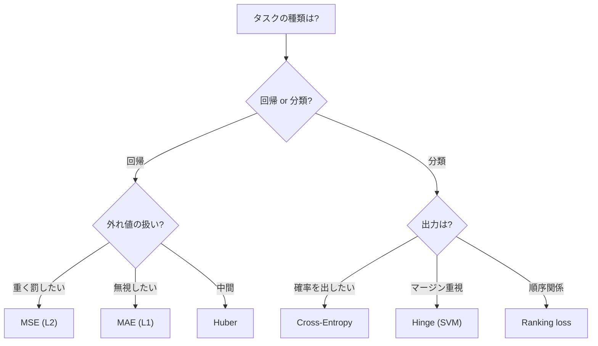
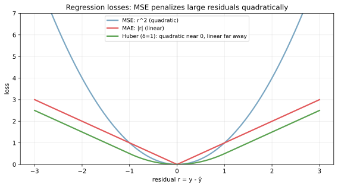
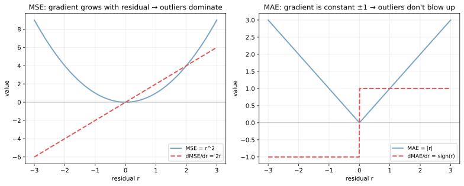
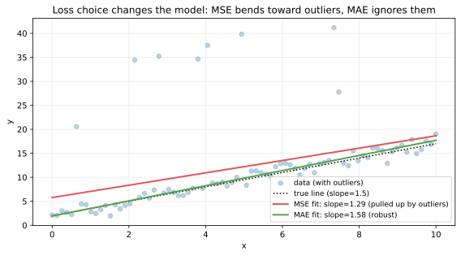
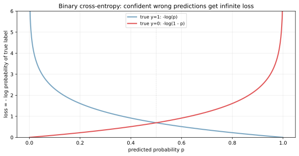

損失関数（loss function, あるいは cost function, objective function）は、モデルの予測 `ŷ` と正解 `y` のずれを「1 つの数」に変換する関数である。学習はこの損失関数の値を最小化する操作で、モデル設計の選択肢の中で「どの損失関数を選ぶか」は「どのモデルを選ぶか」と同じくらい結果に効く。

回帰では平均二乗誤差（mean squared error, MSE）と平均絶対誤差（mean absolute error, MAE）が標準で、外れ値の扱いやすさで使い分ける。分類では交差エントロピー（cross-entropy）が標準で、確率分布の差を測る尺度として定式化されている。両者とも [最急降下法・SGD](../../math/gradient-descent-sgd/) と組み合わせてパラメータを更新する設計が前提となる。

### 損失関数が決めるもの

損失関数の選び方は次の 3 点を直接決める。

- どの予測誤差を「重い」と見るか（外れ値への感度、誤分類の重み付け）
- パラメータの勾配の振る舞い（学習の安定性、収束速度）
- 学習結果が何を最適化するか（平均的な予測か、中央値的な予測か、確率分布の一致か）

「正解」が無いタスクほど損失関数の選び方が前面に出る。例として、回帰問題で「外れ値を強く罰したい」なら MSE、「外れ値を無視したい」なら MAE、「中間を取りたい」なら Huber 損失、というような切り分けが必要となる。



---

### 回帰の損失関数: 形を見比べる

MSE、MAE、Huber の 3 つを「残差 `r = y - ŷ`」の関数として並べる。

```python
import numpy as np
import matplotlib.pyplot as plt

r = np.linspace(-3, 3, 400)
mse = r ** 2
mae = np.abs(r)
def huber(r, delta=1.0):
    return np.where(np.abs(r) <= delta, 0.5 * r ** 2,
                    delta * (np.abs(r) - 0.5 * delta))

plt.plot(r, mse, color="#7aa6c2", lw=2, label="MSE: r^2")
plt.plot(r, mae, color="#e15759", lw=2, label="MAE: |r|")
plt.plot(r, huber(r, 1.0), color="#59a14f", lw=2, label="Huber (δ=1)")
plt.savefig("loss_regression_shapes.svg", bbox_inches="tight")
```



3 本の曲線の読み方:

- MSE（青）: 二次関数。残差 `±1` の損失は 1 だが、`±3` の損失は 9 に跳ね上がる。外れ値の影響が極端に大きい
- MAE（赤）: 線形。残差 `±1` で損失 1、`±3` で損失 3。外れ値の影響が線形にしか効かない
- Huber（緑）: 小さい残差では MSE（二次）、大きい残差では MAE（線形）。両者の良いとこ取りで、外れ値耐性と滑らかさを両立する。閾値 `δ` で切り替える残差を決める

定義式は次の通り。

- MSE: `L = (1/n) Σ (y_i - ŷ_i)^2`
- MAE: `L = (1/n) Σ |y_i - ŷ_i|`
- Huber: `L = (1/n) Σ ℓ_δ(y_i - ŷ_i)`、`ℓ_δ(r) = r^2 / 2` if `|r| ≤ δ`, else `δ(|r| - δ/2)`

---

### 勾配が「学習の動き方」を決める

損失関数の勾配は、SGD の各ステップで「どの方向にどれだけパラメータを動かすか」を決める量。MSE と MAE では勾配の振る舞いが対照的である。

```python
fig, axes = plt.subplots(1, 2, figsize=(11, 4.5))
axes[0].plot(r, r ** 2, color="#7aa6c2", lw=2, label="MSE")
axes[0].plot(r, 2 * r, color="#e15759", lw=2, ls="--", label="dMSE/dr = 2r")
axes[1].plot(r, np.abs(r), color="#7aa6c2", lw=2, label="MAE")
axes[1].plot(r, np.sign(r), color="#e15759", lw=2, ls="--", label="dMAE/dr = sign(r)")
plt.savefig("loss_gradient_behavior.svg", bbox_inches="tight")
```



左の MSE では勾配が残差そのものに比例して `2r` で増える。残差が 5 のサンプル 1 つは、残差が 1 のサンプル 5 つと同じ勾配を生むため、外れ値が更新の方向を支配しやすい。右の MAE では勾配が ±1 で一定（残差 = 0 でのみ不連続）で、残差の大きさに関わらず同じ強さの寄与しかしない。これが「MAE は外れ値に強い」と言われる理論的根拠となる。

ただし MAE の勾配は `r = 0` で不連続なので、勾配ベース最適化では微妙に扱いにくい。Huber 損失は両者の良い点を取り、勾配は連続かつ大きな残差では飽和する設計で、深層学習でも回帰タスクのデフォルトとしてよく選ばれる。

---

### 外れ値が支配する学習結果

理論ではなく実際の挙動として、MSE と MAE で当てた線形回帰の傾きを比較する。

```python
from sklearn.linear_model import LinearRegression, QuantileRegressor

rng = np.random.default_rng(0)
x = np.linspace(0, 10, 80)
y = 1.5 * x + 2.0 + rng.normal(0, 1.0, 80)
y[rng.choice(80, 8, replace=False)] += rng.uniform(15, 30, 8)  # outliers

X = x.reshape(-1, 1)
ols = LinearRegression().fit(X, y)  # MSE
mae_fit = QuantileRegressor(quantile=0.5, alpha=0.0).fit(X, y)  # MAE
print(f"true slope = 1.5, MSE slope = {ols.coef_[0]:.2f}, MAE slope = {mae_fit.coef_[0]:.2f}")
plt.savefig("loss_mse_vs_mae_fit.svg", bbox_inches="tight")
```

出力:

```text
true slope = 1.5, MSE slope = 2.30, MAE slope = 1.53
```



外れ値を 10% 含むデータで、MSE は傾きを `2.30` と過大評価する一方、MAE は `1.53` で真の値 `1.5` をほぼ言い当てている。同じ「データに当てる線」でも、最適化する関数を変えるだけで結論が変わる、という構造である。回帰問題で「予測精度（テスト誤差）が低い」とき、外れ値の有無と損失関数の組み合わせを疑うのは早めに試したい仮説となる。

---

### 分類の損失関数: 交差エントロピー

二値分類で出力 `p ∈ (0, 1)` を「正例である確率」と解釈するとき、交差エントロピー（cross-entropy, log loss）は次のように書ける。

`L = -(1/n) Σ [ y_i log p_i + (1 - y_i) log(1 - p_i) ]`

- `y_i = 1`（正例）なら寄与は `-log p_i`
- `y_i = 0`（負例）なら寄与は `-log(1 - p_i)`

つまり「正解側の確率に対する負の対数」を平均しているだけである。`p = 1` で正解なら `-log(1) = 0`、`p → 0` で正解なら `-log → ∞`、というように「自信を持って間違える」を強く罰する非対称な性質を持つ。

```python
p = np.linspace(0.001, 0.999, 400)
ce_pos = -np.log(p)
ce_neg = -np.log(1 - p)

plt.plot(p, ce_pos, color="#7aa6c2", lw=2, label="true y=1: -log(p)")
plt.plot(p, ce_neg, color="#e15759", lw=2, label="true y=0: -log(1-p)")
plt.savefig("loss_cross_entropy.svg", bbox_inches="tight")
```



青い曲線は「正解が `y=1` のとき」の損失で、`p` が 1 に近づくほど 0 に近づき、`p` が 0 に近づくほど無限大に発散する。赤い曲線は逆向きで、`y=0` のとき `p` が 0 に近いほど低損失。`p = 0.5` のときどちらの損失も `log 2 ≈ 0.69`、すなわち「分からない」と言うのが最も無難な選択肢になる。

実装上は数値安定性のため `log(p + 1e-15)` のように小さな下駄を履かせるか、`logits` の段階でソフトマックスと組み合わせた `logsumexp` ベースの計算が標準である。詳細は [対数・指数関数と log-odds](../../math/log-exp-logodds/) のノートで触れた数値安定性の話と同じ流れになる。

### 多クラスへの拡張: ソフトマックス + 交差エントロピー

多クラス分類（クラス数 `K`）では、出力 `K` 次元の `logits z = (z_1, ..., z_K)` をソフトマックスで確率に変換する。

`p_k = exp(z_k) / Σ_j exp(z_j)`

正解クラス `c` についての交差エントロピーは

`L = -log p_c = -z_c + log(Σ_j exp(z_j))`

の形になる。第 1 項は「正解クラスの logit を上げる方向」、第 2 項は「すべてのクラスの logit の log-sum-exp」を引く形で、確率の正規化を担っている。これは「One-hot 表現 vs 確率分布の KL ダイバージェンス」の特殊形でもあり、情報理論との繋がりも明確である。

### 数学での使いどころ

- 最尤推定との対応: ガウス雑音モデルの最尤推定は MSE 最小化、カテゴリ分布の最尤推定は交差エントロピー最小化と等価
- KL ダイバージェンス: 交差エントロピー = `H(p)` + `KL(p || q)` の `q` 依存部分（`p` は真の分布、`q` は予測分布）
- 凸最適化: MSE・MAE・交差エントロピーはいずれも凸関数。グローバル最適解が一意に決まる（パラメータが線形に効く範囲では）
- 正則化付きの目的関数: `L(θ) + λ ||θ||_2^2` のように [正則化](../regularization/) 項を加えて過学習を制御
- ベイズ的解釈: MSE は正規分布尤度、MAE はラプラス分布尤度、交差エントロピーはベルヌーイ/カテゴリ尤度に対応

---

### 機械学習での使いどころ

- 線形回帰の標準損失: MSE（最小二乗法）。閉形式解 `θ = (X^T X)^-1 X^T y` がある
- 外れ値に強い回帰: MAE (quantile regression q=0.5)、Huber 損失
- [ロジスティック回帰](../logistic-regression/): 二値交差エントロピーが標準
- 多クラス分類（softmax 回帰、ニューラルネット）: 多クラス交差エントロピー
- [サポートベクターマシン](../svm/): ヒンジ損失 `max(0, 1 - y · ŷ)`
- 順位学習: pairwise ranking loss、listwise ranking loss
- 顔認識・メトリック学習: contrastive loss、triplet loss、ArcFace
- 強化学習: policy gradient の `log π(a|s) × advantage`
- セグメンテーション: Dice loss、Focal loss（クラス不均衡対応）
- 生成モデル: VAE の ELBO、GAN の min-max 損失、Diffusion の score matching

実装上、scikit-learn では `LinearRegression`（MSE）、`HuberRegressor`、`QuantileRegressor`、`LogisticRegression`（交差エントロピー）のように、損失関数がモデル名に組み込まれているのが普通である。深層学習フレームワークでは `nn.MSELoss`、`nn.L1Loss`、`nn.HuberLoss`、`nn.CrossEntropyLoss` を選んで `loss.backward()` で勾配を計算する形になる。

---

### 適さないケース / 落とし穴

- MSE をそのまま不均衡データの分類に使う: 確率出力にならず、評価指標（accuracy、F1）と食い違う。分類なら交差エントロピーを使う
- 交差エントロピーで `p = 0` を出してしまう: `-log 0 = ∞`。クリッピング（`p = clip(p, 1e-7, 1 - 1e-7)`）か数値安定な実装に切り替える
- 外れ値が多いデータで MSE: 数件の外れ値が学習を支配する。MAE / Huber を検討するか、[外れ値検出](../../math/quantile/) で前処理する
- 損失と評価指標の不一致: 学習で MSE を最小化しても、評価指標が MAE や R² だと改善方向が一致しないことがある。両者を揃えるか、評価指標を直接最適化する手法（[勾配ブースティング](../gradient-boosting/) の `loss="quantile"` 等）を選ぶ
- [クラス不均衡](../class-imbalance/) で標準の交差エントロピー: 多数クラスに引きずられる。class-weighted cross-entropy や Focal loss を使う
- 損失関数のスケールが極端に大きい / 小さい: 学習率と相互作用して発散・収束遅延を招く。標準化された損失で動くようにする
- 微分不可能な損失（accuracy、F1 そのもの）を直接最小化しようとする: 勾配が定義されない。代理損失（surrogate loss）として交差エントロピーを使い、評価は別指標で見る
