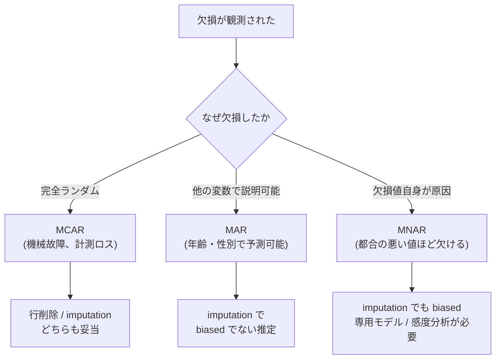
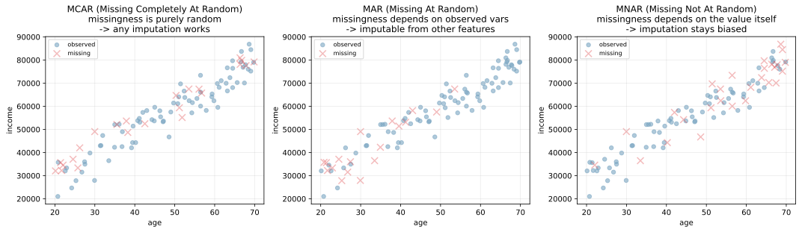
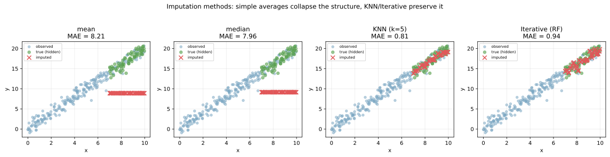
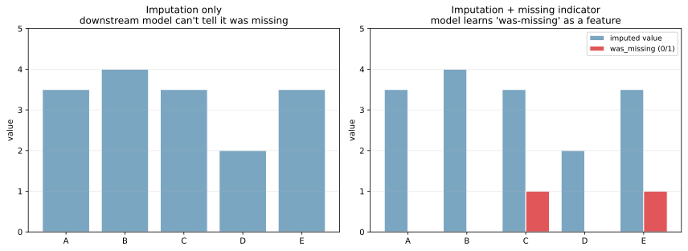

欠損値（missing values）は実データに付き物の汚れで、何も対処せずに学習器に渡すと多くの実装でエラーになるか、無視されてサンプル数が激減する。「平均で埋める」「行ごと削除する」のような素朴な対応も状況次第では正しいが、欠損が起きるメカニズム（MCAR / MAR / MNAR）を理解せずに当てると分析結果がバイアスする。

欠損値処理は [標準化](../standardization/) や [カテゴリ変数のエンコーディング](../categorical-encoding/) と並ぶ前処理の基本で、`scikit-learn` では `sklearn.impute` モジュールに `SimpleImputer / KNNImputer / IterativeImputer` の 3 系統が提供されている。

### 欠損のメカニズム: MCAR / MAR / MNAR

欠損は「なぜ欠損したか」で 3 種類に分かれる。これが対処方針を決める最初のステップ。

| 略称 | 正式名 | 意味 | 対処 |
|---|---|---|---|
| MCAR | Missing Completely At Random | 完全にランダム（測定不良など） | 行削除も imputation も OK |
| MAR | Missing At Random | 観測変数に依存（若年層ほど年収を書かない） | imputation で補正可能 |
| MNAR | Missing Not At Random | 欠損変数自身に依存（高所得者ほど書きたがらない） | imputation でもバイアスが残る |



判定方法:

- 欠損フラグ `was_missing` と他の変数の相関を計算 → 相関が出れば MAR
- MNAR を観測データだけで証明することは不可能（欠損値そのものを見られないため）。ドメイン知識で判断
- 「高所得者ほど年収を書かない」「重症患者ほどフォローアップに来ない」のような構造があれば MNAR を疑う

```python
import numpy as np
import matplotlib.pyplot as plt

# 3 種類の欠損パターンを散布図で示す
# 詳細は scripts 側を参照
plt.savefig("missing_mcar_mar_mnar.svg", bbox_inches="tight")
```



左の MCAR では欠損（×印）が散布図全域にランダムに分布。中央の MAR では `age < 30` で欠損が集中（年齢に依存）。右の MNAR では高所得側で欠損が集中（欠損変数自身に依存）。

実データのほとんどは MAR か MNAR で、純粋な MCAR は稀。「欠損が起きるパターンを理解せず単純な処理を当てると、暗黙のバイアスが入る」というのが欠損値処理の落とし穴の中心となる。

---

### Imputation 手法の比較

scikit-learn 標準の 4 系統:

| 手法 | 仕組み | 強み | 弱み |
|---|---|---|---|
| 平均 / 中央値 | 列ごとの統計量で埋める | 軽量、安定 | 関係性を潰す、分散が減る |
| 最頻値 | カテゴリ変数の最頻値 | カテゴリ向け定番 | 分布のバランスを変える |
| KNN | 近傍 k 件の平均で埋める | 関係性を保つ | 計算重い、外れ値に弱い |
| Iterative (MICE) | 他の変数で回帰して予測 | 最も精度が出やすい | 重い、収束しないことがある |

```python
from sklearn.experimental import enable_iterative_imputer  # noqa
from sklearn.impute import SimpleImputer, KNNImputer, IterativeImputer

# MAR データに対して 4 手法を適用
for imputer in [SimpleImputer("mean"), SimpleImputer("median"),
                 KNNImputer(n_neighbors=5), IterativeImputer()]:
    imputed = imputer.fit_transform(df)
plt.savefig("missing_imputation_compare.svg", bbox_inches="tight")
```



赤い × が補完された値、緑が「本当の値」（隠したもの）、青が観測されたデータ。

- 平均・中央値: 全部同じ値（水平な × の列）になり、`x` との関係を完全に潰す
- KNN: 近くの観測点に引っ張られて、`x` との関係を部分的に保持
- Iterative (RF): `y` を `x` から回帰予測する形で補完、関係を最もよく復元

「単純な平均補完」が標準的すぎて、関係性を潰すリスクが見落とされがち。線形回帰や決定木で他の変数から欠損変数を予測するアプローチの方が、ML パイプライン全体としては精度が出やすい、と考えられる。

---

### Missing indicator: 「欠損だったこと」自体を特徴量にする

`imputation` で穴を埋めた後、「もともと欠損だったかどうか」をバイナリ特徴量として残すパターンが安全策として広く使われる。

```python
from sklearn.impute import SimpleImputer
import numpy as np

# imputation + missing indicator
imp = SimpleImputer(strategy="median", add_indicator=True)
X_filled = imp.fit_transform(X)
# X_filled は元の列 + 「was_missing 列」が連結された形
plt.savefig("missing_indicator_pattern.svg", bbox_inches="tight")
```



左の「imputation のみ」では補完後、モデルは「欠損だった」事実を知らない。MAR / MNAR の場合、欠損していたという事実が予測に役立つ可能性があるのを取りこぼす。

右の「Imputation + indicator」では `was_missing` バイナリ列を追加することで、モデルが「欠損だった」を独立した特徴量として学習できる。例として「収入が記入されていないユーザーほど離反率が高い」のような関係が拾える。

scikit-learn では `SimpleImputer(add_indicator=True)` で自動的に追加される。

### 列ごとの戦略

欠損率に応じた対処方針の目安:

| 欠損率 | 推奨対処 |
|---|---|
| < 5% | 平均 / 中央値で埋めて十分なことが多い |
| 5〜30% | KNN または IterativeImputer + missing indicator |
| 30〜50% | imputation するか、列を落とすか慎重判断 |
| > 50% | 列削除が現実的、または欠損自体を特徴量化 |

ただし「欠損率 90% だが欠損していない 10% がきわめて重要」のようなケースもあり、機械的に切らずに [特徴量重要度](../feature-importance/) や欠損フラグの予測力を見て判断する。

---

### 列ごとの型に応じた戦略

- 連続値（年齢、収入）: 中央値 / KNN / Iterative
- カテゴリ変数: 最頻値 / 「unknown」カテゴリで埋める
- 順序変数: 中央値 or グループ内中央値
- 時系列: 前方フィル（forward fill）、線形補間、季節調整付き補間
- テキスト: 空文字列、`"<missing>"`、専用トークン

[カテゴリ変数のエンコーディング](../categorical-encoding/) のノートで触れたように、CatBoost や LightGBM など一部の勾配ブースティング実装は欠損値を「専用カテゴリ」として自動処理する。ここでも「欠損値の発生源」を捉えるため、一般的には別の手法（imputation）を経由する方が透明性は高いと考えられる。

### 数学での使いどころ

- EM アルゴリズム: 欠損値を潜在変数として扱う最尤推定
- 多重代入法（Multiple Imputation）: 1 つの imputation でなく複数候補を生成し、ばらつきを含めて推論
- ベイズ流: 欠損値を確率変数として周辺化（[ベイズの定理](../../math/bayes-theorem/)）
- [大数の法則](../../math/lln-clt/) と欠損: 大量データで MCAR ならサンプル平均は biased でない
- 行列補完: ユーザー × アイテム行列の欠損 → 低ランク行列分解（SVD ベース、[固有値分解](../../math/eigen-decomposition/) 参照）

---

### 機械学習での使いどころ

- センサーデータの欠測（ハードウェアの故障）
- ユーザー入力の任意項目（年収、家族構成）
- 過去データの不揃い（最近追加された列）
- 結合した複数テーブルの不一致
- 季節的・周期的な収集不能（夜間データなし）
- A/B test の脱落（dropout）
- 医療データの欠損（測定機器の不整合、患者が来院しなかった）
- 推薦システムの user × item 行列（評価していないセル）
- 時系列の欠測 → 時系列特化の補間
- 連合学習の欠損（一部のクライアントが特定の特徴量を持たない）

scikit-learn では `sklearn.impute.SimpleImputer / KNNImputer / IterativeImputer`、pandas では `df.fillna() / df.interpolate()`、時系列特化なら `statsmodels.tsa.tsatools` を使うのが定石となる。

---

### 適さないケース / 落とし穴

- テストデータで imputation 統計を計算: データリーク（[data leakage](../data-leakage/) 参照）。訓練データで fit → テストで transform
- MCAR 仮定でいきなり行削除: MAR / MNAR ならバイアスが入る。せめて欠損フラグの分析を
- 平均値補完だけで満足: 関係性が潰れる、分散が縮む、信頼区間が狭くなりすぎる
- 欠損率の高い列を残す: 補完値が支配的になり信号 / ノイズ比が下がる
- カテゴリ変数の最頻値補完で過剰な偏り: 「未回答」自体に意味があるなら専用カテゴリで
- IterativeImputer の収束問題: 欠損が多すぎるとループが収束しない。`max_iter` を増やすか単純化
- 時系列で先のデータから補間: 因果的に未来のデータが過去に漏れる。`forward fill` で過去側からのみ
- 多重代入を 1 回の imputation で済ます: ばらつきを過小評価。本格的な統計推論なら `m=5` 程度の MI を
- 欠損率を可視化しない: 各列の欠損率は EDA で必ず確認。`df.isnull().mean()`、`missingno` で行ごとパターンも見る
- LightGBM / XGBoost の欠損値自動処理を「特別な機能」と捉える: 内部では「欠損は片方の分岐に固定的に振る」だけで、imputation の代わりにはならない場面もある
- 「欠損値はノイズ」と捉える: 欠損自体が情報を含むことが多い（離脱、忘れ、抵抗）。missing indicator で残す
- imputation 前に標準化: 統計量が欠損で歪む。imputation → 標準化の順で
- 値が「9999」「-99」で入っている: ドメイン的に欠損だが数値として読まれる。EDA で確認して `np.nan` に変換してから処理
