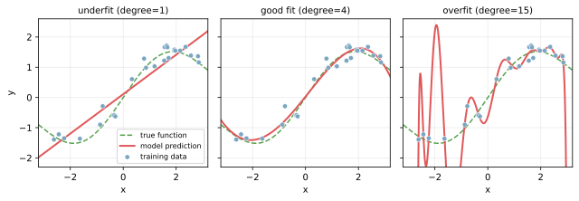
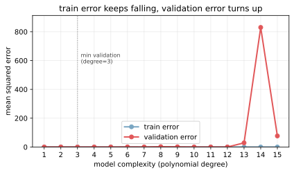

過学習（overfitting）は、モデルが訓練データの特徴を「覚えすぎ」て、未知のデータでうまく予測できなくなる現象である。  
訓練データではほぼ満点なのに、テストデータや本番データでは精度が大きく落ちる、という形で表に出る。

逆に、モデルがデータの傾向を捉えきれずに訓練でもテストでも精度が低い状態を未学習（underfitting）と呼ぶ。良いモデルは「ちょうど良い複雑さ」でこの2つの間に位置する。

### 過学習に気づく方法

最初に頼るシグナルは、訓練データとテストデータの精度差（汎化ギャップ）である。

- 訓練 Accuracy `0.99` ／ テスト Accuracy `0.62` のような大きな差 → 過学習の典型
- 訓練 Accuracy `0.65` ／ テスト Accuracy `0.62` のように両方低い → 未学習を疑う
- 訓練 Accuracy `0.92` ／ テスト Accuracy `0.90` のように差が小さい → うまく汎化している

汎化ギャップは1つの分割で判断するとブレるので、本番では[交差検証](../cross-validation/)で複数分割の平均を取って判断する。

---

### モデルの複雑さと過学習

多項式回帰で次数（複雑さ）を変えた3例を比較する。同じデータに対して、表現力の違うモデルを当てた結果を並べたもの。



- degree=1（直線）: データのカーブを表現しきれていない（underfit）
- degree=4: ちょうど真の関数（緑の点線）に沿う
- degree=15: 訓練点をほぼ全部通る複雑な曲線になり、データの「ノイズ」まで再現してしまっている（overfit）

degree=15 のモデルは訓練データ上では誤差ほぼゼロだが、x=-2 や x=2 付近のように訓練点から少し外れると暴れ、未知の点を渡されると外す。これが過学習の正体である。

---

### 訓練誤差と検証誤差のカーブ

モデルの複雑さを少しずつ上げながら訓練誤差と検証誤差を追うと、典型的なパターンが現れる。



- 訓練誤差はモデルを複雑にするほど下がり続ける（極端に複雑にすればゼロにもできる）
- 検証誤差はある複雑さまでは下がるが、そこを超えると上がり始める
- 検証誤差が最小になる点が「ちょうど良い複雑さ」

この「U 字の底」を探す作業がモデル選択の本質である。検証誤差を見ずに訓練誤差だけ追いかけると、必ず過学習側に倒れる。

---

### 主な原因

- モデルが複雑すぎる（決定木が深い、ニューラルネットの層が多い、多項式の次数が高い、など）
- 訓練データが少ない（複雑なモデルを支えるには情報が足りない）
- 特徴量が多すぎる（次元の呪い／無関係な特徴がノイズになる）
- 同じデータで何度も[ハイパーパラメータ](../hyperparameter/)を調整した（評価データに対する「リーク」）
- データに偏りがある（訓練データに特定の傾向しか含まれていない）

---

### 対処法

過学習対策はいくつかの方向に分かれる。優先順位は状況によるが、まず軽い対策から試すのが定石である。

1. モデルにブレーキをかける
    - [正則化](../regularization/)（L1 / L2）でパラメータの大きさにペナルティを与える
    - 決定木系（[RandomForest](../random-forest/) / [GradientBoosting](../gradient-boosting/)）では `max_depth` や葉ノード数の上限を絞る
    - 勾配ブースティングでは early stopping（検証誤差が下がらなくなった時点で学習を打ち切る）
2. 特徴量を絞る
    - 寄与の小さい特徴量を捨てる
    - 次元削減（[PCA](../pca/) など）
    - リーク疑いのある特徴（予測対象から直接導かれるもの）を除外
3. データ側を変える
    - データ量を増やす
    - データ拡張（画像なら回転や反転、テーブルなら合成サンプル生成）
    - ノイズの多いサンプルを取り除く
4. 評価の作り方を変える
    - [交差検証](../cross-validation/)で安定したハイパーパラメータを選ぶ
    - テストデータは最後の最後だけ使う（途中で何度も触らない）
5. モデル自体を変える
    - より単純なモデルに切り替える
    - 複数モデルの平均（バギング・アンサンブル）でばらつきを抑える

---

### Python での実例

scikit-learn で訓練誤差と検証誤差を出して汎化ギャップを見る最小例。

```python
from sklearn.datasets import make_classification
from sklearn.ensemble import RandomForestClassifier
from sklearn.model_selection import train_test_split

X, y = make_classification(n_samples=500, n_features=20, random_state=0)
X_tr, X_te, y_tr, y_te = train_test_split(X, y, test_size=0.3, random_state=0)

# 木の深さを制限せず、葉が1サンプルになるまで分割 → 過学習しやすい設定
deep = RandomForestClassifier(max_depth=None, min_samples_leaf=1, random_state=0).fit(X_tr, y_tr)
print("deep  train:", deep.score(X_tr, y_tr), "test:", deep.score(X_te, y_te))

# 木の深さを抑えた版 → 汎化ギャップが縮む
shallow = RandomForestClassifier(max_depth=4, min_samples_leaf=10, random_state=0).fit(X_tr, y_tr)
print("shallow train:", shallow.score(X_tr, y_tr), "test:", shallow.score(X_te, y_te))
```

出力の例（実行のたびに小さくぶれる）:

```text
deep  train: 1.000 test: 0.847
shallow train: 0.911 test: 0.880
```

deep モデルは訓練 1.00 / テスト 0.85 で汎化ギャップが大きい一方、shallow モデルはギャップが縮みテスト精度も上がっている。「複雑＝強い」ではないことが端的に見える。

---

### 機械学習での使いどころ

過学習は「現象の名前」であって特定のアルゴリズムに紐づかない。あらゆる教師あり学習で常に意識する必要がある。

- モデル選び: 訓練だけ良くてテストで落ちるモデルは採用しない
- ハイパーパラメータ調整: [交差検証](../cross-validation/)で過学習しないパラメータを選ぶ
- 結果の解釈: 「訓練 0.99 のモデルができた」と言われても、テスト精度を確認しない限り意味がない
- 評価指標との組み合わせ: 不均衡データでは Accuracy だけでなく [ROC-AUC / PR-AUC](../roc-pr-auc/) を併用して汎化を多面的に見る

一般に、訓練精度とテスト精度の両方を必ず出して差を確認する習慣をつけると、出てきた数字がそのまま使えるかどうか判断しやすくなると言える。

---

### よくある誤解

- テストデータの精度が高いから過学習していない、とは限らない: テストデータでハイパーパラメータを何度も調整していると、テストデータに対しても過学習する（だから検証データを別に切る）
- 単純なモデルは過学習しない、とは限らない: 特徴量が極端に多い・データが極端に少ない場合は単純なモデルでも起きる
- 過学習対策はモデル側だけの問題ではない: データのリーク（未来情報の混入など）が本質原因のことも多い
