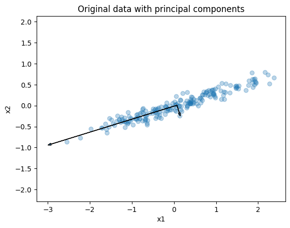
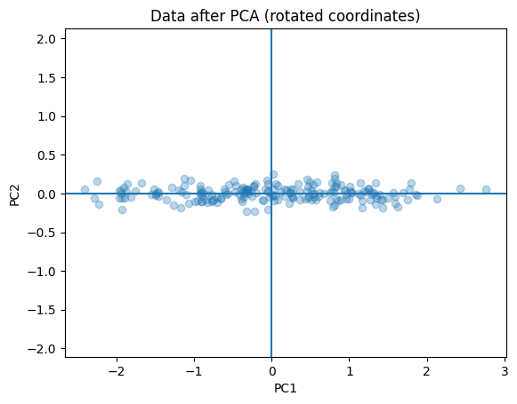

PCA（主成分分析）は、多次元データの「ばらつき（分散）が大きい方向」を見つけ、座標軸をその方向へ回転させてから、重要な軸だけ残す方法である。  
目的は「情報量（分散）をできるだけ保ったまま、次元を減らす」こと。PCAは予測や分類のモデルではなく、前処理として使われる。

ここでの「分散が最大になる直交基底へ線形変換」とは、次を意味する。  
1. 座標軸の回転：元の軸：x₁, x₂, x₃, ...、PCA後の軸：PC1, PC2, PC3, ...
2. 直交基底：軸同士が直角（内積0）で、情報が重ならない。PC1 ⟂ PC2 ⟂ PC3 ⟂ …が成り立つ。
3. 分散が最大：第1主成分を最も分散が大きくなる方向とし、第N+1主成分以下は第Nと直交し、次に分散が大きい方向とする。
4. 投影：必要な軸（例：PC1, PC2）だけ残して低次元に写す。


### 前提・注意

- スケールが違うと結果が歪むので、[標準化](../../math/stddev/)（[平均](../../math/mean/)0・[分散](../../math/variance/)1）が基本
- 外れ値に引っ張られやすい
- 主成分は「軸の組み合わせ」なので解釈しづらいことがある

---

### 利点
- 冗長な特徴量をまとめる
- ノイズの多い次元を落とす
- 人間が解釈しやすい低次元空間に写像する

---

### 欠点
- 線形変換しかできない
- ラベル情報を無視する
- 主成分の意味解釈が難しい
- 分散が大きい＝重要とは限らない（目的変数に効く特徴が小分散のこともある）

---

## Python での実例

---

### 元データ + 主成分軸
- 点群：元のデータ（x1, x2）
- 黒い矢印：
  * 長い矢印 → 第1主成分（PC1）
  * 短い矢印 → 第2主成分（PC2）

---

### PCA後
- 横軸：PC1
- 縦軸：PC2
- 主成分軸に回転した座標として見る
- PC1だけ残す＝「PC2方向の情報を捨てる」ことで、2次元→1次元に圧縮する
- 具体的には、各点をPC1軸へ垂直に落とした位置だけを取り出す

```python
import numpy as np
import matplotlib.pyplot as plt

# 分かりやすい人工データ（明確に細長い分布）
rng = np.random.RandomState(0)
x = rng.randn(200)
y = 0.3 * x + 0.1 * rng.randn(200)
X = np.column_stack((x, y))

# 平均中心化
X_centered = X - X.mean(axis=0)

# 共分散行列と固有分解
cov = np.cov(X_centered, rowvar=False)
eigvals, eigvecs = np.linalg.eigh(cov)

# 固有値の大きい順に並び替え
idx = np.argsort(eigvals)[::-1]
eigvals = eigvals[idx]
eigvecs = eigvecs[:, idx]

# PCA変換（回転）
X_pca = X_centered @ eigvecs

# 図1：元データ + 主成分軸
plt.figure()
plt.scatter(X[:, 0], X[:, 1], alpha=0.3)
origin = X.mean(axis=0)
for i in range(2):
    vec = eigvecs[:, i] * np.sqrt(eigvals[i]) * 3
    plt.arrow(origin[0], origin[1], vec[0], vec[1],
              head_width=0.05, length_includes_head=True)
plt.title("Original data with principal components")
plt.xlabel("x1")
plt.ylabel("x2")
plt.axis("equal")
plt.show()

# 図2：PCA後（回転後）の座標系
plt.figure()
plt.scatter(X_pca[:, 0], X_pca[:, 1], alpha=0.3)
plt.title("Data after PCA (rotated coordinates)")
plt.xlabel("PC1")
plt.ylabel("PC2")
plt.axhline(0)
plt.axvline(0)
plt.axis("equal")
plt.show()
```

出力:




---

### 数学での使いどころ

数学・統計の文脈では、PCAは以下の用途で使われる。

- 多変量データの構造理解
- 相関の強い変数の要約
- データの可視化（特に2次元・3次元）
- 次元削減による解析の簡略化

数学的には、以下で定式化される。

- 共分散行列の固有値分解
- データ行列の特異値分解（SVD, Singular Value Decomposition）
- 固有値は「各主成分の分散」、固有ベクトルは「主成分の方向」

---

### 機械学習での使いどころ

機械学習では、PCAは主に前処理として使われる。

- 教師なし学習というより「特徴量の整形・圧縮」
- ノイズ除去
- 学習の高速化・安定化

具体的な利用例：

- [k-means](../k-means/)前の次元削減
- SVM（Support Vector Machine）・線形モデル前の特徴整理
- 高次元データ（画像・センサデータ）の圧縮
- 可視化用の2次元投影

---

### 適さないケース

- 非線形構造が本質なデータ（画像・自然言語など）
- 分類において、分散の小さい特徴が重要な場合
- 解釈性が強く求められるモデル
- カテゴリ変数が主体のデータ
