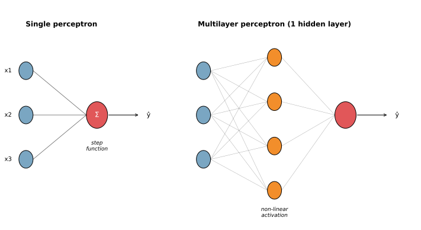
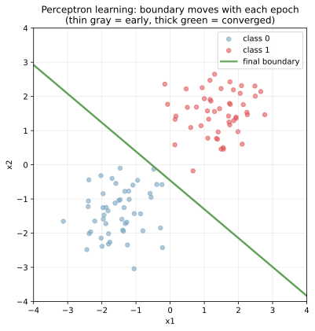
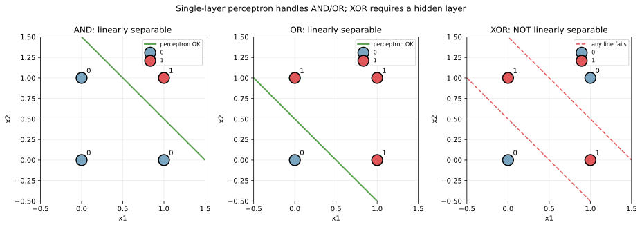
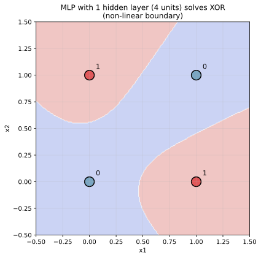
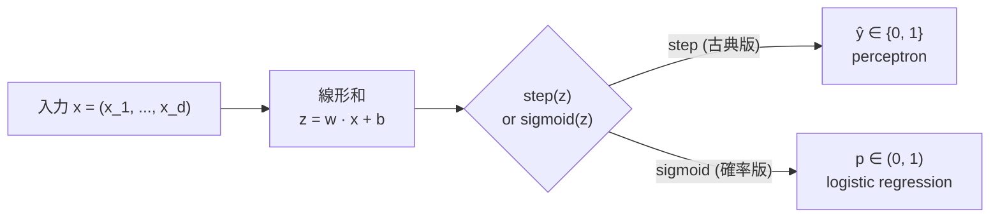

パーセプトロン（perceptron）は 1958 年に Frank Rosenblatt が提案した、神経細胞の動作を模した最も基本的な分類器である。入力特徴量に重みを掛けて足し合わせ、その和がある閾値を超えるかどうかでクラスを判定するだけの単純な構造を持つ。

`ŷ = step(w_1 x_1 + w_2 x_2 + ... + w_d x_d + b)`

[線形回帰](../linear-regression/) や [ロジスティック回帰](../logistic-regression/) と数式の中身はほぼ同じで、最後の出力を「シグモイドで確率に変換するか / step function で 0,1 に変換するか」だけが違う。発想は古典的だが、(1) 単純な構造で動く、(2) パーセプトロン収束定理という強い理論保証がある、(3) 多層に積めば任意の関数を近似できる（[多層パーセプトロン](#多層パーセプトロンとxor)）、という 3 点で深層学習の出発点として今でも教科書の最初に登場する。

### 単純パーセプトロンの構造

入力 → 重み付き和 → ステップ関数 → 出力、という最小構成。



左が単純パーセプトロン: 入力 `x_1, x_2, x_3` に重み `w_1, w_2, w_3` を掛けて加算し、step function で `0/1` を出す。右が多層パーセプトロン（multi-layer perceptron, MLP）: 入力層と出力層の間に「隠れ層」を 1 層挟み、非線形な活性化関数を経由する。

学習則（perceptron learning rule）は、誤分類したサンプル `x_i` について次のように重みを更新する。

`w ← w + η × (y_i - ŷ_i) × x_i`

- `y_i ∈ {0, 1}`: 正解
- `ŷ_i ∈ {0, 1}`: 予測
- `η`: 学習率
- 正しく分類できた点 (`y_i = ŷ_i`) では更新しない（重みを微調整するのではなく、間違えた点だけを学習する設計）

データが線形分離可能なら、有限回の更新で必ず収束する（パーセプトロン収束定理）。これは強い保証だが、後述の通り「線形分離可能でなければ収束しない」のが弱点となる。

---

### 学習の様子: 重みが更新で動く

2 次元の線形分離可能データに対して学習を回したときの境界の動きを見る。

```python
import numpy as np
import matplotlib.pyplot as plt

rng = np.random.default_rng(0)
X1 = rng.normal([-1.5, -1.5], 0.7, (50, 2))
X2 = rng.normal([1.5, 1.5], 0.7, (50, 2))
X = np.vstack([X1, X2])
y = np.array([0] * 50 + [1] * 50)

X_aug = np.hstack([X, np.ones((len(X), 1))])  # bias 項を加える
w = np.array([0.0, 0.0, 0.0])
for epoch in range(15):
    for i in range(len(X)):
        pred = 1 if X_aug[i] @ w > 0 else 0
        if pred != y[i]:
            w += 0.1 * (y[i] - pred) * X_aug[i]
plt.savefig("perceptron_learning_trajectory.svg", bbox_inches="tight")
```



灰色の細い線が初期〜途中の境界、緑の太線が最終境界。初期重み `w = 0` から始まり、誤分類した点を 1 つずつ拾って重みを修正していく。15 epoch で線形分離可能なこのデータには十分収束しており、緑の境界が 2 群を正しく分けている。

[ロジスティック回帰](../logistic-regression/) のように勾配ベースで全データの損失を一気に下げるのではなく、「間違えた点だけを 1 つずつ修正していく」のがパーセプトロン学習則の特徴。確率的勾配降下法（[SGD](../../math/gradient-descent-sgd/)）の最古の例とも言える。

---

### 線形分離可能性と XOR 問題

パーセプトロンの最大の弱点は「線形分離可能なデータしか学習できない」こと。AND・OR は 1 本の直線で分けられるが、XOR はそれができない。

```python
def truth_table(op):
    X = np.array([[0,0], [0,1], [1,0], [1,1]])
    return X, {"AND":[0,0,0,1], "OR":[0,1,1,1], "XOR":[0,1,1,0]}[op]
# 描画は scripts 側を参照
plt.savefig("perceptron_separability.svg", bbox_inches="tight")
```



左の AND と中央の OR は 1 本の緑線で 0 と 1 を分けられる。右の XOR は、どこに直線を引いても (0,0) と (1,1) を同じ側に、(0,1) と (1,0) を反対側に置くことができない。赤い破線で 2 本試しているが、いずれも 4 点を正しく分類できない。

この XOR 問題は 1969 年に Minsky と Papert が指摘したもので、「パーセプトロンは XOR すら解けない」という結論が AI 冬の時代（1970-80 年代）の引き金の 1 つになった。解決策が見つかるまで約 20 年を要し、その解決策が次の多層パーセプトロンと [誤差逆伝播法](../backpropagation/) である。

---

### 多層パーセプトロンと XOR

XOR は単層では解けないが、「隠れ層を 1 層挟んで非線形な [活性化関数](../activation-functions/) を入れる」と解ける。中間層が「入力空間を歪めて新しい特徴量を作る」役割を果たすため、出力層から見ると線形分離可能な空間に変換される。

```python
from sklearn.neural_network import MLPClassifier
X, y = truth_table("XOR")
mlp = MLPClassifier(hidden_layer_sizes=(4,), activation="tanh",
                    max_iter=10000, random_state=0).fit(X, y)
plt.savefig("perceptron_mlp_xor.svg", bbox_inches="tight")
```



色付きの領域が決定領域で、4 点がそれぞれ正しいクラス領域に入っている。決定境界は曲がっており、単層では引けない形になっている。

普遍近似定理（universal approximation theorem）は「十分な数のユニットを持つ 1 隠れ層 MLP は、任意の連続関数を任意の精度で近似できる」と主張する。これが「ニューラルネットは何でも学習できる」と言われる理論的根拠で、現代の深層学習はこの原理の延長線上にある。

---

### 数式と学習則のまとめ



パーセプトロンとロジスティック回帰は出力部分だけが違う近い親戚関係にある。

- パーセプトロン: `ŷ = step(z)`、学習則は「誤分類サンプルだけ更新」
- ロジスティック回帰: `p = sigmoid(z)`、損失は交差エントロピー、勾配は全サンプルから

歴史的にはパーセプトロンが先で、その確率版がロジスティック回帰、その多層版がニューラルネット、と発展してきた。

### 数学での使いどころ

- パーセプトロン収束定理: 線形分離可能なら有限回で収束（[線形代数](../../math/vector-matrix-ops/) の幾何的議論）
- 線形分離可能性の判定: VC 次元、マージン理論
- カーネル法との対比: 非線形分離が必要なときカーネルで暗黙的に特徴量空間を拡張（[サポートベクターマシン](../svm/) 参照）
- ヘブ則との関係: 「使われたシナプスは強化される」生物学的学習則との繋がり
- オンライン学習の原型: 1 サンプルずつ更新するアルゴリズムの最古の例

---

### 機械学習での使いどころ

現代では単純パーセプトロンを単体で使う場面はほぼ無い。学習素材として、または以下の派生形として登場することが多い。

- ニューラルネットの最小単位（neuron）として: 多層化と [活性化関数](../activation-functions/) の選択で表現力が爆発する
- [ロジスティック回帰](../logistic-regression/) の理解の出発点: step → sigmoid の置き換えで確率出力に
- [サポートベクターマシン](../svm/) との比較: マージン最大化の発想がパーセプトロン学習則の延長
- オンライン学習のアルゴリズム: Perceptron、AROW、Passive-Aggressive など
- 教育用: 「ニューラルネット入門」の最初の章としてほぼ必ず登場
- 大規模ロジスティック回帰の代替: SGD ベースの perceptron は超高速 (`sklearn.linear_model.Perceptron`)

実装は scikit-learn の `Perceptron` か、PyTorch / TensorFlow の `nn.Linear` + `nn.Heaviside`。実用上は MLP（多層）として使うのがほぼすべてとなる。

---

### 適さないケース / 落とし穴

- 線形分離不可能なデータに対する単純パーセプトロン: 永遠に収束しない（あるいは振動を続ける）。MLP に切り替える
- 確率出力が欲しい場合: パーセプトロンの step function は 0/1 しか出さない。[ロジスティック回帰](../logistic-regression/) を使う
- 特徴量のスケールが揃っていない: 重み更新が大スケール特徴量に支配される。[標準化](../standardization/) を必ず先に
- 重み初期化が雑（全部 0 のままなど）: 学習が遅い、対称性が崩れない。He / Xavier 初期化が標準
- 学習率が極端: 大きすぎると振動、小さすぎると収束が遅い。`η = 0.01〜0.1` 程度から
- ノイズが強いデータ: パーセプトロンは「外れ値を学習し続ける」性質がある。マージンを取る [SVM](../svm/) や [損失関数](../loss-functions/) で対応
- 多クラス分類: 単純パーセプトロンは本質的に 2 クラス。one-vs-rest や softmax 出力（→ ロジスティック回帰の多クラス版）で対応
- 微分不可能な step function を勾配ベース最適化に使う: 勾配が常に 0 または未定義。MLP 化するときは [活性化関数](../activation-functions/) を sigmoid / ReLU 等に置き換える
- 「パーセプトロン 1 個で深層学習を理解した気になる」: MLP・[誤差逆伝播法](../backpropagation/)・[活性化関数](../activation-functions/)・正則化・最適化アルゴリズム、すべてが追加要素として必要
- 古典の知識で現代を語る: 1958 年の論文の内容は出発点に過ぎず、現代の深層学習は普遍近似定理から最適化理論、ハードウェア対応まで遥かに広い
