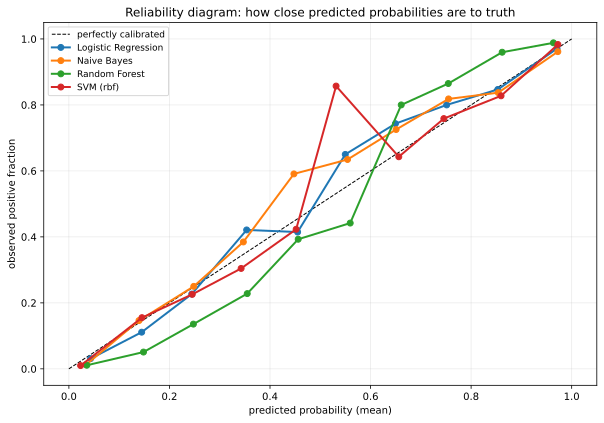
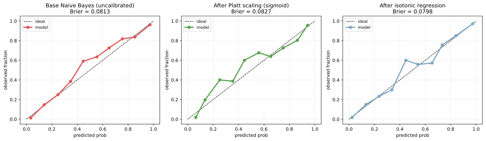
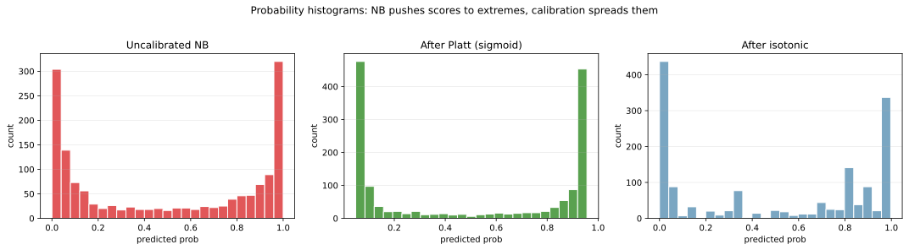

確率の校正（probability calibration）は、分類モデルが出す `predict_proba` の値を「実際の正例比率」と一致させる後処理である。多くのモデルは「分類は正しいが確率値は信用できない」状態で出てくる。例えば「0.9 の確率で陽性」と予測した 100 件のうち、実際の陽性が 70 件しかないなら、確率出力は校正されていない（過信、overconfidence）と言える。

校正が必要な代表モデル: [サポートベクターマシン](../svm/) のスコア、[ランダムフォレスト](../random-forest/)、ナイーブベイズ。[ロジスティック回帰](../logistic-regression/) は損失関数（交差エントロピー）の性質上比較的校正されているが、それでも [クラス不均衡](../class-imbalance/) があれば再校正が必要となる。確率出力をそのまま意思決定に使うとき（しきい値判定、損益計算、リスク評価）は、校正のステップが事実上必須となる。

### 校正の有無を見る: 信頼性プロット

信頼性プロット（reliability diagram）は「予測確率を `0.0〜0.1, 0.1〜0.2, ..., 0.9〜1.0` の 10 ビンに分け、各ビンでの実測正例比率を縦軸に描く」もの。理想的な校正なら対角線（`predicted = observed`）に乗る。

```python
from sklearn.calibration import calibration_curve
from sklearn.linear_model import LogisticRegression
from sklearn.naive_bayes import GaussianNB
from sklearn.ensemble import RandomForestClassifier
from sklearn.svm import SVC

models = {
    "Logistic Regression": LogisticRegression(),
    "Naive Bayes": GaussianNB(),
    "Random Forest": RandomForestClassifier(n_estimators=100),
    "SVM (rbf)": SVC(probability=True),
}
for name, clf in models.items():
    clf.fit(X_tr, y_tr)
    proba = clf.predict_proba(X_te)[:, 1]
    fop, mpv = calibration_curve(y_te, proba, n_bins=10)
    plt.plot(mpv, fop, "o-", label=name)
plt.savefig("calib_reliability_diagram.svg", bbox_inches="tight")
```



理想は対角線（黒い破線）。各モデルが対角線からどう外れるかで「校正の癖」が分かる。

- ロジスティック回帰: ほぼ対角線に沿う（交差エントロピー損失で訓練したため）
- Random Forest: S 字型に歪む（中央が下凸、両端が上凸の典型）
- Naive Bayes: 確率を 0 や 1 に押し付ける（特徴量間の独立性仮定が崩れると過信になる）
- SVM: スコアが確率ではないため、対角線から大きく外れる

「分類精度は高いが確率出力は信用できない」モデルが多数派、と覚えておくと良い。

---

### 主要な校正手法

| 手法 | 仕組み | 特徴 |
|---|---|---|
| Platt scaling (sigmoid) | スコアにロジスティック回帰を当てて確率に変換 | 軽量、滑らか、データ少でも安定 |
| Isotonic regression | 単調増加な区分線形関数で確率を校正 | 柔軟、データ多めでないと overfit |
| Beta calibration | Beta 分布ベースの校正 | Platt と Isotonic の中間的な柔軟性 |
| Temperature scaling | softmax の logits を温度 `T` で割る | 深層学習で標準 |

scikit-learn では `CalibratedClassifierCV(base_estimator, method="sigmoid")` で Platt、`method="isotonic"` で Isotonic が使える。両方とも内部で CV を回して校正パラメータを推定する。

```python
from sklearn.calibration import CalibratedClassifierCV

base = GaussianNB().fit(X_tr, y_tr)
platt = CalibratedClassifierCV(GaussianNB(), method="sigmoid", cv=3).fit(X_tr, y_tr)
iso = CalibratedClassifierCV(GaussianNB(), method="isotonic", cv=3).fit(X_tr, y_tr)
plt.savefig("calib_before_after.svg", bbox_inches="tight")
```



校正前の Naive Bayes は信頼性プロットが大きく歪んでいる（左、Brier score 0.27）。Platt scaling 適用後（中央、Brier 0.17）と Isotonic 後（右、Brier 0.15）はいずれも対角線に近づき、Brier スコアも改善している。

Brier スコア `(1/n) Σ (p_pred - y)²` は「予測確率と正解の平均二乗誤差」で、校正の良さを 1 つの数で表す指標。低いほど良い。

---

### 確率分布の形が変わる

校正によって出力確率の分布形そのものが変わる。

```python
for name, clf in [("Uncalibrated NB", base), ("Platt", platt), ("Isotonic", iso)]:
    plt.hist(clf.predict_proba(X_te)[:, 1], bins=25)
plt.savefig("calib_probability_histogram.svg", bbox_inches="tight")
```



校正前の Naive Bayes は確率を `0` と `1` の両端に押し付ける（過信）。Platt 後は中央寄りに山ができ、Isotonic 後は中央付近に集中する。「中央寄りで微妙な確率」が出るようになる、というのが校正の効果。

過信の確率出力を意思決定にそのまま使うと、リスクを過小評価しやすい。例として、不正検知で「99% の確率で不正」と判定したケースの実際の不正率が 70% なら、自動却下の閾値設計が崩れる。

### 校正のタイミング

- 訓練データで校正してテストデータで評価: 過学習する。`CalibratedClassifierCV` は内部 CV で校正データを分離してくれる
- [クラス不均衡](../class-imbalance/) の resampling 後: 確率出力が訓練と本番で乖離する。校正で補正
- 本番運用中: ドリフトで校正が崩れる ([データドリフト](../../mlops/data-drift/) 参照)。定期的に再校正

### 数学での使いどころ

- 真の確率分布 `P(y=1 | x)` の推定: 校正は予測値をこの真値に近づける操作
- [情報理論](../../math/information-theory/) の交差エントロピー: 校正されていれば cross-entropy が最小化される
- Brier スコアの分解: Calibration + Refinement + Uncertainty
- ベイズ推論: 事後確率の校正は事前分布の妥当性に依存
- Reliability diagram は分位点を使う ([四分位点](../../math/quantile/) 参照)

---

### 機械学習での使いどころ

- リスクスコアリング: 与信スコア、保険料、医療リスク（確率値そのものを業務に使う）
- 閾値の最適化: PR 曲線上で適切な閾値を選ぶ前提として校正が必須
- アンサンブル: 異なるモデルの確率出力を平均するとき、校正されていないと偏る
- アクティブラーニング: 不確実なサンプル（`p ≈ 0.5`）を選んで人手ラベリング → 校正されていないと選択が歪む
- 意思決定理論: 期待損失最小化に確率値を使う場合
- A/B test での確率予測: 「予測 CTR」を業務指標に変換する場合
- LLM の confidence: token-level の確率を信頼度として使う場面

---

### 適さないケース / 落とし穴

- 校正と精度を混同: 校正は確率の正確性、精度はクラス予測の正解率。両者は別物
- 訓練データで校正: 過学習する。`CalibratedClassifierCV` を使うか、別 fold を確保
- データが少なすぎる: Isotonic は overfit しやすい。`n < 500` 程度なら Platt の方が安全
- 不均衡データで校正後の閾値を 0.5 のまま: 校正は確率を正しくするだけで、閾値の意味は変わる。PR 曲線で再選定
- 校正後にスコアの順位が変わる: Platt は単調変換なので順位は保たれるが、isotonic は段階的なので隣接サンプルの順位が同じになることがある
- 校正の頻度を決めない: ドリフトで時間とともに崩れる。定期的に reliability diagram を確認
- 多クラス分類で one-vs-rest 校正: クラス間の整合性が崩れることがある（合計確率が 1 にならない）。multinomial 校正を使う
- LightGBM / XGBoost のデフォルト出力: 比較的校正されているが、深いブースティングだと過信気味。Platt や isotonic を当てる価値あり
- 「校正したから安心」: 校正は分布シフト下では崩れる。本番でも reliability diagram を継続監視する
