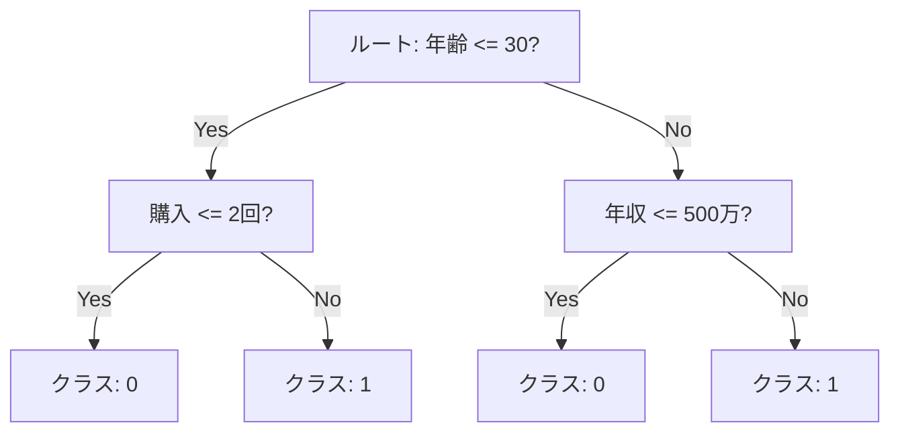
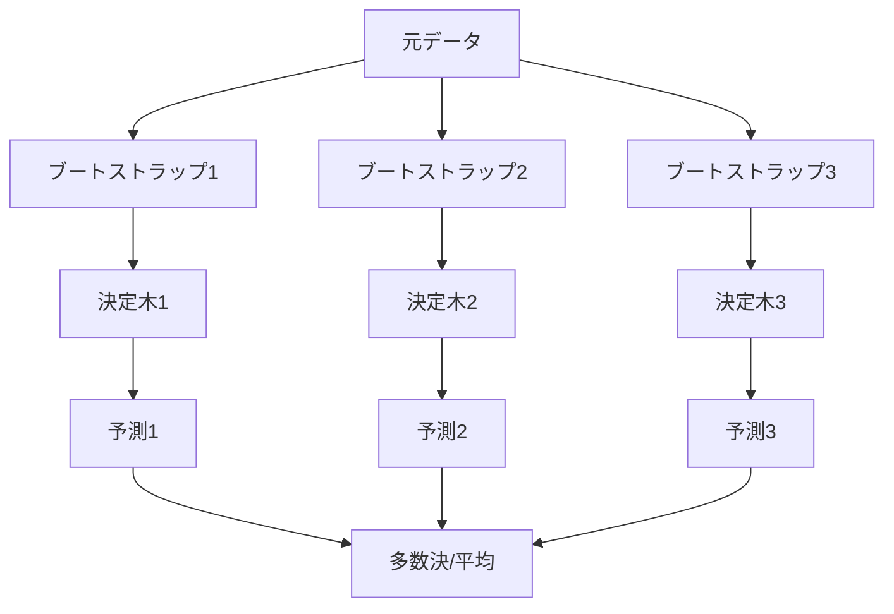

RandomForest は、複数の決定木を組み合わせて予測するアンサンブル手法（Bagging）。  
アンサンブル手法は、複数のモデルの出力をまとめて、単体より安定・高精度を狙う方法。
Bagging（Bootstrap Aggregating）は、ブートストラップで作った複数の学習セットで別々のモデルを学習し、予測を平均/多数決で集約する考え方。
それぞれの木は「ブートストラップサンプル」と「特徴量のランダム選択」で多様性を持たせ、分類は多数決、回帰は平均でまとめる。

### 決定木の分岐例（しきい値）



---

### ブートストラップは「行の再サンプリング」

ブートストラップは、特徴量の種類を変えるのではなく、同じ列を持つまま行（サンプル）を復元抽出で取り直すこと。  
そのため「別の学習セット」とは、行の並びと重複が違うデータを指す。

---

### 例（元データが 5 行の場合）

- 元データ: [1, 2, 3, 4, 5]
- ブートストラップ1: [2, 2, 3, 5, 1]
- ブートストラップ2: [4, 1, 5, 5, 2]

特徴量をランダムに選ぶのは別の仕組みで、各分岐で一部の特徴量だけを見ることで木同士の違いをさらに増やす。

---

### 仕組み（概要）

1. データを復元抽出（ブートストラップ）して複数の学習セットを作る
2. 各決定木は分割のたびに一部の特徴量だけを見る（max_features）
3. 予測時は木の出力を平均/多数決で集約する

一部の特徴量だけを見る理由は、木同士の相関を下げて多様性を増やし、[過学習](../overfitting/)を抑えるため。



---

### ブートストラップと「予測」の捉え方

ブートストラップは「元データから復元抽出で別の学習セットを作る」こと。  
同じデータを何度も引いてよいので、各セットは少しずつ違う。これで木ごとの違い（多様性）が生まれ、過学習が起きにくくなる。

予測は「各木が出す答え」。  
分類なら「クラス1/0」や「陽性確率」、回帰なら数値。RandomForest はそれらを集めて、分類は多数決、回帰は平均で最終予測にする。

---

### 前提・注意

- スケーリングは必須ではない（木なので尺度に強い）
- 高次元でも動くが、木数が多いと計算コストが増える
- 重要度は出せるが、単木より解釈は難しい

---

### 利点
- 過学習しにくく安定しやすい
- 非線形関係を捉えられる
- 欠損や外れ値に比較的強い

---

### 欠点
- モデルサイズが大きくなりがち
- 決定境界の解釈が難しい
- 高い再現性には乱数シード管理が必要

---

## Python での実例

```python
import pandas as pd
from sklearn.model_selection import train_test_split
from sklearn.ensemble import RandomForestClassifier
from sklearn.metrics import roc_auc_score

X = df.drop(columns=["target"])
y = df["target"]

X_train, X_valid, y_train, y_valid = train_test_split(
    X, y, test_size=0.2, random_state=0, stratify=y
)

model = RandomForestClassifier(
    n_estimators=300,
    max_depth=None,
    max_features="sqrt",
    random_state=0,
    n_jobs=-1,
)
model.fit(X_train, y_train)
proba = model.predict_proba(X_valid)[:, 1]
print("ROC-AUC:", roc_auc_score(y_valid, proba))
```

---

### 機械学習での使いどころ

- 特徴量の相互作用が強いタスク
- 前処理を最小化したいとき
- 強いベースラインが欲しいとき

---

### 適さないケース

- 推論速度やモデルサイズが厳しい制約になる場合
- 高い説明性が必要な場合
