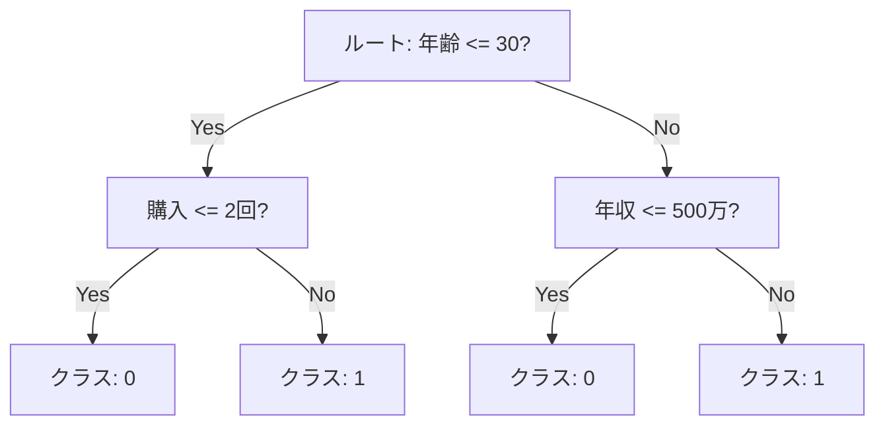
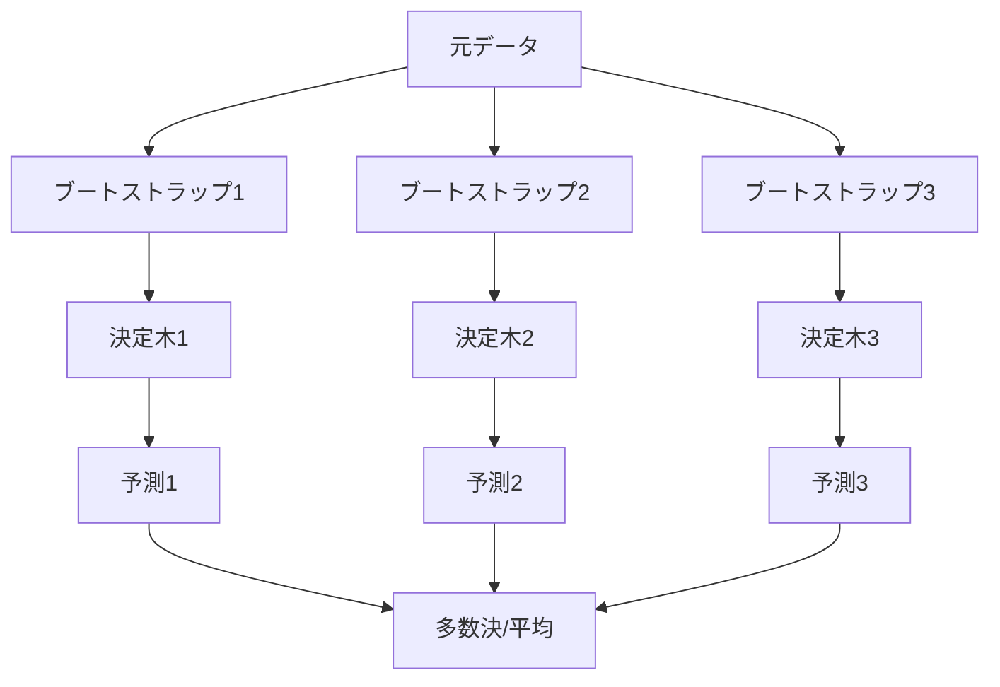

RandomForest は、複数の[決定木](../decision-tree/)を組み合わせて予測する[アンサンブル学習](../ensemble-learning/) の代表的手法（Bagging）。  
アンサンブル手法は、複数のモデルの出力をまとめて、単体より安定・高精度を狙う方法。
Bagging（Bootstrap Aggregating）は、ブートストラップで作った複数の学習セットで別々のモデルを学習し、予測を平均/多数決で集約する考え方。
それぞれの木は「ブートストラップサンプル」と「特徴量のランダム選択」で多様性を持たせ、分類は多数決、回帰は平均でまとめる。

[決定木](../decision-tree/) 単体は過学習しやすく不安定（高 Variance）だが、独立に近い多数の木を平均することで Variance を縮める、というのが原理である（[バイアス-バリアンス分解](../bias-variance-tradeoff/) の bagging 側）。学習後は `feature_importances_`（MDI）で各特徴量の寄与が取れるが、高カーディナリティバイアスがあるため [特徴量重要度](../feature-importance/) で再検証するのが安全と考えられる。

### 決定木の分岐例（しきい値）



---

### ブートストラップは「行の再サンプリング」

ブートストラップは、特徴量の種類を変えるのではなく、同じ列を持つまま行（サンプル）を復元抽出で取り直すこと。  
そのため「別の学習セット」とは、行の並びと重複が違うデータを指す。

---

### 例（元データが 5 行の場合）

- 元データ: [1, 2, 3, 4, 5]
- ブートストラップ1: [2, 2, 3, 5, 1]
- ブートストラップ2: [4, 1, 5, 5, 2]

特徴量をランダムに選ぶのは別の仕組みで、各分岐で一部の特徴量だけを見ることで木同士の違いをさらに増やす。

---

### 仕組み（概要）

1. データを復元抽出（ブートストラップ）して複数の学習セットを作る
2. 各決定木は分割のたびに一部の特徴量だけを見る（max_features）
3. 予測時は木の出力を平均/多数決で集約する

一部の特徴量だけを見る理由は、木同士の相関を下げて多様性を増やし、[過学習](../overfitting/)を抑えるため。



---

### ブートストラップと「予測」の捉え方

ブートストラップは「元データから復元抽出で別の学習セットを作る」こと。  
同じデータを何度も引いてよいので、各セットは少しずつ違う。これで木ごとの違い（多様性）が生まれ、過学習が起きにくくなる。

予測は「各木が出す答え」。  
分類なら「クラス1/0」や「陽性確率」、回帰なら数値。RandomForest はそれらを集めて、分類は多数決、回帰は平均で最終予測にする。

---

### 標準化が不要な理由

RandomForest（および決定木一般）では、[標準化](../standardization/)を行っても結果がほぼ変わらない。各ノードでの分割が「特徴量 X が閾値 t 以下か」という順序判定で完結するためで、値が `1000` でも `0.001` でも、その特徴量内での順序が同じなら閾値が連動して動くだけで分割結果は同じになる。距離ベースの[kNN](../knn/)や正則化付きの[LogisticRegression](../logistic-regression/)とは対照的で、これは経験則ではなく構造から導かれる帰結と言える。

そのため前処理パイプラインで「とりあえず StandardScaler を挟む」という慣習を木系モデルにそのまま持ち込むのは不要で、計算コストの無駄になりやすい。ただし [PCA](../pca/) のような前処理を併用する場合は、PCA 側がスケーリングを要求するので結果として標準化が必要になる、というように「他の前処理との関係で間接的に必要になる」場合はある。

---

### 前提・注意

- スケーリングは必須ではない（木の分割は順序にのみ依存する）
- 高次元でも動くが、木数 `n_estimators` を増やすと計算コストが線形に増える
- 重要度は `feature_importances_` で取れるが、相関の強い特徴量同士で重要度が分散する性質がある（後述）
- 外れ値に対しては、距離ベースのモデルほど敏感ではないが、極端な値が分岐基準を引っ張ることはある
- 多数の木を平均する性質上、単一の決定木に比べて解釈性は下がる

---

### 特徴量重要度の使い方と落とし穴

`model.feature_importances_` で各特徴量の重要度（Gini importance / Mean Decrease in Impurity）が出る。0〜1 に正規化されており、大きいほど分岐に寄与した特徴量である。

ただし注意点が 2 つある。

- 相関の強い特徴量があると、重要度が分散する。例えば「身長」と「体重」のように相関 0.9 を超える特徴量を両方入れると、本来 1 つの特徴量で出せる重要度が 2 つに割れて、それぞれ「半分の重要度の特徴量」として現れる。読み手が「両方とも中程度に重要」と誤読すると、特徴量選択を誤る
- カーディナリティ（ユニーク値の数）の多い数値特徴量は、構造的に重要度が高く出やすい。分岐の選択肢が多いため、純度向上の余地が大きく見えてしまうため

より信頼度の高い重要度を求める場合は、scikit-learn の `permutation_importance` を使う。各特徴量の値をランダムにシャッフルしたときの精度低下を測る方式で、上記 2 つのバイアスを受けにくいと考えられる。

---

### 利点

- 過学習しにくく安定しやすい（複数木の平均で分散が抑えられる）
- 非線形関係や特徴量間の相互作用を自然に捉えられる
- 欠損や外れ値に比較的強く、前処理コストが低い
- 特徴量重要度を出せるため、簡易的な特徴量選択や説明に使える
- ハイパーパラメータ感度が低く、初期パラメータでも一定の精度が出るので強いベースラインになる
- 並列学習が可能で、`n_jobs=-1` で全 CPU を使える

---

### 欠点

- モデルサイズが大きくなりがちで、`n_estimators=300` を超えると数十 MB〜数百 MB になることもある
- 推論時間も木数に比例するので、リアルタイム推論には不向きな場面がある
- 決定境界が階段状になり、滑らかな関係（連続値の補間など）は苦手
- 高い再現性には `random_state` の固定が必須
- 多数の木の平均なので、単一の決定木のようなルール抽出（IF-THEN）は直接できない
- 線形構造が強いデータでは、シンプルな線形回帰や [LogisticRegression](../logistic-regression/) より精度が落ちることがある

---

## Python での実例

```python
import pandas as pd
from sklearn.model_selection import train_test_split
from sklearn.ensemble import RandomForestClassifier
from sklearn.metrics import roc_auc_score

X = df.drop(columns=["target"])
y = df["target"]

X_train, X_valid, y_train, y_valid = train_test_split(
    X, y, test_size=0.2, random_state=0, stratify=y
)

model = RandomForestClassifier(
    n_estimators=300,
    max_depth=None,
    max_features="sqrt",
    random_state=0,
    n_jobs=-1,
)
model.fit(X_train, y_train)
proba = model.predict_proba(X_valid)[:, 1]
print("ROC-AUC:", roc_auc_score(y_valid, proba))
```

---

### 機械学習での使いどころ

汎用的に強いベースラインとなるため、まず当てて当たりを付けるモデルとして使われることが多い。

- 表形式データの分類・回帰の最初のベースライン
- 特徴量の相互作用が強いタスク（年齢 × 収入 のような積の効果がある場合）
- 前処理を最小化したいとき（[標準化](../standardization/)・外れ値処理がほぼ不要）
- 特徴量重要度で「どの変数が効いているか」の当たりを付けたいとき
- カテゴリ変数が多いタスク（GBDT 系と並んで、表形式データで強い）
- 欠損が多いデータ（scikit-learn 1.4 以降は `HistGradientBoosting` 系と同様に欠損対応が改善されている）

具体的な利用例:

- 顧客の離脱予測: 多数の行動特徴量の交互作用を自動で捉える
- 不正取引検知のベースライン: [PR-AUC](../roc-pr-auc/) で勾配ブースティングと比較する起点
- 医療データの予後予測: 線形モデルで取りこぼす非線形な閾値効果を補足
- Kaggle の Tabular コンペで GBDT と組み合わせるアンサンブル要員

---

### 適さないケース

- 推論速度やモデルサイズが厳しい制約になる場合（IoT デバイス、リアルタイム広告入札など）
- 高い説明性が必要な場合（単純なルール 1 本を提示したい用途）
- 線形性の強いデータ（[LogisticRegression](../logistic-regression/) のほうがシンプルで精度も近い）
- 系列性が本質的なデータ（時系列・テキスト・画像）: 木は系列構造を直接扱わないため、専用モデルに劣る
- 滑らかな関数を当てたい場合: 階段状の境界では補間が粗くなる
