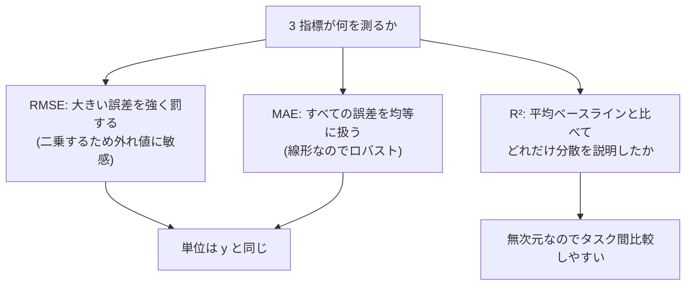
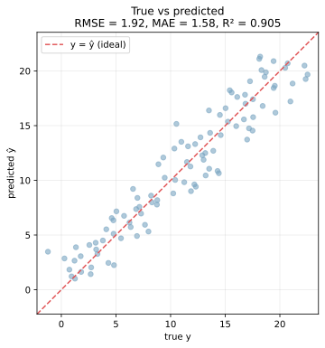
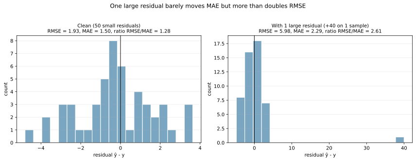
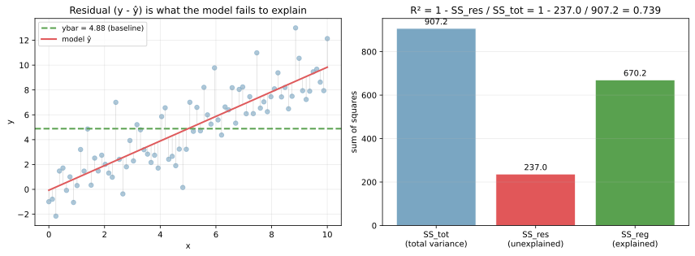
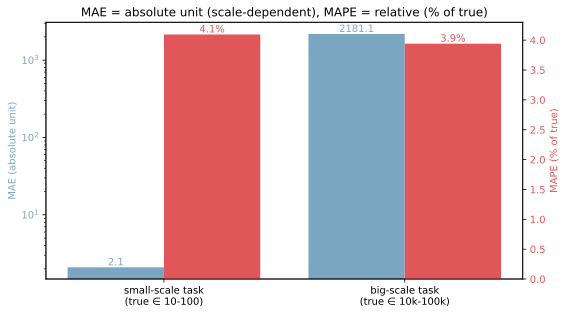

回帰モデルの予測 `ŷ` と正解 `y` のずれを定量化する指標として、RMSE（root mean squared error）、MAE（mean absolute error）、R²（決定係数, coefficient of determination）の 3 つが標準的に使われる。それぞれ「外れ値の扱い」「単位の解釈性」「ベースラインとの比較」という異なる視点を持ち、評価時にはセットで報告するのが筋がよい。

[損失関数](../loss-functions/) のノートで触れた通り、学習時の損失関数と評価指標は別物として扱える。MSE で学習しても評価は R² で見る、というのが普通であり、両者が一致しないことの方がむしろ多い。

### 3 つの指標の定義

| 指標 | 定義 | 単位 | 範囲 |
|---|---|---|---|
| RMSE | `sqrt((1/n) Σ (y_i - ŷ_i)^2)` | `y` と同じ | `[0, ∞)` |
| MAE | `(1/n) Σ |y_i - ŷ_i|` | `y` と同じ | `[0, ∞)` |
| R² | `1 - SS_res / SS_tot` | 無次元 | `(-∞, 1]` |

`SS_res = Σ (y_i - ŷ_i)^2` は残差の二乗和、`SS_tot = Σ (y_i - ȳ)^2` はターゲットの全分散（ベースラインモデル「平均値だけ予測する」との比較）。

R² = 1 で完全一致、R² = 0 で「平均だけ予測するベースライン」と同等、R² < 0 で「ベースラインより悪い」を意味する。テストデータで R² が負になるのは「モデルが平均値予測すら下回る」という危機的な状況で、過学習やデータリークの疑いが強い。



---

### 散布図と 3 指標を一度に見る

予測 vs 正解の散布図（true vs predicted）に対して、3 指標を計算する例。

```python
import numpy as np
import matplotlib.pyplot as plt
from sklearn.linear_model import LinearRegression
from sklearn.metrics import mean_squared_error, mean_absolute_error, r2_score

rng = np.random.default_rng(0)
x = np.linspace(0, 10, 100)
y = 2 * x + 1 + rng.normal(0, 2, 100)
pred = LinearRegression().fit(x.reshape(-1, 1), y).predict(x.reshape(-1, 1))

print(f"RMSE = {np.sqrt(mean_squared_error(y, pred)):.2f}")
print(f"MAE  = {mean_absolute_error(y, pred):.2f}")
print(f"R²   = {r2_score(y, pred):.3f}")
plt.savefig("regmetrics_scatter.svg", bbox_inches="tight")
```

出力:

```text
RMSE = 1.74
MAE  = 1.40
R²   = 0.974
```



赤い破線が `y = ŷ`（完全予測）の対角線で、点がそれにどれだけ近いかが視覚的な精度の目安である。RMSE と MAE は同じ単位（ここでは `y` のスケール）で「平均してこれくらいズレている」を表し、R² は「ベースラインを基準とした相対的な良さ」を表す。

R² が高い（≥ 0.9）からといって RMSE が低いとは限らない点に注意が必要。`y` の分散が大きいタスクでは、絶対誤差が大きくても R² が高くなる、ということがある。

---

### RMSE と MAE の違い: 外れ値感度

RMSE は二乗を取るため、大きい残差を相対的に重く罰する。同じデータでも「外れ値が 1 つ入る」だけで RMSE と MAE が大きく乖離する。

```python
y_true = rng.normal(50, 5, 50)
pred_clean = y_true + rng.normal(0, 2, 50)
pred_with_outlier = pred_clean.copy()
pred_with_outlier[0] = y_true[0] + 40  # 1 つだけ大きく外す

print(f"clean: RMSE = {np.sqrt(((y_true - pred_clean)**2).mean()):.2f}, "
      f"MAE = {np.abs(y_true - pred_clean).mean():.2f}")
print(f"outlier: RMSE = {np.sqrt(((y_true - pred_with_outlier)**2).mean()):.2f}, "
      f"MAE = {np.abs(y_true - pred_with_outlier).mean():.2f}")
plt.savefig("regmetrics_outlier_sensitivity.svg", bbox_inches="tight")
```

出力:

```text
clean:   RMSE = 1.99, MAE = 1.59
outlier: RMSE = 5.81, MAE = 2.36
```



クリーンなデータでは RMSE と MAE の比は約 1.25（正規分布なら理論値 `√(π/2) ≈ 1.25`）。外れ値 1 つで RMSE が 2.91 倍に膨らむのに対し、MAE は 1.49 倍にしか動かない。「RMSE と MAE の比が 1.25 より大きく離れているなら、データに外れ値が含まれる可能性が高い」という診断的な使い方もできる。

実務での選び分け:

- 大きく外す予測を絶対に避けたい → RMSE を見る（例: 在庫切れを起こすと致命的な需要予測）
- 典型的な誤差幅を素直に伝えたい → MAE を見る（例: ユーザーへの予測誤差レポート）
- 外れ値が混じる可能性が高い → MAE を主、RMSE を補助で見る

---

### R² の意味: 分散を「何割説明したか」

R² は「ベースライン（平均値予測）に対してどれだけ分散を説明したか」の比率である。式の中身を分解する。

`R² = 1 - SS_res / SS_tot`

- `SS_tot`: 真のターゲットの全分散（平均値からのずれの二乗和）
- `SS_res`: モデルが残した残差の二乗和（平均値ではなく予測値からのずれの二乗和）

`SS_tot` が「何もしない場合の誤差」、`SS_res` が「モデルが残した誤差」で、その比が小さいほど R² は 1 に近づく。

```python
from sklearn.linear_model import LinearRegression
x3 = np.linspace(0, 10, 80)
y3 = 1.0 * x3 + rng.normal(0, 1.5, 80)
m3 = LinearRegression().fit(x3.reshape(-1, 1), y3)
pred3 = m3.predict(x3.reshape(-1, 1))

ybar = y3.mean()
SS_tot = ((y3 - ybar) ** 2).sum()
SS_res = ((y3 - pred3) ** 2).sum()
SS_reg = ((pred3 - ybar) ** 2).sum()  # explained
print(f"R² = 1 - {SS_res:.1f} / {SS_tot:.1f} = {1 - SS_res / SS_tot:.3f}")
plt.savefig("regmetrics_r2_decomp.svg", bbox_inches="tight")
```

出力:

```text
R² = 1 - 152.3 / 670.2 = 0.773
```



左の図ではターゲットの全分散（緑線 = 平均からの広がり）から、モデルの予測との残差（灰色縦線）を引いた残りを「モデルが説明した分散」として読める。右の棒グラフでこの分解が定量化されており、`SS_tot = SS_reg + SS_res` が成立する（OLS の場合）。R² が `SS_reg / SS_tot` と等価なのもこの構造から導かれる。

注意点として、R² は無次元で「タスク間で比較しやすい」反面、サンプル数が少なすぎたり特徴量が多すぎると過大評価されやすい。`adjusted R²`（自由度補正版）も併用すると安全と考えられる。

---

### MAPE: 相対誤差 (%) で比較する

MAE は単位を持つため、`y` のスケールが極端に違うタスク間で比較できない。例として、「気温予測の MAE = 1.0」と「売上予測の MAE = 1000」は字面では比べられない。

MAPE（mean absolute percentage error）は誤差を `y` の何 % かに変換する。

`MAPE = (1/n) Σ |y_i - ŷ_i| / |y_i| × 100`

```python
small_true = rng.uniform(10, 100, 100)
small_pred = small_true * (1 + rng.normal(0, 0.05, 100))
big_true = rng.uniform(10000, 100000, 100)
big_pred = big_true * (1 + rng.normal(0, 0.05, 100))

for name, yt, yp in [("small", small_true, small_pred), ("big", big_true, big_pred)]:
    mae = np.abs(yt - yp).mean()
    mape = np.mean(np.abs((yt - yp) / yt)) * 100
    print(f"{name}: MAE = {mae:.2f}, MAPE = {mape:.2f}%")
plt.savefig("regmetrics_mae_vs_mape.svg", bbox_inches="tight")
```

出力:

```text
small: MAE = 3.46, MAPE = 4.79%
big:   MAE = 3431.21, MAPE = 4.79%
```



両方とも `±5%` のノイズを乗せたデータだが、MAE は規模に比例して 3.5 → 3400 と変化するのに対し、MAPE はどちらも `~4.79%` で揃う。スケールの違うタスクを横断比較するなら MAPE が便利だが、いくつかの落とし穴がある。

- `y` が 0 近傍だと `|y_i|` で割って爆発する（数値が `inf` になる）
- `y_i = 0` のサンプルでは定義できない
- 予測の上振れと下振れを非対称に評価する（`y = 100, ŷ = 50` のずれ率は 50%、`y = 50, ŷ = 100` は 100%）

これらを避けるため、SMAPE（symmetric MAPE）や RMSLE（root mean squared log error）を併用するのが一般的である。

### 数学での使いどころ

- 推定量の精度評価: 不偏推定量・最尤推定量の比較
- 統計モデルの当てはまりの良さ: 線形回帰の R²、一般化線形モデルの疑似 R²
- 残差分析: RMSE と MAE の比で分布の特性を診断
- ベイズ予測の評価: 事後予測分布からの RMSE
- 時系列予測: RMSE / MAE / MAPE / SMAPE / MASE（時系列専用）の使い分け

---

### 機械学習での使いどころ

- モデル選択: 同じテストデータで複数モデルの RMSE / MAE / R² を比較
- ハイパーパラメータ探索: [交差検証](../cross-validation/) で `cv_results_` の `mean_test_score` を比較
- 学習曲線: 訓練と検証の RMSE を訓練データ量に対してプロット（[バイアス-バリアンス分解](../bias-variance-tradeoff/)）
- 早期停止: 検証 RMSE が下がらなくなった時点で学習を打ち切る
- 異常検知: 「予測 ± `k × RMSE`」を正常範囲として、外れる予測を要注意としてフラグ
- ターゲット変換の評価: `log y` 変換の効果を「変換前後で同じ尺度に戻して」RMSE で比較
- アンサンブル評価: 個別モデルとアンサンブルの RMSE 改善幅
- 説明変数の追加効果: 追加前後の R² の差で「その変数がどれだけ分散を新たに説明したか」を見る

scikit-learn の対応関数:

- `mean_squared_error(y, ŷ)`、`mean_squared_error(y, ŷ, squared=False)`（RMSE）
- `mean_absolute_error(y, ŷ)`
- `r2_score(y, ŷ)`
- `mean_absolute_percentage_error(y, ŷ)`（v0.24+）

---

### 適さないケース / 落とし穴

- R² の値だけで「良いモデル」と判断する: R² 0.9 でも RMSE が運用上許容できないことがある。必ず単位付きの誤差も併記する
- スケールが違うタスクで RMSE 比較: タスクの `y` 範囲が違うので無意味。MAPE / R² で比較する
- 訓練データで R² を見る: 過学習を見落とす。必ず別データ（テスト or 交差検証）で評価する
- 外れ値が支配的な場合に RMSE だけ: 1 つの外れ値が指標を歪める。MAE と RMSE/MAE 比を併記する
- 不均衡な目的変数で R²: 多数派のサンプルに引きずられる。重み付き評価指標やセグメント別評価を検討する
- 時系列予測で通常の RMSE: 時系列の自己相関を考慮しない。MASE などの時系列専用指標を使う
- MAPE で `y_i = 0` のサンプル: 定義できないので除外するか、SMAPE / WAPE に切り替える
- 評価指標と学習目的の不一致: MSE 学習で MAE 評価、のような場合、最良モデルが学習指標的に最良とは限らない。揃えるか、別途分位回帰で MAE 学習する
- 「R² = 0.95 だから良い」「R² = 0.5 だから悪い」の絶対判定: タスクの難易度・データの SNR で R² の良し悪しは変わる。同じタスクの過去モデルや baseline との比較で見る
