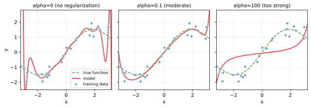
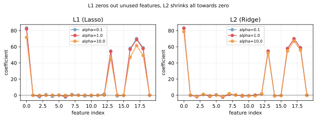

正則化（regularization）は、[過学習](../overfitting/)を抑えるためにモデルの「複雑さ」へペナルティを課す仕組みである。  
学習時に最小化する損失関数に、パラメータの大きさを表す項を足すことで、極端に大きな重みを持つモデルが選ばれにくくなる。

ペナルティの形によって主に L2（リッジ）、L1（ラッソ）、L1 と L2 の組み合わせ（Elastic Net）に分かれる。

- L2: `loss = 通常の誤差 + alpha * sum(w_i ^ 2)`
- L1: `loss = 通常の誤差 + alpha * sum(|w_i|)`

`alpha` は正則化の強さを決める[ハイパーパラメータ](../hyperparameter/)。大きいほどブレーキが強い。`alpha=0` は正則化なし（通常の最小二乗）と同じ。

### 正則化が効く様子

意図的に過学習しやすい設定（多項式の次数 15）に L2 正則化をかけ、`alpha` を変えた3例。



- `alpha=0`: 訓練点をなぞる暴れた曲線 = [過学習](../overfitting/)
- `alpha=0.1`: 緑の真の関数にほぼ沿う、ちょうど良い状態
- `alpha=100`: ブレーキが強すぎて直線に近づき、データの特徴を捉えきれない = 未学習

`alpha` 自体も[交差検証](../cross-validation/)で選ぶのが基本。「正則化を入れれば過学習しない」のではなく「適切な `alpha` を選んで初めて効く」点に注意する。

---

### L1 と L2 の違い

両方とも係数を 0 に近づけるが、近づけ方が違う。



- L1（左, Lasso）: 不要な特徴量の係数を完全に 0 にする。「特徴量を選別する」効果がある
- L2（右, Ridge）: すべての係数を均等に 0 へ縮める。0 にはしないが小さくする

使い分けの目安:

- 特徴量がたくさんあって、本当に効いている数個に絞りたい → L1
- すべての特徴量に少しずつ影響があってほしい、計算が安定する方が良い → L2
- どちらを取るか決め切れない → Elastic Net（L1 と L2 の混合）

---

### Python での実例

scikit-learn では正則化はモデルクラスとして用意されている。回帰なら `Ridge` / `Lasso`、[ロジスティック回帰](../logistic-regression/)なら `LogisticRegression` の `penalty` 引数で指定する。

```python
from sklearn.datasets import make_regression
from sklearn.linear_model import Ridge, Lasso, LinearRegression
from sklearn.model_selection import train_test_split

X, y = make_regression(n_samples=200, n_features=20, n_informative=5,
                       noise=15, random_state=0)
X_tr, X_te, y_tr, y_te = train_test_split(X, y, test_size=0.3, random_state=0)

for model in [
    LinearRegression(),
    Ridge(alpha=1.0),
    Lasso(alpha=1.0),
]:
    model.fit(X_tr, y_tr)
    name = type(model).__name__
    nonzero = (model.coef_ != 0).sum()
    print(f"{name:18s} test R^2: {model.score(X_te, y_te):.3f}  nonzero coefs: {nonzero}/20")
```

出力の例:

```
LinearRegression   test R^2: 0.972  nonzero coefs: 20/20
Ridge              test R^2: 0.974  nonzero coefs: 20/20
Lasso              test R^2: 0.973  nonzero coefs: 6/20
```

Lasso だけが係数の多くを 0 に潰し、実質 5 個の特徴量で同等のスコアを出している。本当に効く特徴量を知りたい場面で役立つ。

---

### 機械学習での使いどころ

正則化が組み込まれている代表的なモデル:

- 線形回帰: Ridge（L2）、Lasso（L1）、Elastic Net
- [ロジスティック回帰](../logistic-regression/): `penalty='l1'` / `'l2'` / `'elasticnet'`
- SVM: `C` パラメータ（C が小さいほど正則化が強い）
- ニューラルネット: weight decay（L2 と同じ）、dropout、batch normalization
- [GradientBoosting](../gradient-boosting/): `reg_alpha`（L1）、`reg_lambda`（L2）、`min_child_weight` など

決定木そのものには「正則化項」は無いが、`max_depth` や `min_samples_leaf` の上限を絞ることが事実上の正則化として働く。[RandomForest](../random-forest/) や GradientBoosting でハイパーパラメータを絞ることは、概念上は正則化と同じことをしている。

---

### 正則化を効かせる前に確認すること

- 特徴量がスケーリングされているか: L1/L2 はパラメータの大きさにペナルティを課すので、特徴量のスケールが揃っていないと一部の特徴ばかり罰せられる。前段に[標準化](../../math/stddev/)（StandardScaler）を入れるのが基本
- `alpha` を 1 つ決め打ちで使っていないか: 適切な値はデータ依存。[交差検証](../cross-validation/)で複数候補を試して選ぶ
- 過学習の原因がモデル側にあるか: データのリークや評価方法の問題（テストデータの使い回し）が原因なら、正則化を強めても解決しない

---

### 適さないケース

- 訓練データが圧倒的に多く、モデルが単純で過学習していない場面: 正則化は性能をむしろ落とす
- 解釈性が必要で、特徴量の生の係数を見たい場面: 正則化で縮められた係数は「特徴量の真の影響度」とは別物
- ハイパーパラメータを探す予算（時間・計算資源）が無い場面: 適切な `alpha` を選ばないと意味がないため、決め打ちで導入するのは慎重に
