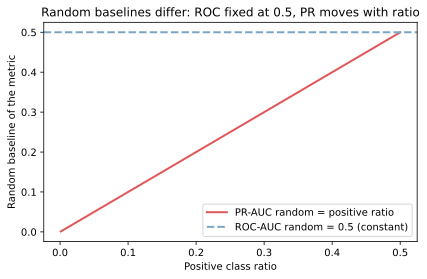
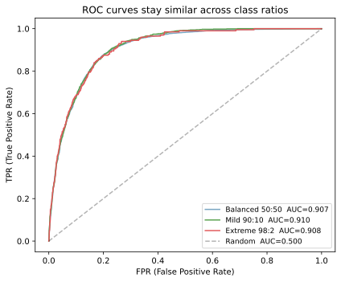
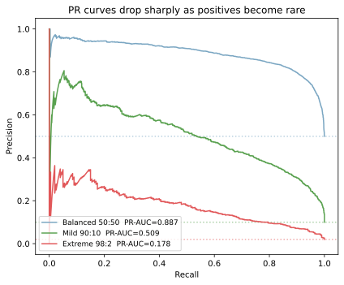
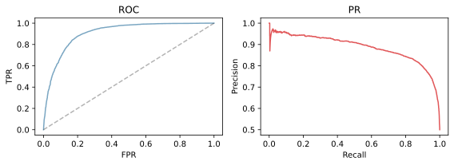

ROC-AUC（Receiver Operating Characteristic - Area Under the Curve）と PR-AUC（Precision-Recall - Area Under the Curve）は、二値分類モデルの性能を「閾値に依存せず」 1 つの数で比較するための指標である。両者は同じ予測スコアから計算できるが、不均衡データ（陽性クラスが極端に少ないデータ）における振る舞いが大きく違うため、目的によって使い分ける。

結論を先に置くと、不均衡データでは ROC-AUC は楽観的に出るため、PR-AUC を主指標にした方が良い。理由は順を追って示す。

### 何を測っているか

ROC-AUC と PR-AUC は、いずれもモデルが出した「陽性である確率」 (`y_score`) を真のラベル (`y_true`, 0/1) と突き合わせて、閾値 `t` を 1.0 から 0.0 まで動かしながら点を打って描いた曲線の下の面積である。閾値 1 つにつき次の 4 つの値が決まる。

- `TPR(t) = TP / (TP + FN)` ＝ 真陽性率（Recall とも呼ぶ）。陽性のうち捕まえた割合
- `FPR(t) = FP / (FP + TN)` ＝ 偽陽性率。陰性のうち誤って陽性と判定した割合
- `Precision(t) = TP / (TP + FP)` ＝ 陽性と判定したうち本当に陽性の割合
- `Recall(t) = TPR(t)` ＝ TPR と同じ

ここでの TP / FP / TN / FN は[混同行列](../confusion-matrix/)の 4 マスに対応する。閾値を下げると TP と FP の両方が増え、上げると両方が減る。

---

### ROC / PR 曲線の作り方

予測確率の閾値 `t` を 1.0 → 0.0 へ少しずつ下げながら、各 `t` で次の 1 点を打って線でつなぐ。

- ROC: 点 `( FPR(t), TPR(t) )` を打ち続けたもの
- PR:  点 `( Recall(t), Precision(t) )` を打ち続けたもの

両端は固定される。

- `t = 1.0`（誰も陽性と判定しない）: ROC は原点 (0, 0)、PR は右下 (0, 1) 付近
- `t = 0.0`（全員陽性と判定）: ROC は右上 (1, 1)、PR は右下 (1, 陽性比率)

ROC は左上に寄るほど良く（TPR が高く FPR が低い）、PR は右上に寄るほど良い（Recall と Precision の両方が高い）。AUC（曲線下面積）はその「平均的な良さ」を 1 つの数にしたものである。

---

### ROC-AUC と PR-AUC のランダム基準

判断軸として真っ先に押さえたいのが「ランダム予測の基準値が両者で違う」ことである。

- ROC-AUC のランダム基準: 常に `0.5`。クラス比率に依存しない
- PR-AUC のランダム基準: 陽性比率に等しい。陽性が 2% なら 0.02、50% なら 0.5

つまり、PR-AUC の絶対値は陽性比率と一緒に動く。陽性 2% のデータで PR-AUC=0.2 が出たら、ランダム (0.02) の 10 倍だから優秀である一方、陽性 50% のデータで PR-AUC=0.2 だとランダム (0.5) を大きく下回るので使い物にならない。同じ数字でも意味が変わる。

以下の図は両者のランダム基準を陽性比率の関数として描いたもの。ROC-AUC が常に 0.5 で水平なのに対し、PR-AUC は陽性比率に沿って斜めに動く。



---

### 不均衡データで PR-AUC を優先する理由

不正検知（陽性 1〜2%）や稀少疾患診断（陽性 0.1% 未満）のようなクラス不均衡の強い場面では、ROC-AUC は楽観的に高い値を出す。原因は FPR の分母にある。

`FPR = FP / (FP + TN)` の分母は陰性の総数 `(FP + TN)`。陰性が 98% を占めるデータでは TN が圧倒的に大きく、FP が多少増えても FPR がほとんど動かない。具体的には、陰性 9800 件のうち 100 件を誤って陽性と判定しても FPR は 0.01 にしかならない。つまり ROC 曲線は小さな FPR の範囲で大きな TPR を稼ぐ形になり、曲線が左上に張り付いて AUC が高くなる。

一方 PR-AUC の構成要素である Precision は `TP / (TP + FP)` で、分母に陰性総数が入らない。FP が 100 件出れば、本当の陽性が 100 件しかない場面では Precision が 0.5 になり、PR-AUC は急に悪化する。Precision と Recall のいずれも陽性クラスに直接関係する量なので、陽性クラスの取り逃し感度を素直に反映できると言える。

このコントラストは図で見ると分かりやすい。以下は同じ判別性能を持つモデル（モデルそのものは固定）を、陽性比率だけ変えた 3 種類のデータで評価した結果である。



ROC 曲線は 3 本ともほぼ重なり、ROC-AUC はすべて 0.91 前後で「変化なし」に見える。モデルの判別性能が変わっていないので、これは当然である。

```python
import numpy as np
import matplotlib.pyplot as plt
from sklearn.datasets import make_classification
from sklearn.linear_model import LogisticRegression
from sklearn.metrics import roc_curve, roc_auc_score


def base_dataset(seed=0):
    X, y = make_classification(
        n_samples=40_000, n_features=10, n_informative=5,
        weights=[0.5, 0.5], flip_y=0.02, class_sep=1.0, random_state=seed,
    )
    model = LogisticRegression(max_iter=1000).fit(X, y)
    return y, model.predict_proba(X)[:, 1]


def subsample(y_all, scores_all, pos_ratio, n_total=10_000, seed=0):
    rng = np.random.default_rng(seed)
    n_pos = int(n_total * pos_ratio)
    pos_idx = np.where(y_all == 1)[0]
    neg_idx = np.where(y_all == 0)[0]
    pick = np.concatenate([
        rng.choice(pos_idx, n_pos, replace=False),
        rng.choice(neg_idx, n_total - n_pos, replace=False),
    ])
    return y_all[pick], scores_all[pick]


y_all, scores_all = base_dataset()
plt.figure(figsize=(6, 5))
for ratio, name, color in [(0.5, "50:50", "#7aa6c2"),
                           (0.1, "90:10", "#59a14f"),
                           (0.02, "98:2", "#e15759")]:
    y, s = subsample(y_all, scores_all, ratio)
    fpr, tpr, _ = roc_curve(y, s)
    plt.plot(fpr, tpr, color=color,
             label=f"{name}  AUC={roc_auc_score(y, s):.3f}")
plt.plot([0, 1], [0, 1], "k--", alpha=0.3)
plt.legend(); plt.tight_layout()
plt.savefig("roc-pr-auc_roc_imbalance.svg", bbox_inches="tight")
```

同じデータに対する PR 曲線が次の図である。



PR-AUC は 50:50 で 0.89、90:10 で 0.51、98:2 で 0.18 と大きく下がる。点線は各陽性比率のランダム基準を示している。PR-AUC が「陽性クラスを見つける難しさ」をモデルの判別性能とは別に反映していることが視覚的に分かる。

```python
from sklearn.metrics import precision_recall_curve, average_precision_score

plt.figure(figsize=(6, 5))
for ratio, name, color in [(0.5, "50:50", "#7aa6c2"),
                           (0.1, "90:10", "#59a14f"),
                           (0.02, "98:2", "#e15759")]:
    y, s = subsample(y_all, scores_all, ratio)
    precision, recall, _ = precision_recall_curve(y, s)
    plt.plot(recall, precision, color=color,
             label=f"{name}  PR-AUC={average_precision_score(y, s):.3f}")
    plt.axhline(ratio, color=color, linestyle=":", alpha=0.5)
plt.legend(); plt.tight_layout()
plt.savefig("roc-pr-auc_pr_imbalance.svg", bbox_inches="tight")
```

実行結果のテキストは以下のようになる。

```text
ROC-AUC vs PR-AUC across class ratios:
  Balanced 50:50 (positive=50.0%):  ROC-AUC=0.907  PR-AUC=0.887
  Mild 90:10 (positive=10.0%):      ROC-AUC=0.910  PR-AUC=0.509
  Extreme 98:2 (positive=2.0%):     ROC-AUC=0.908  PR-AUC=0.178
```

ROC-AUC だけ見ると「ほぼ同じ性能のモデル」に見えるが、現実には陽性 2% のデータで運用したら Precision が低くて使い物にならない、ということが起こり得る。PR-AUC を併用しない限りこの落とし穴は見えないと考えられる。

---

### 使い分けの判断フロー

実際の指標選定は次の 2 ステップで進める。

1. `y.mean()` や `value_counts(normalize=True)` で陽性比率を確認する。
2. 陽性比率に応じて主指標を決める。
    - 陽性が 5% 未満（強い不均衡）: PR-AUC を主指標、ROC-AUC は補助で見る
    - 陽性が 5〜30%（中程度）: PR-AUC と ROC-AUC を両方見る。乖離があれば PR-AUC を優先
    - 陽性が 30〜70%（ほぼ均衡）: ROC-AUC が標準。PR-AUC も値が安定しているので併用してよい

加えて、用途のニュアンスで補助指標を選ぶ。

- 「見逃しを徹底的に減らしたい」（不正検知・癌診断など）: Recall を最大化しつつ Precision の下限を決める
- 「誤検知のコストが高い」（顧客への自動アクション）: Precision を高めに固定して Recall を見る
- 「両者をバランスさせたい」: F1 / F-beta

PR 曲線の「肘」付近を見て、ビジネス制約に合うしきい値を選ぶのが実用的な手順となる。

---

### AUC と曲線の役割の違い

AUC（数字）と曲線（形）は目的が違うので混同しないようにする。

- AUC（数字）はモデルどうしを比較するための指標。「モデル A と B のどちらが全閾値で平均的に強いか」を 1 つの数で表す。しきい値の選定には使わない
- 曲線そのものは、運用上のしきい値を決めるために使う。「誤検知 (FPR) を 5% までに抑えたい」のような制約があるとき、曲線上で制約を満たす点を探し、その点に対応するしきい値を採用する

つまり、「モデル選定 → AUC」「閾値選定 → 曲線」と覚えると整理しやすい。

---

## Python での実例

実装そのものは scikit-learn の関数で完結する。基本的な ROC 曲線と PR 曲線の描画は次の通り。

```python
import matplotlib.pyplot as plt
from sklearn.metrics import (
    roc_auc_score,
    average_precision_score,
    roc_curve,
    precision_recall_curve,
)

roc = roc_auc_score(y_true, y_score)
pr = average_precision_score(y_true, y_score)
print("ROC-AUC:", roc)
print("PR-AUC:", pr)

fpr, tpr, _ = roc_curve(y_true, y_score)
precision, recall, _ = precision_recall_curve(y_true, y_score)

fig, axes = plt.subplots(1, 2, figsize=(8, 3))
axes[0].plot(fpr, tpr, color="#7aa6c2")
axes[0].plot([0, 1], [0, 1], "k--", alpha=0.3)
axes[0].set_title("ROC")
axes[0].set_xlabel("FPR")
axes[0].set_ylabel("TPR")
axes[1].plot(recall, precision, color="#e15759")
axes[1].set_title("PR")
axes[1].set_xlabel("Recall")
axes[1].set_ylabel("Precision")
plt.tight_layout()
plt.savefig("roc-pr-auc_curves.svg", bbox_inches="tight")
```

出力:



`y_score` はモデルが出す確率（あるいは確率に変換できるスコア）で、scikit-learn なら `model.predict_proba(X)[:, 1]` で得られる。`model.predict(X)` ではなく確率を渡すのが要点で、`predict` の結果は閾値を 0.5 で打ち切った 0/1 ラベルなので曲線が描けない。

これらの図をまとめて生成するスクリプトは `projects/ml/scripts/notes/roc-pr-auc_gen.py` にあり、`cd projects/ml && uv run python scripts/notes/roc-pr-auc_gen.py` で再生成できる。

---

### 数学での使いどころ

- 二値分類の識別性能の要約（閾値非依存）
- モデル比較で「全体的にどちらが強いか」を 1 つの数で示す
- 確率予測の校正度合いとは別の軸（識別の良さは AUC、確率値そのものの正しさは Brier Score など）

---

### 機械学習での使いどころ

ROC-AUC / PR-AUC は二値分類で最も多用される評価指標の組み合わせと考えられる。場面によって主従が入れ替わる。

- 不正取引検知（陽性 1〜2%）: PR-AUC を主、ROC-AUC は補助
- スパムフィルタ（陽性 30%〜）: ROC-AUC を主、PR-AUC も併用
- 稀少疾患診断（陽性 0.1% 未満）: PR-AUC を主、Recall の下限制約も併用
- レコメンドの「クリックされる/されない」予測: PR-AUC が標準的に使われる
- A/B テストで複数モデルを比較: ROC-AUC のばらつきを[交差検証](../cross-validation/)で押さえる

具体的な利用例:

- 不正取引検知（陽性 2%）で PR-AUC=0.4、ランダム基準 0.02 → 20 倍良いので採用候補
- 同データで ROC-AUC=0.85 だけ見て採用すると、Precision が低くて運用に乗らない事故が起こり得る

---

### 適さないケース

- 多クラス分類: One-vs-Rest / One-vs-One のどちらで集計するかが必要。`macro` / `micro` / `weighted` の選択にも注意
- 確率値そのものの校正を評価したい場合: AUC は順位だけ見るので、確率値が真の頻度と合っているかは別途 Brier Score / Calibration Plot で確認する
- コストが閾値で大きく変わる場合: AUC は閾値非依存なので、コスト構造を反映した指標（Expected Cost / utility）が望ましい
- データが極端に少ない場合: 曲線がギザギザになり AUC が不安定。[交差検証](../cross-validation/)で平均と[標準偏差](../../math/stddev/)を出すと判断しやすい
