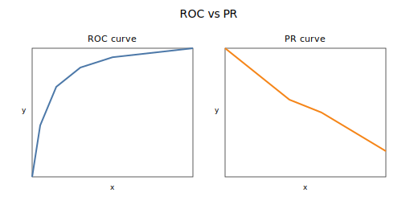

ROC-AUC と PR-AUC は、分類モデルの性能を「閾値に依存せず」比較するための代表的な指標。  
* Receiver Operating Characteristic - Area Under the Curve
* Precision-Recall - Area Under the Curve

### ROC-AUC

ROC 曲線は、偽陽性率（FPR: False Positive Rate）と真陽性率（TPR: True Positive Rate）の関係を描いた曲線である。AUC（Area Under the Curve）は曲線の下の面積で、「全てのしきい値で平均的にどれだけ良いか」を1つの数にまとめたもの。  

ROC-AUC では、0.5 はランダム、1.0 は完全一致を意味する。

* 良い点: 全体の識別性能を評価しやすい
* 注意点: クラス不均衡が強いと実感とズレることがある

### PR-AUC

PR 曲線は、再現率（Recall）と適合率（Precision）の関係を描いた曲線。PR-AUC は陽性クラスの識別に焦点を当てた指標で、不均衡データで有効。

* 良い点: 陽性の検出性能に敏感
* 注意点: クラス比率によって値の基準が変わる

### 使い分けの目安

* クラス不均衡が強い場合は PR-AUC を優先
* クラス比率が極端でない場合や全体識別を見るなら ROC-AUC
* 目的が「見逃し削減」なら PR-AUC や Recall に寄る

### ROC / PR 曲線の作り方

ROC/PR 曲線は、予測確率のしきい値を 0〜1 の範囲で動かし、そのたびに評価指標を計算して描く。ここでの予測確率とは、「陽性である確率」としてモデルが出力するスコアである。（多くは 0〜1）。

各しきい値で混同行列を作り、ROC は TPR/FPR、PR は Precision/Recall を求め、点を連続的につないだものが曲線になる。ここでの混同行列は、実際の正解と予測結果を組み合わせた 2×2 の集計表で、TP（True Positive）/FP（False Positive）/TN（True Negative）/FN（False Negative）の件数をまとめる。

### ROC / PR 曲線の読み方

* ROC は左上に寄るほど良い（FPR が低く、TPR が高い）
* PR は右上に寄るほど良い（Recall が高く、Precision も高い）
* 曲線全体の「平均的な良さ」を一つの数で比較したいときに AUC を使う
* 実運用でしきい値を固定するなら、そのしきい値に対応する点（Precision/Recall のバランス）を選ぶ必要がある

## Python での実例

ROC-AUC / PR-AUC を計算し、ROC 曲線と PR 曲線を並べて可視化する例。

```python
import matplotlib.pyplot as plt
from sklearn.metrics import (
    roc_auc_score,
    average_precision_score,
    roc_curve,
    precision_recall_curve,
)

roc = roc_auc_score(y_true, y_score)
pr = average_precision_score(y_true, y_score)
print("ROC-AUC:", roc)
print("PR-AUC:", pr)

fpr, tpr, _ = roc_curve(y_true, y_score)
precision, recall, _ = precision_recall_curve(y_true, y_score)

fig, axes = plt.subplots(1, 2, figsize=(8, 3))
axes[0].plot(fpr, tpr)
axes[0].set_title("ROC")
axes[0].set_xlabel("FPR")
axes[0].set_ylabel("TPR")
axes[1].plot(recall, precision)
axes[1].set_title("PR")
axes[1].set_xlabel("Recall")
axes[1].set_ylabel("Precision")
plt.tight_layout()
plt.show()
```

**Output:**



### 数学での使いどころ

* 二値分類の識別性能の要約
* 閾値を固定しない比較

### 機械学習での使いどころ

* 不均衡データのモデル比較
* 目的に応じた評価指標の選択

### 適さないケース

* コストが閾値に強く依存する場合（最適閾値の検討が必要）
* 多クラス分類では扱い方に注意（macro/micro の選択が必要）
