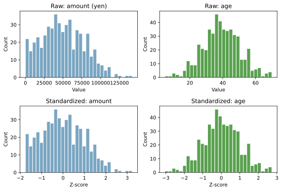
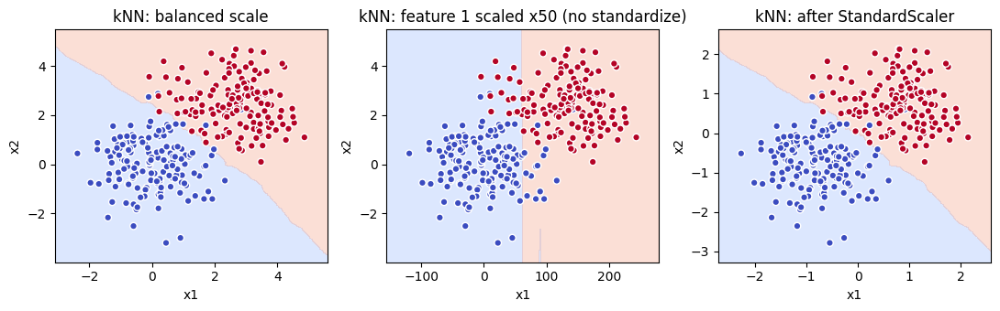
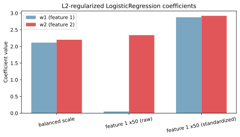
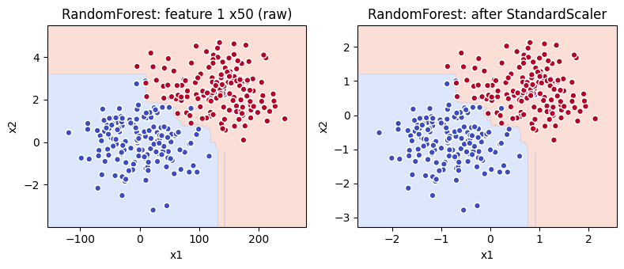

特徴量スケーリングは、複数の特徴量のスケール（値の取り得る範囲・分散）を揃える前処理である。代表は標準化（standardization, Z-score）と正規化（normalization, Min-Max）の 2 つで、scikit-learn ではそれぞれ `StandardScaler` と `MinMaxScaler` が対応する。

スケールを揃える理由は、特定のモデルでは特徴量のスケール差がそのまま学習結果を歪めるからである。例えば金額（数十万円）と年齢（〜100）を素のまま [kNN](../knn/) に入れると、金額の差が距離計算を支配して年齢が無視される、といったことが起きる。スケーリングが必要かどうかはモデル種別で決まり、判断基準を持っていれば「とりあえず標準化」のような迷いから解放されると考えられる。

結論を先に置くと、距離ベース・正則化系のモデルでは標準化が必須、木系のモデルでは不要、というのが基本の判断軸になる。理由は順を追って示す。

### 標準化と正規化の違い

両者は「スケールを揃える」点では同じだが、揃え方の基準が異なる。

- 標準化（standardization, Z-score）: `z = (x - mu) / sigma`。各特徴量の平均を 0、標準偏差を 1 に揃える。外れ値の影響を受けるが、外れ値を残したまま分布の形は保たれる
- 正規化（normalization, Min-Max）: `x' = (x - x_min) / (x_max - x_min)`。各特徴量を 0〜1 の範囲に押し込める。最大・最小の影響を強く受けるので、外れ値があると有用な範囲が圧縮される
- ロバストスケーリング（robust scaling）: 中央値と四分位範囲（[四分位点](../../math/quantile/)で計算）を使う。外れ値に強い

以下は同じデータに対して、生の値と標準化後の値をヒストグラムで並べた図である。金額（数十万円スケール）と年齢（〜100）はスケールが大きく違うが、標準化後は両方とも Z-score（平均 0・標準偏差 1）の同じ尺度に揃う。



スケーリングは「形を変える」のではなく「軸の単位を揃える」操作であることに注意したい。分布の歪み（[歪度](../../math/skewness/)）はスケーリングしても残るので、必要なら別途 `log1p` などの変換と組み合わせる。

---

### 標準化が必要なモデルと不要なモデル

スケーリングの必要性は、モデルが内部で「特徴量の値そのもの」を使うのか「順序だけ」を使うのかで決まる。判断軸として次の表を頭に入れておくと、新しいモデルに出会ったときも当てが効きやすくなる。

| モデル種別 | 標準化の必要性 | 理由 |
|---|---|---|
| 距離ベース（[kNN](../knn/), [k-means](../k-means/), SVM RBF カーネル） | 必須 | 距離計算でスケールの大きい特徴量が他を支配する |
| 正則化付き線形モデル（[LogisticRegression](../logistic-regression/) L1/L2, Ridge, Lasso） | 必須 | [正則化](../regularization/)項がスケールに依存し、本来重要な特徴量の係数が不当に縮められる |
| ニューラルネットワーク（勾配降下で学習するもの） | 推奨 | スケールの違いが勾配の方向を歪め、収束が遅くなる |
| 木系（決定木, [RandomForest](../random-forest/), [GradientBoosting](../gradient-boosting/)） | ほぼ不要 | 各分割は「特徴量 X が閾値 t 以下か」という順序ベースの判定で、値の絶対スケールに依存しない |
| 確率モデル（Naive Bayes） | 不要 | 各特徴量を独立に扱い、特徴量間の比較を行わない |

---

### kNN で起きること（距離ベース）

距離ベースモデルは、特徴量のスケール差をそのまま距離に変換してしまう。以下は同じデータに対する [kNN](../knn/) の決定境界で、左から「スケールがバランスしている場合」「特徴量 1 を 50 倍にして混ぜた場合（標準化なし）」「混ぜたものを標準化した場合」の 3 枚を並べた。



中央の図では、距離計算がほぼ「特徴量 1 の差」だけで決まるため、決定境界が x1 軸に対してほぼ垂直に走る。本来情報を持っているはずの特徴量 2 が事実上無視されている状態である。標準化後（右）は両方の特徴量が同じ尺度に並ぶので、決定境界が両軸の情報を使った形に戻る。

[k-means](../k-means/) も同様の理由でスケール差に弱い。クラスタ中心からの距離で振り分けるため、スケールの大きい特徴量の方向だけにクラスタが伸びるという不自然な結果を生む。

---

### LogisticRegression で起きること（正則化系）

[正則化](../regularization/)付きの線形モデルでは、係数 `w_i` の大きさが `||w||^2`（L2 の場合）でペナルティを受ける。同じ予測効果を出すために必要な係数の大きさはスケールに反比例するため、スケールの大きい特徴量は「同じ影響を出すのに小さい係数で済む」と判定され、スケールの小さい特徴量に大きな係数を当てると正則化で罰せられる、という非対称が生じる。

下の図は、同じデータと同じ `C=1.0`（L2 正則化）で [LogisticRegression](../logistic-regression/) を学習させたときの係数を 3 ケースで比較したもの。



中央の「feature 1 x50 (raw)」では、特徴量 1 のスケールが大きいため `w1` が極端に小さく押し下げられ、`w2` が相対的に大きくなる。標準化後（右）は両方の係数が同程度のスケールに収まり、特徴量の本来の影響度を反映するようになる。標準化なしのままだと「係数が大きい特徴量が重要」という解釈が成立しないので、係数解釈を行いたい場合は標準化が事実上必須と考えられる。

```python
from sklearn.preprocessing import StandardScaler
from sklearn.linear_model import LogisticRegression

# raw のスケール差をそのまま投入
LogisticRegression(C=1.0, max_iter=1000).fit(X_scaled_input, y)
# StandardScaler を挟んでから投入
LogisticRegression(C=1.0, max_iter=1000).fit(
    StandardScaler().fit_transform(X_scaled_input), y,
)
```

このコードはパイプライン化したくなる典型例で、`sklearn.pipeline.make_pipeline` で `StandardScaler` と `LogisticRegression` を結ぶのが通常の運用となる（後述）。

---

### RandomForest で起きないこと（木系）

[RandomForest](../random-forest/) のような木系モデルは、各ノードで「特徴量 X が閾値 t 以下か」という順序判定だけを行う。値が `1000` でも `0.001` でも、その特徴量内での順序が変わらなければ閾値が連動して動くだけで、分割結果は同じになる。

実際に同じデータで `RandomForest` を当てた場合の決定境界を、スケール変更前後で並べると次のようになる。



左右でほぼ同じ境界が描かれる（軸スケールの数字だけが違う）。5-fold [交差検証](../cross-validation/)で精度を見ると次のような数字になる。

```text
Accuracy by model and scaling:
  kNN balanced                      acc=0.970
  kNN raw x50                       acc=0.893
  kNN standardized                  acc=0.970
  RandomForest balanced             acc=0.957
  RandomForest raw x50              acc=0.957
  RandomForest standardized         acc=0.957
```

kNN は raw x50 で精度が 0.97 → 0.89 に落ち、標準化で 0.97 に戻る。RandomForest はどのケースでも 0.957 で完全に変わらない。「木系は標準化が不要」というのは経験則ではなく、アルゴリズムの構造から導かれる帰結だと言える。

---

## Python での実例

scikit-learn では `StandardScaler` を使うのが基本。注意点は「テストデータに `fit` してはいけない」「[交差検証](../cross-validation/)では fold ごとに fit し直す」の 2 点である。これらを安全に守るために `Pipeline` を使う。

```python
from sklearn.pipeline import make_pipeline
from sklearn.preprocessing import StandardScaler
from sklearn.linear_model import LogisticRegression
from sklearn.model_selection import cross_val_score

pipe = make_pipeline(
    StandardScaler(),
    LogisticRegression(max_iter=1000, class_weight="balanced"),
)
scores = cross_val_score(pipe, X, y, cv=5, scoring="roc_auc")
print("ROC-AUC:", scores.mean(), "+/-", scores.std())
```

Pipeline 化すると、CV の各 fold で訓練データだけに `fit` し、テスト fold には学習済みパラメータで `transform` だけが適用されるため、「テストデータの情報が標準化に漏れる」（[リーケージ](../data-leakage/)）を機械的に防げる。直接 `StandardScaler().fit_transform(X)` を全データに当てた後に分割すると、テストデータの平均・分散が訓練に混ざってしまい、評価が楽観的になる落とし穴がある。

---

### 数学での使いどころ

- 異なる単位・スケールの量を 1 つの尺度（Z-score）に揃える
- [相関係数](../../math/correlation/) は実は片方の量を標準化した上で内積を取った値（共分散をそれぞれの[標準偏差](../../math/stddev/)で割る）
- [主成分分析](../pca/)（PCA）は標準化した特徴量で実行するのが標準的で、スケールを揃えないと「スケールの大きい特徴量の方向」が第 1 主成分になってしまう
- 距離ベースの統計量（マハラノビス距離など）も内部で似た正規化を行っている

---

### 機械学習での使いどころ

- 距離ベースモデル（[kNN](../knn/), [k-means](../k-means/), SVM）の前処理として常用
- 正則化付き線形モデル（[LogisticRegression](../logistic-regression/), Ridge, Lasso）の係数解釈・学習安定化
- [主成分分析](../pca/)・[勾配ブースティング](../gradient-boosting/) の入力前処理（GBDT は分割ベースなので必須ではないが、特徴量に LR を組み合わせる場合は揃える）
- ニューラルネットワークの入力前処理（収束安定化）
- 異なる単位の特徴量を混ぜたモデル比較（金額・年齢・回数など）

具体的な利用例:

- 顧客分析: 年齢・年収・購買回数を混ぜた kNN レコメンドで、年収だけが効いてしまう問題を回避
- 医療データ: 血圧・体温・心拍数をスケーリングしてからロジスティック回帰で疾患予測
- 不正検知: 金額と取引頻度を混ぜた距離ベースの異常検知

---

### 適さないケース

- 木系モデル（[RandomForest](../random-forest/), [GradientBoosting](../gradient-boosting/), 決定木）: 標準化しても精度はほぼ変わらない。計算時間の無駄になる
- カテゴリ変数（One-Hot Encoding 済みの 0/1 列）: 既にスケールが揃っているので標準化は不要。やっても害は少ないが意味も薄い
- 外れ値が多くて Z-score が極端に偏る場合: 通常の `StandardScaler` ではなく `RobustScaler`（中央値と[四分位点](../../math/quantile/)を使う）の方が安定する
- 確率密度の推定・[カーネル密度推定](../../math/kde/) のように分布の形そのものを評価する場合: 標準化で形は保たれるが、軸の解釈が必要なら別途バックトランスフォームが要る
