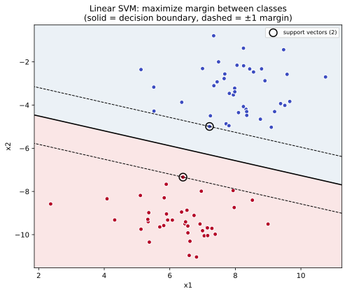
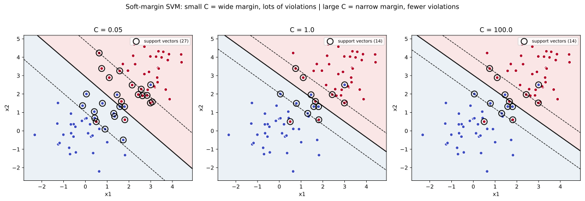
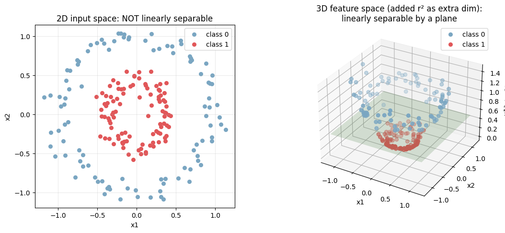
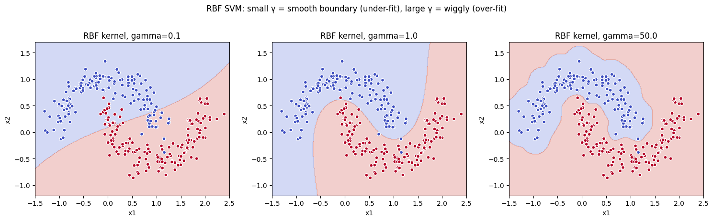

サポートベクターマシン（SVM, support vector machine）は、2 クラスのデータを「マージン（境界と最も近い点との距離）が最大になる超平面」で分離する分類器である。1990 年代から 2000 年代前半にかけて分類の標準アルゴリズムとして広く使われ、カーネルトリック（kernel trick）により非線形分離まで自然に拡張できる柔軟性を持つ。

現代の表データタスクでは [勾配ブースティング](../gradient-boosting/) に主役を譲ったが、(1) 中規模データでの高精度、(2) 数学的な美しさ（凸最適化）、(3) 「マージン最大化」という解釈しやすい設計思想、(4) テキスト分類など特徴量が極端に高次元なタスクでの強さ、によって今でも重要なアルゴリズムである。

### マージン最大化の発想

線形分離可能な 2 クラスデータでは、両者を分ける直線（超平面）が無限に引ける。SVM は「最も近い点との距離（マージン）が最大になる線」を選ぶ。直感的には「両クラスの間の安全圏が最も広い線」を引く操作である。

数式的には次の最適化問題になる（線形 SVM、ハードマージン）。

```text
min  (1/2) ||w||^2
s.t. y_i (w · x_i + b) ≥ 1   for all i
```

- `w`: 超平面の法線ベクトル
- `b`: 切片
- `y_i ∈ {-1, +1}`: クラスラベル
- 制約 `y_i (w · x_i + b) ≥ 1` は「全サンプルが正しい側にマージン 1 以上で分離される」

`||w||^2` を最小化するのは「マージン `1 / ||w||` を最大化する」のと等価で、これが SVM が「最大マージン分類器」と呼ばれる理由となる。最適解は「マージン上に乗っている少数の点（support vectors, サポートベクター）」だけで決まり、それ以外の点は捨てても結果が変わらない。

---

### 線形 SVM の決定境界とサポートベクター

可分なデータ（クラスタが離れている）に線形 SVM を当てると、マージンとサポートベクターが明示的に見える。

```python
from sklearn.datasets import make_blobs
from sklearn.svm import SVC
X, y = make_blobs(n_samples=80, centers=2, cluster_std=1.1, random_state=6)
model = SVC(kernel="linear", C=1.0).fit(X, y)
print(f"support vectors: {len(model.support_vectors_)} of {len(X)}")
# 描画は scripts 側を参照
plt.savefig("svm_linear_margin.svg", bbox_inches="tight")
```

出力:

```text
support vectors: 3 of 80
```



実線が決定境界 `w · x + b = 0`、その両側の破線がマージン境界 `±1` で、丸で囲った点がサポートベクターである。80 サンプルのうちわずか 3 点だけで境界が決まっており、これらを取り除くと境界が変わる。残りの 77 点をどう動かしても、`±1` の外にいる限り境界には影響しない。

「データの大部分は無視して、境界に近い少数の点だけで判定する」という発想は、kNN や決定木とは対照的で、SVM の性格をよく示している。

---

### ソフトマージン: C パラメータの意味

実データは完全に線形分離できないことの方が多い。ソフトマージン SVM は「マージンを超える点」「逆側に入る点」をある程度許容する。許容度を制御するのが正則化パラメータ `C` である。

`min (1/2) ||w||^2 + C Σ ξ_i`

`ξ_i ≥ 0` は各サンプルの「マージン違反量」で、`C` が大きいほど違反を強く罰する。

- `C` 小: 違反を許す → マージンが広い → 単純な境界（under-fit リスク）
- `C` 大: 違反を厳しく罰する → マージンが狭い → 訓練データに張り付く（over-fit リスク）

```python
for C in [0.05, 1.0, 100.0]:
    m = SVC(kernel="linear", C=C).fit(X, y)
    # 描画は scripts 側を参照
plt.savefig("svm_soft_margin_C.svg", bbox_inches="tight")
```



`C = 0.05` ではマージンが極端に広く、多くの点がマージン内に入り込んでも気にしていない。`C = 100` ではマージンが狭く、ほぼ全点がマージン外に押し出される（誤分類は減るが境界が動きやすい）。`C = 1` 付近が「ほどよいバランス」で、ハイパーパラメータ探索ではこの周辺を [交差検証](../cross-validation/) で詰めるのが定石となる。

`C` は [ロジスティック回帰](../logistic-regression/) や [線形回帰](../linear-regression/) の [正則化](../regularization/) 強さ `α` とは逆向きの解釈（`C` 大 = 正則化弱、`C` 小 = 正則化強）になる点に注意が必要である。

---

### カーネルトリック: 非線形を線形に変換する

線形 SVM では「同心円状に並んだ 2 クラス」のような非線形なデータを分離できない。カーネルトリック（kernel trick）は、データを暗黙的に高次元空間に射影することで線形分離可能にする手法である。

例として、2 次元のデータ `(x_1, x_2)` に「半径の二乗」`r^2 = x_1^2 + x_2^2` を 3 つ目の特徴量として加えると、内側クラスと外側クラスが「`z` 軸方向の高さ」で線形に分けられるようになる。

```python
from sklearn.datasets import make_circles
X_c, y_c = make_circles(n_samples=200, factor=0.4, noise=0.08, random_state=0)
z = X_c[:, 0] ** 2 + X_c[:, 1] ** 2
# 左: 2D 入力空間、右: 3D 特徴空間 (scripts 側)
plt.savefig("svm_kernel_trick.png", bbox_inches="tight")
```



左の 2D 散布図では円形のクラスタを直線で分けることはできないが、右の 3D 散布図では `z = x_1^2 + x_2^2` の高さで完全に分離可能になっている。緑の平面がその分離面である。

カーネルトリックの核心は「実際に高次元空間で座標を計算しなくても、内積だけ計算できれば SVM を解ける」点にある。よく使われるカーネル関数は次の通り。

| カーネル | 式 | 用途 |
|---|---|---|
| 線形 | `K(x, x') = x · x'` | 特徴量が既に良い、または高次元疎データ |
| 多項式 | `K(x, x') = (γ x · x' + r)^d` | 中程度の非線形性 |
| RBF（ガウス） | `K(x, x') = exp(-γ ||x - x'||^2)` | デフォルト候補、汎用的に強い |
| シグモイド | `K(x, x') = tanh(γ x · x' + r)` | ニューラルネット的 |

`scikit-learn` では `SVC(kernel="rbf", gamma=γ, C=C)` のように指定する。

---

### RBF カーネル: γ の効き方

RBF カーネルでは `γ`（ガンマ）パラメータが「1 サンプルの影響範囲」を決める。`γ` が小さいと各サンプルの影響範囲が広く（境界が滑らか）、大きいと影響範囲が狭く（境界が局所的）なる。

```python
from sklearn.datasets import make_moons
X_m, y_m = make_moons(n_samples=300, noise=0.15, random_state=0)
for gamma in [0.1, 1.0, 50.0]:
    SVC(kernel="rbf", gamma=gamma, C=1.0).fit(X_m, y_m)
plt.savefig("svm_rbf_gamma.png", bbox_inches="tight")
```



- γ=0.1: 境界が滑らかすぎて月の形を捉えきれない（under-fit）
- γ=1.0: 月の輪郭をうまく捉えている
- γ=50: 各点に張り付く形で過学習（境界が断片化）

`C` と `γ` は両方とも複雑度を上げる方向に効くため、2 次元グリッドで [交差検証](../cross-validation/) するのが標準。経験則として `gamma="scale"`（`1 / (n_features × var(X))`）から始め、`C ∈ {0.1, 1, 10, 100}`、`gamma ∈ {0.01, 0.1, 1, 10}` の範囲で探索するのが定石となる。

### 数学での使いどころ

- 凸二次計画法（QP）の応用: SVM の最適化は凸 QP で、大域最適解が一意に決まる
- カーネル法の代表例: RKHS（再生核ヒルベルト空間）の理論的基盤
- マージン理論: 統計的学習理論で汎化誤差の上限を導く（VC 次元、Rademacher 複雑度）
- 双対問題: 主問題と双対問題の対応（KKT 条件）
- ヒンジ損失: `max(0, 1 - y · ŷ)` の最小化が SVM の損失と等価

---

### 機械学習での使いどころ

- 中規模データの分類: 数千 〜 数万サンプルで強い性能を出す
- 高次元疎データ: テキスト分類、文書分類（線形 SVM が定番）
- 画像分類のベースライン: 深層学習以前は SVM + HOG / SIFT が標準
- 異常検知: One-class SVM で「正常データ範囲」を学習し、外れる点を異常と判定
- 構造化予測: structured SVM で系列ラベリング・木構造予測
- バイオインフォマティクス: タンパク質分類、遺伝子発現データの解析
- カーネル PCA: SVM の双子的手法として非線形次元削減
- SVR（Support Vector Regression）: SVM の回帰版で、ε-許容範囲内の誤差は無視する損失を使う

実装上は `sklearn.svm.SVC` / `SVR` がベース。大規模データ（数十万サンプル以上）では訓練時間が `O(n^2)` 〜 `O(n^3)` に膨らむため、`LinearSVC`（線形限定、Liblinear ベース）か `SGDClassifier(loss="hinge")` を使うのが現実的となる。

---

### 適さないケース / 落とし穴

- 大規模データ（n > 10 万）: 訓練時間が爆発する。線形 SVM か別のアルゴリズム（[勾配ブースティング](../gradient-boosting/)、ニューラルネット）を使う
- 確率出力が必要: SVM の決定関数は確率ではない。`probability=True` で Platt scaling を当てられるが、追加コストが大きい。確率が要るなら [ロジスティック回帰](../logistic-regression/) の方が素直（校正の詳細は [確率の校正](../probability-calibration/) 参照）
- 特徴量のスケールが不揃い: RBF カーネルが歪む。[標準化](../standardization/) を必ず先に挟む
- ハイパーパラメータの探索コスト: `C` と `γ` の 2 次元グリッドが必要で、データが大きいと現実的でない
- カテゴリ変数を整数のまま: 順序を仮定してしまう。[ダミー化](../categorical-encoding/) を経由
- 多クラス分類で素朴に使う: SVM は本来 2 クラス用。`one-vs-rest` か `one-vs-one` で多クラス化されるが、クラス数 K に対して `K(K-1)/2` 個の SVM を訓練する `one-vs-one` は計算量が増える
- 解釈性が必要: カーネル SVM の決定関数は「サポートベクターとの距離の重み付き和」で、特徴量レベルの寄与を直接読むのが難しい。[決定木](../decision-tree/) や [線形回帰](../linear-regression/) の方が説明しやすい
- 不均衡データ: マージン最大化が多数派クラスに引きずられる。`class_weight="balanced"` か別のリサンプリング手法（[クラス不均衡](../class-imbalance/)）が必要
