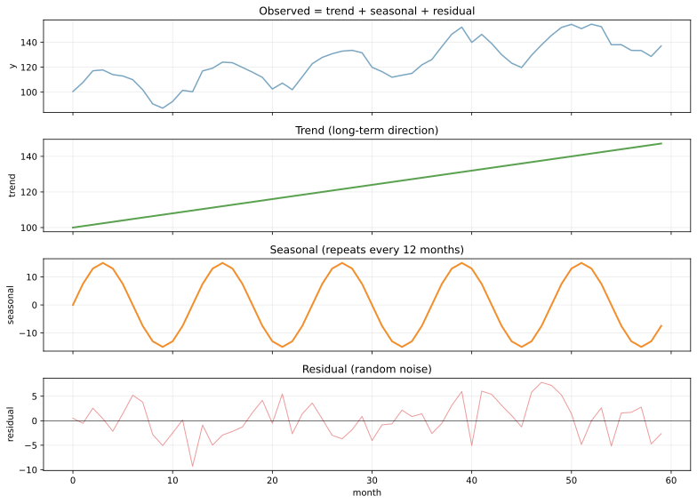
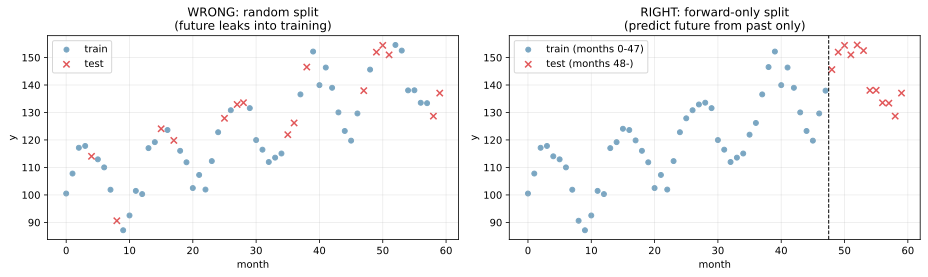
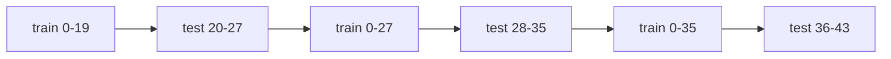
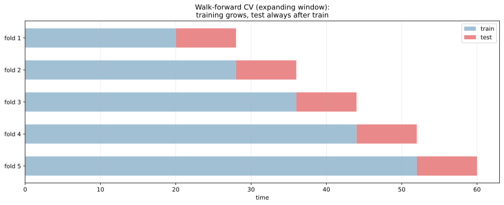
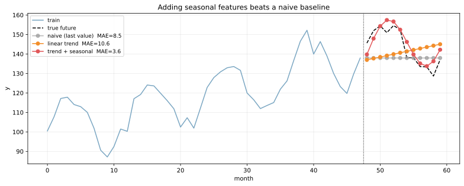

時系列予測（time series forecasting）は、「過去の観測値から未来の値を予測する」教師あり学習の一系統である。需要予測、株価、気温、サーバー負荷、医療モニタリングなど、ビジネスでも研究でも頻出する。

通常の教師あり学習（[線形回帰](../linear-regression/)、[勾配ブースティング](../gradient-boosting/)）と異なる点は、(1) サンプル間に時間的順序があり独立でない、(2) 評価は「未来データで」行う必要がある、(3) トレンド・季節性・自己相関という特有の構造を持つ、の 3 点。これを無視して通常の CV を当てると、未来情報がリークして本番性能が崩れる。

### 時系列の 3 つの成分

多くの時系列は次のように分解できる。

```text
y_t = trend(t) + seasonal(t) + residual(t)
```

- trend: 長期的な傾向（上昇・下降）
- seasonal: 周期的な変動（日次・週次・月次・年次）
- residual: 上 2 つで説明できないランダムな変動

```python
import numpy as np
import matplotlib.pyplot as plt

t = np.arange(60)  # 月次データ 5 年分
trend = 100 + 0.8 * t
seasonal = 15 * np.sin(2 * np.pi * t / 12)
noise = np.random.default_rng(0).normal(0, 4, 60)
y = trend + seasonal + noise
plt.savefig("ts_decomposition.svg", bbox_inches="tight")
```



上から「観測値」「トレンド」「季節性」「残差」。3 成分を抜き出すことで、それぞれを別の手法で予測する戦略が取れる。代表ライブラリは `statsmodels.tsa.seasonal_decompose`、Facebook Prophet（自動分解 + 予測）など。

---

### 時系列の train/test 分割: forward-only

最も基本的で最もよく忘れられるルール: **時系列は時間順に分割する**。

```python
# 詳細は scripts 側を参照
plt.savefig("ts_train_test_split.svg", bbox_inches="tight")
```



左は通常の機械学習でやる「ランダム分割」。時系列でこれを当てると、未来の test サンプルが train に混じり、`月 40 と月 60 の値から月 50 を予測する` 状況になる。本番では未来は分からないので、test 評価が本番性能と大きく乖離する（[data leakage](../data-leakage/) の典型）。

右の「forward-only split」では `t < cutoff` を訓練、`t ≥ cutoff` をテストとし、訓練データに未来が混じらないことを保証する。実装は `sklearn.model_selection.TimeSeriesSplit` で扱える。

---

### Walk-forward / Expanding-window CV

単一の train/test 分割では、特定の時期の精度しか測れない。複数の時点で評価したい場合は walk-forward CV（または expanding window CV）を使う。



各 fold で訓練データが拡張されながら、test は常に train の後ろに来る。



scikit-learn の `TimeSeriesSplit(n_splits=5)` でこのパターンが作れる。`gap=N` で「予測のリードタイム」（train と test の間に N サンプル空ける）も指定できる。

ローリングウィンドウ CV（古い train を捨てる）と expanding window CV（古い train も残す）の使い分け:

- ローリング: 過去のデータがあまり役立たない（ドメインが時間とともに大きく変わる）
- expanding: 過去のデータも一定の信号を持つ

---

### 3 つのアプローチ比較

時系列予測のアプローチは大きく 3 系統。

| アプローチ | 代表手法 | 強み | 弱み |
|---|---|---|---|
| 統計モデル | ARIMA、SARIMA、ETS | 解釈可能、少データで動く | 非線形・複数特徴量に弱い |
| ML 回帰 | [線形回帰](../linear-regression/)、[勾配ブースティング](../gradient-boosting/) | 多特徴量、非線形を扱える | 自己相関の扱いが手作業 |
| 深層学習 | RNN、LSTM、Transformer | 長期依存、複雑なパターン | データ大量 + チューニング重い |

```python
# 同じデータに「ナイーブ予測」「線形トレンド」「線形+季節」の 3 つを当てて比較
from sklearn.linear_model import LinearRegression

# 線形トレンドのみ
lr = LinearRegression().fit(t_train.reshape(-1, 1), y_train)
# トレンド + 季節 (sin, cos 特徴量)
features = np.column_stack([t_train, np.sin(2*np.pi*t_train/12),
                              np.cos(2*np.pi*t_train/12)])
season_lr = LinearRegression().fit(features, y_train)
plt.savefig("ts_forecast_compare.svg", bbox_inches="tight")
```



- naive (灰色): 最後の値をそのまま予測。MAE 9.5
- linear trend (橙): トレンドだけ拾うが季節性を取りこぼす。MAE 11.2
- trend + seasonal (赤): 真の構造を捉える。MAE 4.8

「特徴量に時刻情報をどう入れるか」で同じ線形回帰でも性能が大きく変わる、という典型例。月インデックスを `sin / cos` 変換するのは「lag features」と並んで時系列特化の特徴量エンジニアリングの定番テクニック。

---

### 時系列特化の特徴量エンジニアリング

ML 回帰アプローチで時系列を扱うとき、次の特徴量を作るのが定石。

| 特徴量 | 例 | 目的 |
|---|---|---|
| Lag features | `y_{t-1}, y_{t-7}, y_{t-30}` | 自己相関を取り込む |
| Rolling window | `mean(y_{t-7..t})`、`std(y_{t-7..t})` | 直近の動向 |
| 日付特徴量 | 曜日、月、四半期、祝日フラグ | カレンダー効果 |
| Cyclical encoding | `sin(2π·month/12)`、`cos(2π·month/12)` | 周期性を連続的に表現 |
| External regressors | 気温、イベント、競合価格 | 外生要因の取り込み |

これらを作ってから [勾配ブースティング](../gradient-boosting/) （LightGBM、XGBoost）に突っ込むのが、Kaggle 時系列コンペでも実務でも定番の組み合わせとなる。

### 代表的なアルゴリズム

- ARIMA / SARIMA: 自己回帰 + 移動平均 + 季節成分。古典統計の代表
- ETS (Exponential Smoothing): 指数平滑法、Holt-Winters
- Prophet: Facebook 製、トレンド + 季節 + 祝日効果を自動分解
- DeepAR / N-BEATS / Temporal Fusion Transformer: 深層学習ベース
- LightGBM / XGBoost + lag features: 表データ系の万能解

短期予測 (1〜数ステップ先) と長期予測（数十〜数百ステップ先）で適する手法が違う。短期は ARIMA や ML 回帰で十分、長期は Prophet や深層学習が候補。

### 数学での使いどころ

- 自己相関関数（ACF）、偏自己相関関数（PACF）
- 定常性（stationarity）の検定: ADF 検定、KPSS 検定（[hypothesis-test](../../math/hypothesis-test/) 参照）
- フーリエ分解で周期成分を抽出
- 状態空間モデル: Kalman filter、HMM
- 確率過程: マルコフ性、ランダムウォーク、ブラウン運動
- 時系列の共和分（cointegration）

---

### 機械学習での使いどころ

- 需要予測: 小売、在庫管理、容量計画
- 金融: 株価、為替、ボラティリティ予測
- エネルギー: 電力需要、再生可能エネルギーの出力
- 気象: 天気予報、災害予測
- ヘルスケア: 患者バイタル、疫学
- IoT / センサーデータ: 機器の異常検知、故障予測
- サーバー監視: トラフィック予測、自動スケーリング
- マーケティング: 広告効果、キャンペーン後の追跡
- ウェブログ解析: クリック数、コンバージョン率
- A/B test の結果集計（時間効果の補正）

ツール選び:

- 統計モデル: `statsmodels.tsa`、`prophet`
- ML 系: scikit-learn + lag features、LightGBM、XGBoost
- 深層: PyTorch Forecasting、Darts、GluonTS
- AutoML: `pycaret.time_series`、Amazon Forecast

---

### 適さないケース / 落とし穴

- 通常のランダム CV を時系列に当てる: 未来がリークして評価が膨らむ。`TimeSeriesSplit` を使う
- 訓練データに過去の情報しか含めない: トレンドや季節性を捉えるなら最低 2〜3 周期分は必要
- 標準化を全データでやる: テストデータの統計が訓練に漏れる。fold ごとに統計を計算
- 定常性を確認しない: ARIMA は定常性を仮定する。`d` 階差分でトレンドを除去
- 「単に予測精度を上げたい」で深層学習に飛びつく: 線形 + lag features で十分な場合が多い
- 外挿の限界: 過去に観測されていない値域（極端な気温、未経験の需要）は予測精度が著しく落ちる
- 周期境界をまたいだ評価: 1 月 → 12 月の予測は周期性で破綻しやすい。日付特徴量で対処
- 多変量時系列の特徴量設計: 各変数の lag を全部入れると次元爆発（[次元の呪い](../curse-of-dimensionality/)）
- 「予測の信頼区間」を出さない: 点予測だけだと意思決定に使えない。Prophet / DeepAR / quantile loss で確率予測を
- 異常値の処理を忘れる: 単発の外れ値が長期的な予測に影響を残す。先に [異常検知](../anomaly-detection/) で除去
- 階層構造を無視: 「全国合計」と「店舗ごと」の予測の整合性。Hierarchical Forecasting で対処
- 予測対象が現在ある: 「12 月 31 日 0 時時点で 1 月の予測」を出すべきところ「1 月の確定値」を予測ターゲットに使う、というラベルリーク
- 評価指標の選択: 業務上のコストに合った指標を選ぶ。MAPE は 0 近傍で不安定、 SMAPE は対称、MASE は時系列特化
- データ更新が遅延する: 本番の予測時に「最新データ」が手に入らないと、訓練時の特徴量を再現できない
