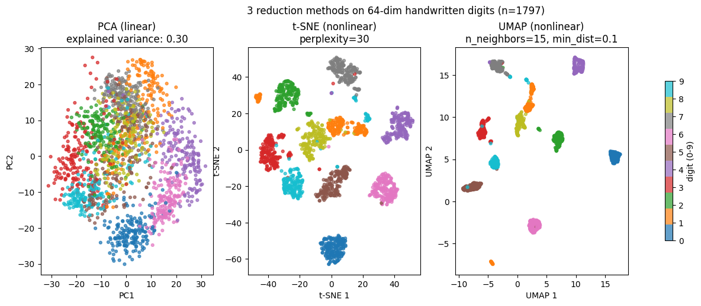
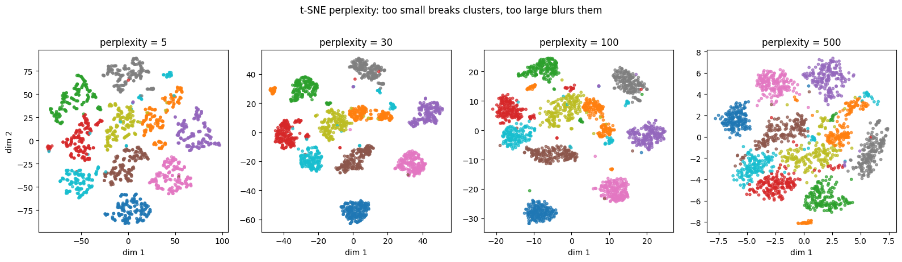
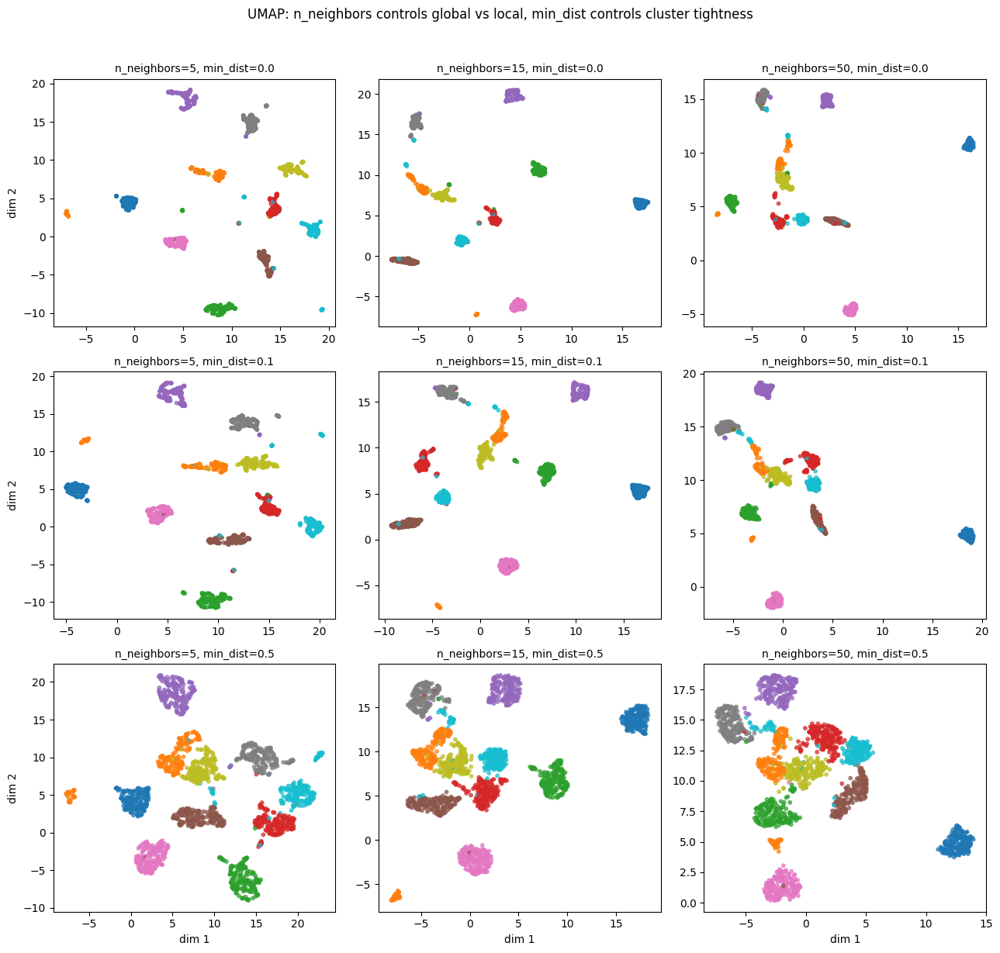
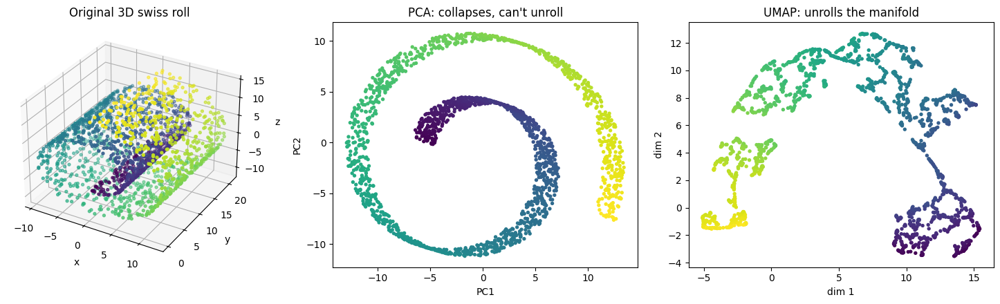

t-SNE（t-distributed Stochastic Neighbor Embedding）と UMAP（Uniform Manifold Approximation and Projection）は、高次元データを 2 〜 3 次元に圧縮して可視化するための非線形次元削減アルゴリズムである。[PCA](../pca/) が線形変換に限定されるのに対し、t-SNE / UMAP は曲がった多様体（manifold）構造を保ったまま低次元化できる。

主な用途は「可視化」で、本格的な機械学習の前処理に使うことは少ない。MNIST のような高次元画像、文書埋め込み、遺伝子発現データ、ニューラルネットの中間層 activations などを 2D 散布図にして、クラスタや構造を目で確認するのに使う。

### PCA との対比

同じ手書き数字データに 3 つの手法を当ててみる。

```python
from sklearn.datasets import load_digits
from sklearn.decomposition import PCA
from sklearn.manifold import TSNE
import umap

digits = load_digits()
X, y = digits.data, digits.target  # 64 次元

X_pca = PCA(n_components=2, random_state=0).fit_transform(X)
X_tsne = TSNE(n_components=2, perplexity=30, random_state=0).fit_transform(X)
X_umap = umap.UMAP(n_components=2, n_neighbors=15, min_dist=0.1, random_state=0).fit_transform(X)
plt.savefig("tsne_umap_compare.png", bbox_inches="tight")
```



- PCA（左）: 数字によって雲がやや分かれるが、相互に重なる。線形射影なので「直交した変換」しかできない
- t-SNE（中央）: 数字ごとに明確に分かれた島ができる。形は自由
- UMAP（右）: t-SNE と同程度のクラスタ分離。t-SNE より大局的な構造（クラスタ同士の距離）も保たれやすい

「分類しやすそうに見えるか」「クラスタが明瞭か」を目視で判断する用途には、PCA より圧倒的に t-SNE / UMAP が強い。

---

### t-SNE: 近傍構造を保つ

t-SNE は「高次元での点間の近さ」を「低次元での点間の近さ」として保とうとするアルゴリズム。

1. 高次元で各点 `x_i` の近傍に対し条件付き確率 `p_{j|i}`（`x_i` の隣に `x_j` が来る確率）を計算
2. 低次元の埋め込み `y_i` に対しても同様の確率 `q_{j|i}` を計算
3. 高次元と低次元の確率分布の [KL ダイバージェンス](../../math/information-theory/) を最小化するように `y_i` を勾配降下で更新

最大のハイパーパラメータは perplexity で、「各点が見る近傍の数」を制御する。

```python
for perp in [5, 30, 100, 500]:
    tsne = TSNE(perplexity=perp).fit_transform(X)
plt.savefig("tsne_perplexity_sensitivity.png", bbox_inches="tight")
```



- perplexity = 5: 局所的すぎる。各クラスタが微細に断片化
- perplexity = 30: バランスが良い。デフォルト推奨
- perplexity = 100: 大局的すぎる。クラスタ境界が曖昧
- perplexity = 500: ほぼ意味を失う。クラスタが融解

公式推奨は 5〜50 の範囲で `5, 30, 50` などを試す。データセットサイズ `n` に対して `perplexity < n/3` を目安に。

---

### UMAP: 高速 + 大局構造保存

UMAP は数学的にはトポロジカルデータ解析の理論に基づく手法で、t-SNE と同等の可視化性能を持ちつつ、

- 計算が速い（t-SNE の数倍）
- 新しいデータの埋め込みもできる（`umap.transform()` で）
- 大局的な構造もある程度保たれる
- 次元削減の出力次元を 3 以上にしてもまともに動く

という実用上の利点がある。主要ハイパーパラメータは `n_neighbors`（局所 vs 大局）と `min_dist`（クラスタの密度）。

```python
for n_neighbors in [5, 15, 50]:
    for min_dist in [0.0, 0.1, 0.5]:
        u = umap.UMAP(n_neighbors=n_neighbors, min_dist=min_dist).fit_transform(X)
plt.savefig("umap_param_grid.png", bbox_inches="tight")
```



- `n_neighbors` を小さく: 局所構造重視（クラスタが細かく断片化）
- `n_neighbors` を大きく: 大局構造重視（クラスタ間の関係も保たれる）
- `min_dist` を小さく: クラスタが密にまとまる
- `min_dist` を大きく: クラスタがふんわり広がる

実用デフォルトは `n_neighbors=15, min_dist=0.1`。EDA で複数試して目視判断するのが現実的。

---

### 非線形性が効く例: Swiss Roll

3D の Swiss Roll を 2D に展開できるかで PCA と UMAP の違いが見える。

```python
from sklearn.datasets import make_swiss_roll
X_sr, color = make_swiss_roll(n_samples=2000, random_state=0)
X_pca = PCA(n_components=2).fit_transform(X_sr)
X_umap = umap.UMAP(n_neighbors=15).fit_transform(X_sr)
plt.savefig("tsne_umap_swissroll.png", bbox_inches="tight")
```



PCA は線形射影しかできないので Swiss Roll を「上から見下ろす」だけで、巻かれた構造が潰れる。UMAP は manifold を「ほぐして」展開し、巻かれていた螺旋を直線的に並べる。

「データが本質的に低次元の manifold 上に乗っている」場合、非線形手法は劇的に効く。深層学習で抽出した embedding（512〜2048 次元）の可視化も同様で、`PCA → 直接 plot` より `PCA で 50 次元程度 → UMAP で 2 次元` というパイプラインが定番。

---

### 落とし穴の中核: 距離の意味

t-SNE / UMAP の最大の注意点: **クラスタ間の距離は意味を持たない**。

- 2 つのクラスタが近くにある = 元データでも近い、とは限らない
- クラスタの大きさ（広がり）も意味を持たない
- 軸の絶対値も意味を持たない

「埋め込み上で見える距離」は元データの距離と直接対応しない、というのは t-SNE / UMAP のアルゴリズム上の性質（局所構造優先）から来る。「同じクラスタに属する点同士は近い」は信用できるが、「異なるクラスタの距離」は信用できないと考えるのが安全。

UMAP は t-SNE よりは大局構造を保つが、それでも「距離の絶対値」を信頼するレベルではない。距離の比較が本当に必要なら PCA や MDS（Multidimensional Scaling）を使う。

### 数学での使いどころ

- KL ダイバージェンス最小化 ([情報理論](../../math/information-theory/) との接続)
- t 分布の重い裾（self-crowding 問題への対処）
- 多様体仮説: データは低次元 manifold 上に乗っている
- グラフ理論: UMAP の単体的複体（simplicial complex）
- 最適化の局所解: 初期値依存性が強い

---

### 機械学習での使いどころ

- 高次元データの探索的可視化（EDA）
- 深層学習の中間層 activations の可視化（学習の進捗確認）
- 文書 embedding（Word2Vec, BERT）のトピック可視化
- 遺伝子発現データの細胞型同定（single-cell RNA-seq）
- 画像 embedding の類似性可視化
- クラスタリング前の事前変換（高次元 → 50 次元 PCA → 2 次元 UMAP）
- 不正検知の前段として「異常クラスタの抽出」
- レコメンドのユーザー / アイテム埋め込み可視化
- LLM の hidden state の可視化（layer-wise 分析）
- 強化学習の state representation の理解

実装は scikit-learn の `manifold.TSNE`、`umap-learn`（pip install umap-learn）。大規模データ向けに `openTSNE`（並列・高速）、`pacmap`（さらに高速）もある。

---

### 適さないケース / 落とし穴

- 距離を信用する: クラスタ間距離は信頼できない
- 軸の値を解釈: `t-SNE 1` や `UMAP 1` 軸は数学的に意味を持たない
- 教師あり学習の特徴量として使う: 結果が初期値依存 + 新規データの transform が（t-SNE では）できない。それなら PCA を使う
- 巨大なデータでそのまま実行: t-SNE は `O(n²)` で破綻。UMAP の方が大規模に強い
- スケールが揃わない: 標準化を必ず先に
- perplexity を 1 つの値だけで判断: 複数試して安定性を確認
- random_state を固定しない: 結果が再現できない
- ハイパラチューニングを「教師あり指標」で: 教師なし手法なので外部の正解との一致度で評価できない（できても意味が limited）
- クラスタ数を t-SNE から読む: 視覚的なクラスタは絶対視できない。kMeans / DBSCAN で別途検証
- 「視覚的にきれい = 良い結果」と判断: チューニングで何でも見栄え良くなる。元の構造を反映しているかは別問題
- 3 次元以上に t-SNE: 計算重く、可視化の利点が消える。`UMAP(n_components=k)` で代用
- t-SNE / UMAP の埋め込みで予測モデルを学習: 上で書いた通り原則 NG
