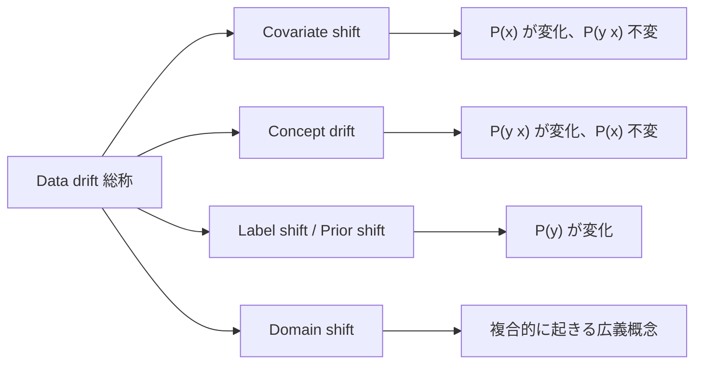
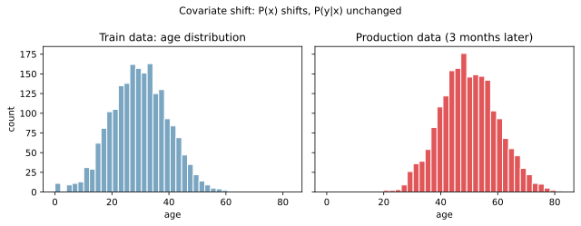
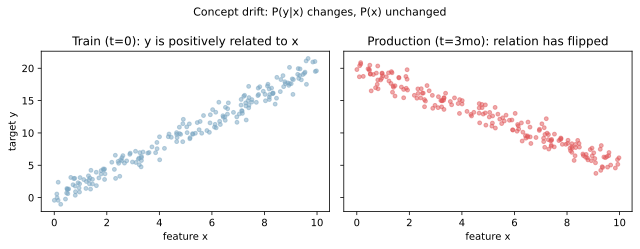
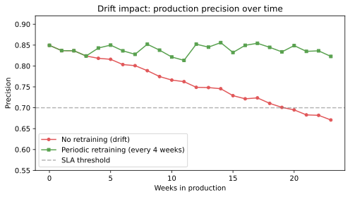

データドリフト（data drift）は、本番運用しているモデルが時間の経過とともに精度を落としていく現象の総称である。学習時には観測できなかった「入力データや入力と出力の関係の変化」が本番で起きるため、コードもモデルも変えていないのに性能が劣化する。

[過学習](../../ml/overfitting/) や [データリーク](../../ml/data-leakage/) が学習時の不具合であるのに対し、ドリフトは運用後にしか起きない。MLOps（機械学習の運用工学）の中心課題のひとつで、検知と再学習の仕組みを最初から設計に織り込む必要があると言える。

### 4 種類のドリフトに分解できる

ドリフトは「何が変化したか」で 4 種類に分かれる。それぞれ対処の打ち手が違うため、まずどれが起きているかを切り分けることが出発点になる。



確率分布の言葉で書くと整理しやすい。`P(x)` は入力分布、`P(y|x)` は入力が与えられたときの目的変数の条件付き分布、`P(y)` は目的変数の周辺分布である。どれが動いたかで呼び名と対処が変わる。

---

### Covariate shift（共変量シフト）

入力分布 `P(x)` が変わるが、入力と出力の関係 `P(y|x)` は変わらないパターン。例として、訓練データのユーザー年齢分布が若年中心だったが、サービスの認知が広がって本番では年配層が増えた、といったケースが該当する。

```python
import matplotlib.pyplot as plt
import numpy as np

rng = np.random.default_rng(0)
train_x = rng.normal(loc=30, scale=10, size=2000).clip(0, 100)
prod_x = rng.normal(loc=50, scale=10, size=2000).clip(0, 100)

fig, axes = plt.subplots(1, 2, figsize=(9, 3.5), sharex=True, sharey=True)
axes[0].hist(train_x, bins=30, color="#7aa6c2", edgecolor="white")
axes[0].set_title("Train data: age distribution")
axes[0].set_xlabel("age"); axes[0].set_ylabel("count")
axes[1].hist(prod_x, bins=30, color="#e15759", edgecolor="white")
axes[1].set_title("Production data (3 months later)")
axes[1].set_xlabel("age")
fig.suptitle("Covariate shift: P(x) shifts, P(y|x) unchanged")
plt.tight_layout()
plt.savefig("data-drift_covariate.svg", bbox_inches="tight")
```



入力の統計量（平均・分散）を訓練時と本番でモニタリングすれば検知できることが多い。検出方法としては Kolmogorov-Smirnov 検定（連続値の分布が同じかを判定する統計検定）や PSI（Population Stability Index, ビン分けした確率分布の差分指標）が定石である。

---

### Concept drift（概念ドリフト）

入力分布 `P(x)` は変わっていないが、入力と出力の関係 `P(y|x)` が変わるパターン。同じユーザー特徴量を入力しても、出るべき正解ラベルが変わってしまう。

```python
x_common = rng.uniform(0, 10, 200)
y_t0 = 2.0 * x_common + rng.normal(0, 1, 200)
y_t1 = -1.5 * x_common + 20 + rng.normal(0, 1, 200)

fig, axes = plt.subplots(1, 2, figsize=(9, 3.5), sharex=True, sharey=True)
axes[0].scatter(x_common, y_t0, alpha=0.5, color="#7aa6c2", s=15)
axes[0].set_title("Train (t=0): y is positively related to x")
axes[0].set_xlabel("feature x"); axes[0].set_ylabel("target y")
axes[1].scatter(x_common, y_t1, alpha=0.5, color="#e15759", s=15)
axes[1].set_title("Production (t=3mo): relation has flipped")
axes[1].set_xlabel("feature x")
fig.suptitle("Concept drift: P(y|x) changes, P(x) unchanged")
plt.tight_layout()
plt.savefig("data-drift_concept.svg", bbox_inches="tight")
```



ユーザー行動の変化（流行・季節性・社会変化）、競合サービスの動き、業界規制の変更などが原因になりやすい。レコメンドモデルで「以前は同ジャンル過去購入が強いシグナルだったが、最近は価格帯が効くようになった」といったケースは典型的な concept drift である。

入力の統計量だけ見ても検知できないのが厄介と言える。検知には予測精度そのものを本番で監視する必要があり、ground truth（正解ラベル）が遅れて入手できる場合は遅延評価ダッシュボードの整備が必須となる。

---

### Label shift（ラベルシフト / Prior shift）

目的変数の周辺分布 `P(y)` が変わるパターン。例として、不正取引検知モデルで「不正の発生率が当初 1% だったが、攻撃キャンペーンの影響で 5% に上昇した」場合、入力分布も入出力関係も変わっていないのに、陽性比率（プリオール）の変化だけでモデルの確率出力の校正がずれる。

検知は単純で、本番での陽性比率を継続的に計測すれば良い。対処も比較的軽く、確率出力の事後校正（Platt scaling や isotonic regression の再フィット）で済むことが多い。再学習までは不要なケースが多いと言える。

---

### Domain shift（ドメインシフト）

`P(x)` `P(y|x)` `P(y)` のいずれか、または複数が同時に変化する広義の概念。「訓練データを取った環境と本番の環境が違う」全般を指す。先述の 3 種が単独で起きることは少なく、現実には複合的に進行する。

切り分けは「先に統計検定で `P(x)` を確認」「次に予測精度と陽性比率を確認」「最後にラベルとの関係を確認」の順で進めるのが効率的である。

---

### 検知する方法

ドリフト検知は、変化を測る対象別に手段が分かれる。

- 入力分布の変化（covariate shift）
    - 連続値: Kolmogorov-Smirnov 検定 (KS test) の p 値を継続監視
    - カテゴリ: chi-square 検定、PSI（Population Stability Index）
    - 高次元: PCA で次元削減してから 2 次元空間でドリフト可視化
- 入出力関係の変化（concept drift）
    - 本番予測精度を継続監視。ground truth が後から入る場合は遅延 N 日後に評価
    - 予測分布の変化（モデルが出す `predict_proba` の平均値の推移）も間接シグナル
- ラベル分布の変化（label shift）
    - 本番での陽性比率の時系列を見る
    - 比率が訓練時から離れたら確率校正の再フィット
- 総合
    - 入力・予測・正解の 3 つを同じダッシュボードに並べて、どの軸で動いたかを目視で切り分ける

evidently / nannyml / Fiddler / Arize といったオープンソース・SaaS ツールが、上記の検定と可視化をまとめて提供している。自前で構築せずツール導入で済ませる選択肢もある。

---

### 対処: 再学習と新陳代謝

検知だけでは精度は戻らない。実際の対処は次のようなパターンに分かれる。

1. 定期再学習
    - 週次・月次など固定スケジュールで最新データを使って再学習
    - パイプライン化が前提（学習ジョブ・評価・デプロイの自動化）
2. しきい値起動の再学習
    - 検知メトリクス（KS test の p 値、precision の低下幅など）がしきい値を割ったら自動で再学習をトリガー
    - 再学習がコスト高のときに有効
3. データの新陳代謝
    - sliding window（直近 N 日分だけ）で学習データを切り替える
    - 時間減衰重み（古いサンプルほど重みを下げる）で学習する
4. オンライン学習
    - 1 サンプルずつ逐次的にモデルを更新する手法（SGDClassifier の `partial_fit` など）
    - 連続的に変化するデータには有効だが、暴走リスクの管理が必要
5. アンサンブル切り替え
    - 複数モデル（古いモデル・新しいモデル）を運用し、状況に応じてゲートで重みを切り替える
    - A/B テストで段階的に新モデルに切り替える運用と相性が良い

```python
weeks = np.arange(0, 24)
baseline = 0.85 - 0.008 * weeks + rng.normal(0, 0.005, len(weeks))

retrained = baseline.copy()
for w in [4, 8, 12, 16, 20]:
    delta = 0.85 - retrained[w]
    retrained[w:] = retrained[w:] + delta + rng.normal(0, 0.003,
                                                       size=len(retrained) - w)

fig, ax = plt.subplots(figsize=(7, 4))
ax.plot(weeks, baseline, color="#e15759", marker="o", markersize=4,
        label="No retraining (drift)")
ax.plot(weeks, retrained, color="#59a14f", marker="s", markersize=4,
        label="Periodic retraining (every 4 weeks)")
ax.axhline(0.70, color="gray", linestyle="--", alpha=0.6,
           label="SLA threshold")
ax.set_xlabel("Weeks in production"); ax.set_ylabel("Precision")
ax.set_title("Drift impact: production precision over time")
ax.set_ylim(0.55, 0.92); ax.legend()
plt.tight_layout()
plt.savefig("data-drift_decay.svg", bbox_inches="tight")
```



定期再学習で SLA（Service Level Agreement, ここでは「精度 0.70 を割らない」という運用上の約束）を守る運用パターンを示している。再学習周期の決め方は「ドリフトの速さ × ビジネス許容度」で決まると考えられる。

---

### 機械学習での使いどころ

ドリフト概念は、モデル単体ではなく「運用パイプラインを設計するとき」に効いてくる。

- 監視ダッシュボード設計: 入力統計・予測分布・正解精度の 3 段を並べる
- 再学習スケジュール設計: ドリフトの速さに応じて週次・月次・しきい値起動を選ぶ
- データセット更新ポリシー: sliding window の幅、減衰重みの設計
- A/B テスト運用: 新旧モデルの並走で安全に切り替える
- データ収集: 本番で ground truth が後から入手できる仕組み（クリック・購入・問い合わせなど）の設計
- 校正の再フィット: 確率出力を使う場面では label shift だけ起きていないか別途確認する

一般に、デプロイがゴールではなく「劣化に気づける状態」を作ることがモデルを本番で使い続ける前提条件と考えられる。コードもモデルも変えていないのに精度が下がる現象がある、と知っているだけで運用後の混乱を減らせる。

ここで使った図をまとめて生成するスクリプトは `projects/ml/scripts/notes/data-drift_gen.py` にあり、`cd projects/ml && uv run python scripts/notes/data-drift_gen.py` で再生成できる。

---

### よくある誤解

- 「コードが同じなら精度は維持される」とは限らない: 入力データとユーザー行動は時間で変わるため、モデルは資産ではなく消耗品として扱う
- 「再学習すれば必ず良くなる」とは限らない: ドリフトの種類によっては再学習が逆効果（古いデータの重みを残した方が安定する）になる場合があるため、A/B で比較する
- 「Accuracy だけ見ていれば気づける」とは限らない: ラベルが遅延入手のサービスでは、本番予測の段階では精度が分からない。入力分布のドリフトを先行指標として併用する必要がある
- 「concept drift と covariate shift は同じ」ではない: 対処（再学習で済むか、確率校正で済むか、入力選別で済むか）が違うので、切り分けが意味を持つ
- 「ドリフトは avoidable」ではない: drift は外部世界の変化が原因なので避けられない。前提として組み込んで運用設計する性質のもの
