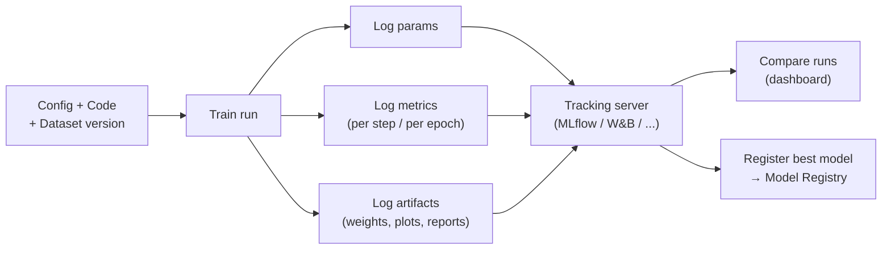
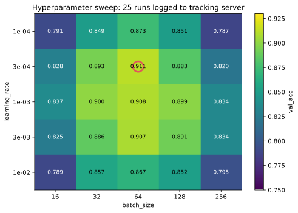
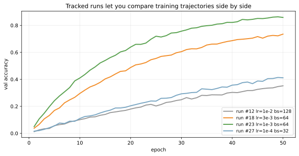
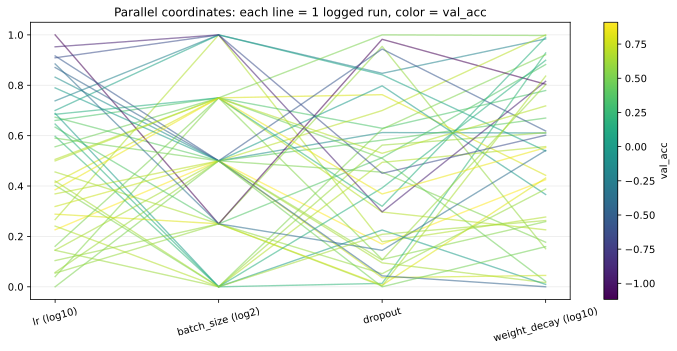

実験管理（experiment tracking）は、機械学習モデルの学習を「再現可能な記録」として残す仕組みである。1 回の学習を「実験（experiment）」と捉え、そこに入った設定（hyperparameter、データセット、コードバージョン）、出てきた結果（metric、可視化、学習曲線）、副産物（学習済み weight、前処理後データ、評価レポート）を 1 セットで保存する。

何百回も `train.py --lr 0.001` を回した記憶を頼りに「あのとき lr いくつだったっけ」を探す事態を避けるための運用基盤で、(1) 再現性、(2) モデル比較、(3) ステークホルダー説明、(4) 監査、の 4 つの目的を同時に達成する。代表的なツールに MLflow、Weights & Biases、Neptune、Comet、TensorBoard、ClearML などがある。

[ハイパーパラメータ](../../ml/hyperparameter/) 探索や [交差検証](../../ml/cross-validation/) と組み合わせると効果が大きく、ベイズ最適化や `Optuna` の study も実験管理ツールに保存できる。

### 実験管理の全体像



トラッキングサーバーは「全実験のメタデータ DB + アーティファクトストア」の組み合わせで、(1) リレーショナル DB に params/metrics を、(2) S3 や MinIO に weights/plots を、ぞれぞれ保存するのが典型。各 run には一意の ID が振られ、Git の commit SHA、データのハッシュ、Docker イメージ、Python の `requirements.txt` まで紐付ける運用が標準となる。

---

### 何をログすればよいか

トラッキング対象は次の 5 つに分類できる。これが揃って初めて「他人がその run を再現できる」状態になる。

| 種別 | 例 | 目的 |
|---|---|---|
| Params | `lr=1e-3, batch_size=64, model="resnet50"` | 設定の記録 |
| Metrics | `train_loss`, `val_acc`, `epoch_time` | 結果の評価 |
| Artifacts | `model.pt`, `confusion_matrix.png`, `predictions.csv` | 成果物保存 |
| Environment | `requirements.txt`, `conda_env.yml`, Docker image digest | 環境再現 |
| Lineage | Git commit SHA、データセット version | コード/データ追跡 |

ログを「迷ったら全部記録」にしておくと、後で「あの run と何が違うんだっけ」と困ったとき助かる。ストレージは安いが、人間の記憶は信用できないと考えると、過剰気味の記録の方が安全と言える。

---

### コード例: MLflow

MLflow を例にした最小限のトラッキングコード。

```python
import mlflow
from sklearn.ensemble import RandomForestClassifier
from sklearn.metrics import accuracy_score, f1_score

mlflow.set_experiment("churn-prediction")
with mlflow.start_run(run_name="rf-baseline"):
    # 1. params を記録
    params = {"n_estimators": 200, "max_depth": 8, "random_state": 0}
    mlflow.log_params(params)

    # 2. 学習
    model = RandomForestClassifier(**params).fit(X_train, y_train)
    pred = model.predict(X_test)

    # 3. metrics を記録
    mlflow.log_metric("accuracy", accuracy_score(y_test, pred))
    mlflow.log_metric("f1", f1_score(y_test, pred))

    # 4. artifacts を記録 (model 自体、可視化、レポート)
    mlflow.sklearn.log_model(model, "model")
    mlflow.log_artifact("confusion_matrix.png")
    mlflow.log_dict(classification_report_dict, "report.json")

    # 5. environment / lineage
    mlflow.log_text(open("requirements.txt").read(), "requirements.txt")
    mlflow.set_tag("git_commit", git_sha)
```

`with mlflow.start_run()` のコンテキストで `log_*` を呼ぶだけで、ID が振られた run としてサーバーに記録される。後でダッシュボードから 1 行ずつ実験を辿れるようになる、というのが基本の使い方となる。

---

### ハイパーパラメータ探索の可視化

実験管理の最も典型的な利用は、ハイパーパラメータ探索の結果比較である。グリッドサーチ・ランダムサーチ・ベイズ最適化のどれを使っても、各試行を個別の run として記録すれば、後で 1 つのダッシュボードで一覧できる。

```python
import numpy as np
import matplotlib.pyplot as plt

# 25 通りの (lr, batch_size) を試して val_acc を取った例
lrs = [1e-4, 3e-4, 1e-3, 3e-3, 1e-2]
batches = [16, 32, 64, 128, 256]
val_acc = np.array([...])  # 5x5 の結果行列
# 詳細は scripts 側を参照
plt.savefig("experiment_sweep_heatmap.svg", bbox_inches="tight")
```



赤丸が最良の組み合わせで、`lr=1e-3, batch_size=64` が最適。色の濃淡は val_acc を直接表す。25 回の実験を 1 枚で見渡せるのは、トラッキングがあって初めて成立する。表計算ソフトに手打ちで管理していたら、`lr` を変えた 5 回の結果を `batch_size` 別に並べ替えるだけでかなり大変な作業になると考えられる。

### 複数 run の学習曲線比較

異なる設定の学習曲線を 1 枚に重ねれば、「過学習しているか」「学習が早すぎたか」が一目で分かる。

```python
# トラッキングサーバーから複数 run の epoch ごと val_acc を取得して描画
plt.plot(epochs, run_12_curve, label="run #12 lr=1e-2 bs=128")
plt.plot(epochs, run_18_curve, label="run #18 lr=3e-3 bs=64")
plt.plot(epochs, run_23_curve, label="run #23 lr=1e-3 bs=64")
plt.plot(epochs, run_27_curve, label="run #27 lr=1e-4 bs=32")
plt.savefig("experiment_compare_runs.svg", bbox_inches="tight")
```



run #23（緑）が最も高い val_acc に収束しており、run #12（灰色）は学習率が大きすぎて早期に頭打ち。run #27（青）は学習率が小さすぎて 50 epoch では伸びきっていない。「次は run #23 の周辺をさらに細かく探索する」「run #27 はもっと epoch を回す」といった次のアクションを、可視化された結果から決められる。

### 多次元ハイパーパラメータの俯瞰

5 個以上のハイパーパラメータを同時に変えると、heatmap や散布図では限界が来る。Parallel coordinates plot は多次元探索を 1 枚にまとめる定番の可視化で、W&B のダッシュボードでも標準機能になっている。



各線が 1 つの run、色がスコア（val_acc）に対応。高スコア（黄緑）の線がどの値を経由しているかを目で追うと、「`lr` は -3 近辺、`dropout` は 0.2 近辺、`weight_decay` は -4 近辺が良さそう」のような仮説を立てやすい。トラッキングがあるからこそ、こういう俯瞰的な分析ができる。

---

### 数学での使いどころ

- 統計的仮説検定との対応: A/B テスト的に「設定 A が設定 B より有意に良いか」を [仮説検定](../../math/hypothesis-test/) で評価
- ベイズ最適化: ガウス過程による獲得関数の更新で、過去の run から次の有望候補を選ぶ
- メタ学習: 過去実験の結果を「メタ訓練データ」として扱い、新タスクの初期 hyperparameter を予測
- 多目的最適化: Pareto 最適性の議論（精度 vs 学習時間など複数の指標）

---

### 機械学習での使いどころ

- ハイパーパラメータ探索: GridSearchCV / RandomizedSearchCV / Optuna の各試行を 1 run として記録
- モデル比較: 異なるアルゴリズム（[ロジスティック回帰](../../ml/logistic-regression/) vs [勾配ブースティング](../../ml/gradient-boosting/) vs ニューラル）を同じ評価指標で並べる
- アブレーション: 特徴量 1 つを外したときの精度変化を run として残す
- データセット version 管理: 同じコードで「v1 のデータ」「v2 のデータ」を別 run として記録
- チームコラボ: 誰がいつ何を試したかが共有できる（休暇明けでも追える）
- 監査・規制対応: 「このモデルがどう作られたか」の証跡として
- 論文の再現性確保: 全実験の seed・ハイパーパラメータをトラッキング ID で参照可能に
- 後段の [モデルレジストリ](../model-registry/) への接続: 「best run」を選んで本番モデルに昇格

ツール選び:

- 個人 / 小規模チーム: MLflow（OSS、self-host 可能）、TensorBoard（深層学習特化）
- 中規模チーム: Weights & Biases（無料枠あり、UI が秀逸）、Neptune、Comet
- 大規模・企業: Vertex AI Experiments、SageMaker Experiments、Azure ML、Databricks MLflow

---

### 適さないケース / 落とし穴

- 1 行 1 メトリックで全部 print してログファイルに頼る: 比較・検索が地獄になる。最低限 MLflow を入れる
- params だけログして artifacts を残さない: モデル本体が再現できなければ意味が薄い
- 環境（requirements / Docker image）を残さない: 「同じコードで違う結果」が起きたとき原因究明できない
- データセット version を tag しない: データが上書きされると過去 run の再現が不可能になる
- 巨大なファイルを毎回 artifact に保存: ストレージコストが爆発。weights は最良 run だけ残す等の運用ルールを決める
- 実験名がカオス（"test1", "final", "final_v2"）: 命名規約（`{date}_{algo}_{purpose}`）を最初に決める
- 個人開発で「自分しか使わないから」と省略: 3 か月後の自分にも他人と思って記録する
- トラッキングサーバーが壊れたときの復旧計画なし: SQLite + ローカルフォルダだと飛ぶ。最低限 backup スクリプトを cron で
- メトリクスのスケールがバラバラ: `loss` と `accuracy` を同じ軸で比較すると判断を誤る。グループ化と単位を意識する
- 失敗 run を消す: 「効かなかった設定」も貴重な情報。失敗 run も残して後から検索できるようにする
