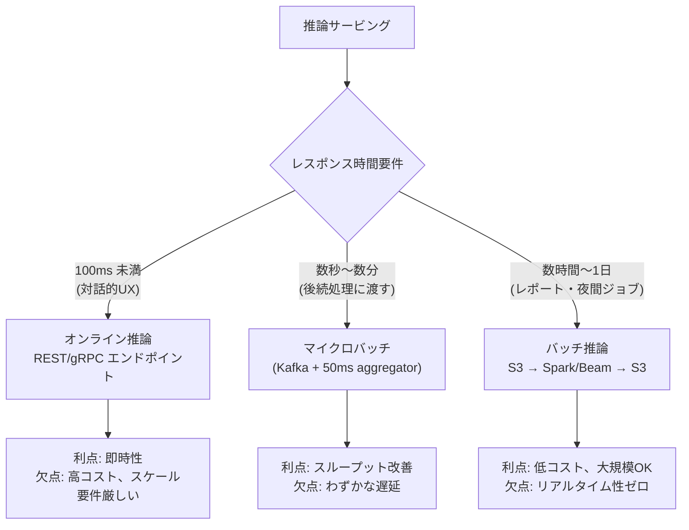
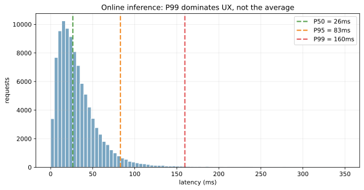
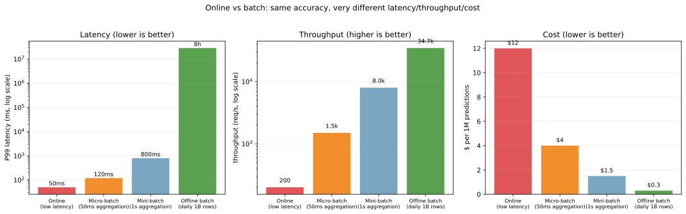
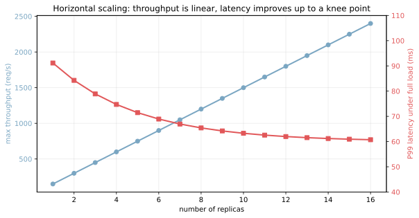
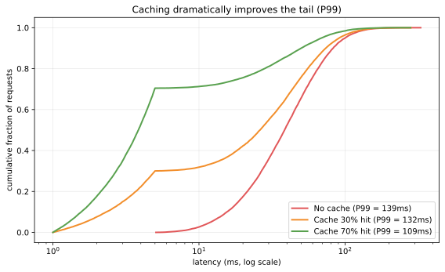

推論サービング（inference serving）は、学習済みモデルに本番トラフィックを流して予測を返す仕組みである。設計の最も大きな分岐点は「リクエストが来たらすぐ返す（オンライン推論）」か「データを溜めて一気に処理する（バッチ推論）」かの 2 系統で、どちらを選ぶかでアーキテクチャ・コスト・モニタリング設計がすべて変わる。

[モデルレジストリ](../model-registry/) からモデルを読み込み、[実験管理](../experiment-tracking/) で学習履歴を辿り、[モデル性能劣化の監視](../model-performance-monitoring/) で本番品質を確認する、という一連のフローの中で「実際に予測を返す」役割を持つのがこの層である。

### バッチ推論 vs オンライン推論

最大の違いは「リクエスト → レスポンスの時間制約」である。



代表ユースケース:

| パターン | 例 | レイテンシ要件 |
|---|---|---|
| オンライン | 検索結果のランキング、リアルタイム不正検知、対話 AI | < 100ms |
| マイクロバッチ | クリック予測、レコメンド更新 | 50ms 〜 数秒 |
| ミニバッチ | リアルタイム性が薄い特徴量生成 | 1 秒 〜 1 分 |
| オフラインバッチ | 夜間の与信スコア再計算、月次レポート | 数時間 〜 1 日 |

「リクエストが来てから返すまでに何ミリ秒許されるか」を最初に決めれば、自動的にどのパターンを選ぶかが見えると考えられる。

---

### オンライン推論のレイテンシは「平均」では測らない

オンライン推論のサービスレベルは「平均レイテンシ」ではなく、P95（95 パーセンタイル）や P99 で語る。理由は、ユーザーが体感するのは「遅かった瞬間」だからで、平均が 30ms でも P99 が 200ms なら、100 リクエストに 1 回は明らかに遅いユーザーが発生する。

```python
import numpy as np
import matplotlib.pyplot as plt

# 10 万リクエストのレイテンシ分布をシミュレーション
n = 100_000
rng = np.random.default_rng(0)
latencies = rng.gamma(shape=2, scale=15, size=n) + \
             rng.exponential(scale=80, size=n) * (rng.random(n) < 0.05)
print(f"P50 = {np.percentile(latencies, 50):.1f}ms")
print(f"P95 = {np.percentile(latencies, 95):.1f}ms")
print(f"P99 = {np.percentile(latencies, 99):.1f}ms")
plt.savefig("serving_latency_distribution.svg", bbox_inches="tight")
```

出力:

```text
P50 = 30.7ms
P95 = 86.5ms
P99 = 197.9ms
```



ヒストグラムは右に裾を引く形をしている。P50（中央値）30ms と P99（199ms）の差が 6 倍以上あり、「平均だけ見ていると遅い瞬間を見逃す」というのが直感的に分かる。SLO（service level objective）も「平均 < 100ms」のような曖昧な指標ではなく「P99 < 200ms」のように明確な percentile で書くのが標準となる。

---

### 3 系統の比較

同じモデルを 3 つの serving パターンで動かしたときのコスト・レイテンシ・スループットを比較する。

```python
modes = ["Online", "Micro-batch (50ms)", "Mini-batch (1s)", "Offline batch"]
latency_p99 = [50, 120, 800, 8 * 3600 * 1000]   # ms
throughput = [200, 1500, 8000, 35_000]            # req/s
cost_per_million = [12, 4, 1.5, 0.3]              # USD
plt.savefig("serving_modes_compare.svg", bbox_inches="tight")
```



3 つのパネルが「レイテンシ・スループット・コスト」をそれぞれ示す。Online はレイテンシで圧勝するがコストで負ける。Offline batch はコストで圧勝するがレイテンシは数時間。中間の micro / mini-batch がバランスの取れた選択肢として浮かび上がる。

「リアルタイム性は本当に必要か」を冷静に判定するのが重要となる。例として「ユーザーがログインしたときレコメンドを更新したい」というケースで、`(1) ログイン時に即座に推論` か `(2) 数時間ごとにバッチで全ユーザーぶん事前計算しておき、ログイン時はキャッシュを返すだけ` のどちらが良いかは、ビジネス要件次第で変わる。後者ならコストが 1/40 で済むので、よほどリアルタイム性が必要でなければ後者を選ぶ判断もある。

---

### コード例: FastAPI でのオンライン推論

最小構成の REST エンドポイント。プロセス内に [モデルレジストリ](../model-registry/) から読んだモデルを保持して、リクエストごとに `predict` を返す。

```python
from fastapi import FastAPI
from pydantic import BaseModel
import mlflow
import numpy as np

app = FastAPI()
# モデルレジストリから Production stage の最新版を読み込み (起動時に 1 回)
model = mlflow.pyfunc.load_model("models:/churn-classifier/Production")

class PredictRequest(BaseModel):
    features: list[float]

@app.post("/predict")
def predict(req: PredictRequest):
    proba = model.predict(np.array([req.features]))[0]
    return {"probability": float(proba), "model_version": model.metadata.run_id}

@app.get("/healthz")
def healthz():
    return {"status": "ok"}
```

`/healthz` は Kubernetes の liveness probe 用、`/predict` が本体。`model.predict` の前後で latency を計測して Prometheus などに送れば、上記の P99 グラフが作れる。

---

### コード例: バッチ推論（PySpark）

夜間バッチで数億行を一気に処理する例。

```python
from pyspark.sql import SparkSession
from pyspark.sql.functions import pandas_udf, PandasUDFType
import pandas as pd
import mlflow

spark = SparkSession.builder.getOrCreate()
model = mlflow.pyfunc.load_model("models:/churn-classifier/Production")
broadcast_model = spark.sparkContext.broadcast(model)

@pandas_udf("double", PandasUDFType.SCALAR)
def predict_udf(features: pd.Series) -> pd.Series:
    m = broadcast_model.value
    X = pd.DataFrame(features.tolist())
    return pd.Series(m.predict(X))

df = spark.read.parquet("s3://data/yesterday-features/")
df.withColumn("score", predict_udf(df["features_vector"])) \
   .write.parquet("s3://data/yesterday-predictions/")
```

ポイントは `broadcast` でモデルを全 executor に配布すること。これがないとモデルが各タスクで複製されてメモリを食う。出力はそのまま S3 に書き戻して、下流のサービスが朝の更新時に読み込む流れになる。

---

### 水平スケーリング: レプリカを増やすと何が起きるか

オンライン推論ではトラフィックが増えたらレプリカ数を増やす。スループットは線形にスケールするが、レイテンシは「あるところで頭打ち」になる。

```python
replicas = np.arange(1, 17)
total_throughput = 150 * replicas  # 1 replica = 150 req/s
p99_per_load = 60 + 40 * np.exp(-replicas / 4)  # 1 → 4 で大きく改善
plt.savefig("serving_replica_scaling.svg", bbox_inches="tight")
```



青がスループット（左軸、線形に上がる）、赤が P99 レイテンシ（右軸、4 レプリカあたりまで急改善、その後ほぼ平ら）。「4 レプリカでレイテンシが十分下がる」という knee point を見つけたら、それ以上の増設はトラフィック対応のみ。コストとレイテンシの両方を意識した自動スケーリング設定が組める。

Kubernetes の HPA（Horizontal Pod Autoscaler）では `CPU 使用率` や `req/s` をトリガーに自動でレプリカ数を増減するのが標準。さらに進んで、KEDA でキューの長さに基づいたスケーリングや、サーバーレス（Cloud Run、Lambda）で 0 → N の自動スケーリングもできる。

---

### キャッシュ: tail latency を激減させる

同じ入力に対する推論結果は決定論的なので、結果をキャッシュすれば次回からは O(1) で返せる。tail latency の改善幅が大きい。

```python
# キャッシュ無し / 30% ヒット / 70% ヒット を比較
for hit_rate in [0.0, 0.3, 0.7]:
    arr = np.where(rng.random(20000) < hit_rate,
                    rng.uniform(1, 5, 20000),     # キャッシュヒット
                    rng.gamma(shape=2, scale=20, size=20000) + 5)  # 通常推論
plt.savefig("serving_cache_effect.svg", bbox_inches="tight")
```



CDF（累積分布関数）で見ると、70% ヒットのケースでは大半のリクエストが 5ms 未満で返り、P99 も大きく下がる。レコメンドのように「同じユーザーが短時間に同じ画面を何度も開く」場面ではキャッシュが極めて効くと考えられる。

ただしキャッシュにはトレードオフがある。

- 入力が動的に変わる場合（タイムスタンプを含む等）はキャッシュヒット率がほぼ 0
- モデルを更新したとき、古い予測がキャッシュに残ったままだと「古いモデルの結果」が返り続ける（cache invalidation 問題）
- キャッシュ自体のメモリコスト

---

### 数学での使いどころ

- 待ち行列理論（queueing theory）: M/M/c モデルでレプリカ数とレイテンシの関係を導出
- パーセンタイル: 平均ではなく P50/P95/P99 で評価（[四分位点](../../math/quantile/) の応用）
- スケーラビリティの理論: Amdahl の法則、Universal Scalability Law
- バッチサイズと精度の関係: バッチサイズが大きいほどスループットは上がるが、メモリと latency が増える
- A/B テストの設計: shadow / canary deployment の効果検証 ([仮説検定](../../math/hypothesis-test/))

---

### 機械学習での使いどころ

- リアルタイムレコメンド: 商品ページに遷移した瞬間に類似アイテムを表示
- 不正検知: 決済リクエスト時に < 100ms で承認/拒否を返す
- 検索ランキング: クエリ受信後に < 200ms でランク済み結果を返す
- 対話 AI / チャットボット: トークン単位のストリーミング推論
- 画像認識: モバイルからの 1 枚 / API リクエスト → ラベル
- バッチスコアリング: 全顧客の与信スコアを日次で再計算
- ETL の一部としての推論: データ取り込み時に分類タグを付与
- A/B test 用の shadow serving: champion と challenger に同じリクエストを流して比較
- エッジ推論（オフライン）: モバイルアプリ内で ONNX / Core ML が動く

サービング基盤の選択肢:

- マネージド: SageMaker Endpoint、Vertex AI Prediction、Azure ML Endpoint、Databricks Serving
- オープンソース: TorchServe、TensorFlow Serving、Triton Inference Server、BentoML、KServe (KFServing)
- 自前 FastAPI + Kubernetes: 柔軟だが運用負荷が大きい
- バッチ用途: Spark、Apache Beam、Ray、Dask

---

### 適さないケース / 落とし穴

- 平均レイテンシで SLO を決める: P99 が見えず、ユーザー体験を取りこぼす。必ず percentile で
- モデル読み込みをリクエストごとにやる: コールドスタートで毎回数秒。プロセス起動時に 1 回だけ load する
- バッチ推論で全データを 1 マシンに集める: OOM (out of memory) で落ちる。Spark / Beam で分散処理する
- スケーリング設定なしで本番投入: トラフィックスパイクで全部 timeout。HPA / KEDA で自動スケール
- キャッシュ無効化を考えずに導入: モデル更新後も古い予測が返り続ける。モデル version をキャッシュキーに含める
- 特徴量変換を訓練と本番で書き分ける: わずかな差で精度が落ちる ([データリーク](../../ml/data-leakage/) の派生問題)。同じコード（feature store または共通 library）で揃える
- 推論結果のログを取らない: あとで「あのときどう予測したか」が分からない。リクエスト / レスポンスは sampling して保存する
- A/B test 抜きで Production 切り替え: 障害発生時の影響範囲が予測できない。shadow → canary → 全展開の段階を踏む
- バッチ推論の出力スキーマが急に変わる: 下流のサービスが壊れる。スキーマ check + 後方互換性
- GPU / CPU の選択ミス: 軽量モデルを GPU で動かすとオーバーヘッドが支配的。逆も同様。プロファイルしてから決める
- レイテンシだけ最適化してコストが爆発: 「P99 < 50ms」と「コスト 1/10」の両立は難しいので、ビジネス要件と擦り合わせる
- マルチモデル運用で 1 つのモデルだけ Production 想定: 複数モデルの A/B test や multi-armed bandit を最初から想定した serving 基盤を選ぶ
