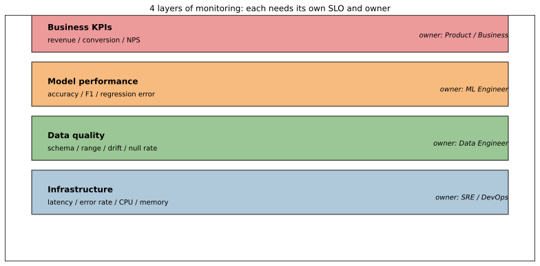
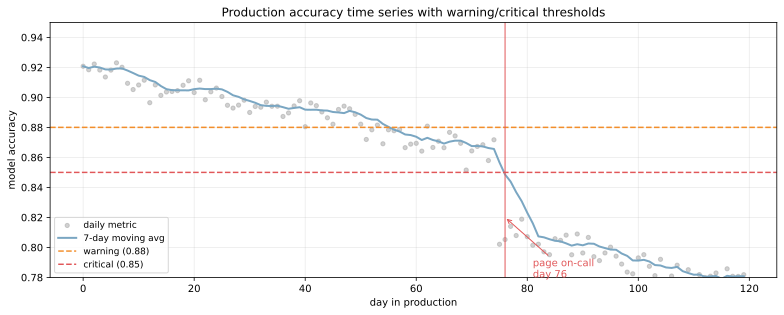
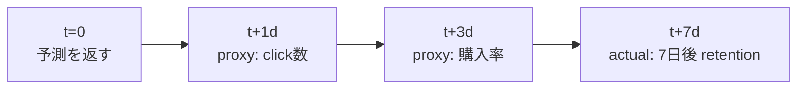
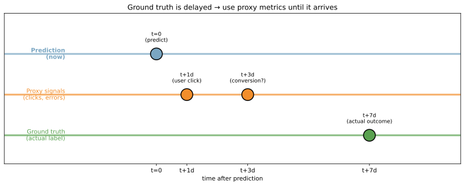
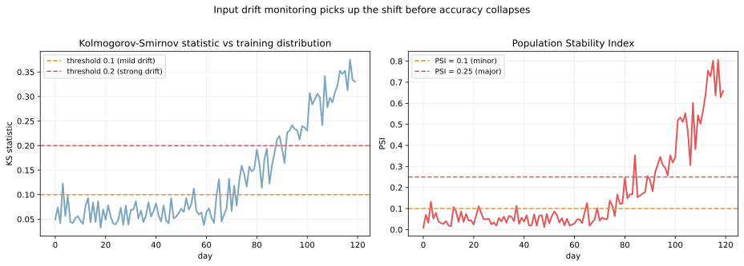

モデル性能劣化の監視（model performance monitoring）は、本番運用しているモデルの予測品質を継続的に観測し、劣化を早期に検知する仕組みである。学習時の精度は本番でずっと維持されるわけではなく、[データドリフト](../data-drift/) や仕様変更で時間とともに落ちていく。劣化に気づかず放置すると、ユーザー体験やビジネス指標がじわじわ悪化し、最悪の場合は気づいたときには手遅れになる。

監視は単一の指標ではなく、複数の層（infra → data → model → business）を組み合わせて行うのが標準。検知後の対応として [再学習パイプライン](../retraining-pipeline/) が自動起動するように設計しておくのが理想形となる。

### 4 つの監視レイヤ

監視対象は粒度の違う 4 つのレイヤに整理できる。それぞれ「気づきたい問題」「責任者」「使う指標」が違う。



| レイヤ | 監視内容 | 主な指標 | 主担当 |
|---|---|---|---|
| ビジネス KPI | エンドツーエンドの効果 | revenue、conversion、NPS | プロダクト / ビジネス |
| モデル性能 | 予測品質そのもの | accuracy、F1、回帰誤差、PR-AUC | ML エンジニア |
| データ品質 | 入力データの健全性 | schema、range、null 率、drift | データエンジニア |
| インフラ | 配信基盤の健全性 | latency、error rate、CPU、メモリ | SRE / DevOps |

「モデルの精度が落ちた」と一口に言っても、原因がモデル本体か、入力データか、配信基盤か、上位のビジネス事情かで対処が違う。4 層を別々に観測しておくと切り分けが速くなる、と考えられる。

---

### モデル性能指標の時系列監視

最も基本的な監視が「精度の時系列プロット」。生の値だと daily noise が大きいので、移動平均（moving average, MA）と閾値を組み合わせるのが定番。

```python
import numpy as np
import matplotlib.pyplot as plt

rng = np.random.default_rng(0)
days = np.arange(0, 120)
# 緩やかなドリフト + 75日目に外的要因でジャンプ
true_acc = 0.92 - 0.0008 * days
true_acc[75:] -= 0.05
observed = true_acc + rng.normal(0, 0.006, len(days))

# 7 日移動平均
ma = np.array([observed[max(0, i - 7):i + 1].mean() for i in range(len(days))])
plt.scatter(days, observed, alpha=0.4, label="daily")
plt.plot(days, ma, lw=2, label="7-day MA")
plt.axhline(0.88, color="#f28e2b", ls="--", label="warning")
plt.axhline(0.85, color="#e15759", ls="--", label="critical")
plt.savefig("monitoring_accuracy_alert.svg", bbox_inches="tight")
```



灰色の点が日次の生値、青線が 7 日移動平均。橙の破線（warning, 0.88）と赤の破線（critical, 0.85）が SLO 閾値で、移動平均が critical を下回った時点で on-call にページが飛ぶ。最初の 75 日は緩やかなドリフト、その後外的要因（例: 新キャンペーンによるユーザー層変化）で一気に劣化、というシナリオで、閾値超過まで約 80 日かかっている。

「critical までいかなくても warning は早めに鳴らす」というのが鉄則。warning で再学習や原因調査を開始すれば、critical に達する前に手が打てる。

---

### Ground truth が遅れる問題と proxy metrics

精度を測るには ground truth（実際の正解）が必要だが、現実には数時間〜数週間遅れて到着することが多い。例として、レコメンドの「クリックの有無」は数秒で分かるが、「購入したかどうか」は数日後、「リテンションに寄与したか」は数週間後にしか確定しない。





ground truth を待っていたら検知が遅すぎるので、proxy metrics（代理指標）で「劣化の兆候」を早期に捉える設計にする。

- 即時に取れる指標: 予測スコアの分布、予測値の偏り（全部 1 クラスに寄っていないか）
- 数時間で取れる指標: クリック率、エラー率、ユーザーフィードバック
- 数日で取れる指標: 部分的な ground truth（早期に確定するもの）
- 最終的な指標: 完全な ground truth（最終評価）

複数 proxy のうち 1 つでも異常を示せばアラート、というのが standard pattern となる。

---

### 入力ドリフト検知: KS 検定と PSI

ground truth がほぼ取れないケースでも、入力データの分布変化は即時検知できる。代表的な指標が KS 検定（Kolmogorov-Smirnov test）と PSI（Population Stability Index）。

- KS 検定: 訓練分布と本番分布の累積分布関数の最大差を測る。`0` で完全一致、`1` で完全不一致
- PSI: 分布を 10 ビンに分けて KL ダイバージェンスの近似を計算。`< 0.1` で安定、`0.1〜0.25` でやや変化、`> 0.25` で大きく変化

```python
from scipy import stats

ref = rng.normal(50, 10, 5000)  # 訓練分布
ks_stats, psi_values = [], []
for d in range(120):
    if d < 60:
        live = rng.normal(50, 10, 200)
    else:
        live = rng.normal(50 + (d - 60) * 0.15, 10, 200)  # 徐々にずれる
    ks, _ = stats.ks_2samp(ref, live)
    ks_stats.append(ks)
    # PSI 計算は scripts 側
plt.savefig("monitoring_input_drift.svg", bbox_inches="tight")
```



左の KS 統計量と右の PSI が、60 日目あたりから上昇を始めている。前章の accuracy 監視では 75 日目まで影響が見えなかったのに対し、入力ドリフトはおよそ 15 日早く兆候を検知できている。「予測精度が落ちる前に入力分布の変化を捉える」のがドリフト監視の意義となる。

ただし入力ドリフトと精度劣化は必ずしも 1:1 対応しない。`P(x)` が変わっても `P(y|x)` が安定なら精度は維持される（covariate shift, 詳細は [データドリフト](../data-drift/) 参照）。入力ドリフトはあくまで「何かが起きている」のシグナルで、それが実害になっているかは精度監視で確認する、という二段構えになる。

---

### コード例: Prometheus + Grafana で監視メトリクスを公開

推論サーバー側で predict のたびにメトリクスを記録し、Prometheus がスクレイプして Grafana で可視化する標準パターン。

```python
from prometheus_client import Counter, Histogram, Gauge
import time

PREDICTIONS_TOTAL = Counter("predictions_total", "Total predictions", ["model_version"])
PREDICTION_LATENCY = Histogram("prediction_latency_seconds", "Latency",
                                buckets=[0.01, 0.05, 0.1, 0.2, 0.5, 1.0])
PREDICTION_SCORE = Histogram("prediction_score", "Output score distribution",
                              buckets=[0.0, 0.1, 0.2, 0.5, 0.8, 0.9, 1.0])
INPUT_FEATURE_MEAN = Gauge("input_feature_mean", "Mean of input feature",
                            ["feature_name"])

def predict_with_metrics(req):
    start = time.time()
    pred = model.predict([req.features])[0]
    elapsed = time.time() - start

    PREDICTIONS_TOTAL.labels(model_version=model_version).inc()
    PREDICTION_LATENCY.observe(elapsed)
    PREDICTION_SCORE.observe(pred)
    for name, val in zip(feature_names, req.features):
        INPUT_FEATURE_MEAN.labels(feature_name=name).set(val)

    return {"prediction": pred}
```

Grafana のダッシュボードで「過去 24 時間の P99 latency」「予測スコアの分布の変化」「入力特徴量の平均推移」を並べておけば、人間が眺めるだけでもおかしさに気づきやすい。アラートルール（PromQL: `histogram_quantile(0.99, ...) > 0.2`）を入れれば自動通知も組める。

---

### Alert の二段階設計

監視で「常にアラートが鳴っている」状態は実質「鳴っていない」のと同じになる。閾値とアラート設計は次のように二段階にする。

| レベル | 閾値 | 通知先 | 期待される対応 |
|---|---|---|---|
| Warning | SLO の 10% 余裕 | Slack channel | 1 営業日以内に調査 |
| Critical | SLO そのもの | PagerDuty / 電話 | 1 時間以内に対処 |

例として「accuracy SLO = 0.85」のモデルなら、warning = 0.88、critical = 0.85 で設定。warning でじわじわ落ちる兆候を早めに捉え、critical で即時対応する。

「false alarm が多すぎる」は監視の最大の敵で、誤検知が続くと on-call が無視するようになる。閾値・移動平均ウィンドウ・連続違反数（例: 「3 連続で閾値を下回ったらアラート」）の調整で false alarm を抑える運用ノウハウが必要となる。

---

### Observability の 3 本柱: metrics / logs / traces

完全な observability は metrics だけでは作れない。

- Metrics: 数値の時系列（accuracy、latency、throughput）。トレンドの俯瞰に強い
- Logs: 個別イベントの詳細（特定の予測の入力・出力・モデル version）。原因究明に強い
- Traces: 1 リクエストが複数サービスを通る軌跡（特徴量取得 → 推論 → DB 書き込み）。ボトルネック特定に強い

機械学習特有の「予測の根拠を後から追えるようにしたい」要求（規制対応、顧客クレーム対応）に対しては、logs に「リクエスト ID、モデル version、入力特徴量、予測値、確率」をすべて記録するのが必須。サンプリングで全件は厳しいので、1% 〜 10% 程度の sampling rate で十分な情報量が得られる。

### 数学での使いどころ

- CUSUM（Cumulative Sum control chart）: 累積偏差で変化点検出
- ベイズ的変化検出: 事後確率の変化で検出（[ベイズの定理](../../math/bayes-theorem/)）
- 移動統計（rolling mean, rolling std）: ノイズを抑えてトレンドを見る
- [仮説検定](../../math/hypothesis-test/): KS 検定、`χ²` 検定、Mann-Whitney U 検定
- 情報理論: KL ダイバージェンス、Jensen-Shannon ダイバージェンスで分布距離

---

### 機械学習での使いどころ

- 推論精度の時系列監視（日次・週次レポート）
- 入力ドリフトの自動検知（KS、PSI、Wasserstein 距離）
- 予測スコア分布の監視（偏り、極端値の急増）
- ground truth lag を見越した proxy metrics の設計
- model fairness の継続監視（属性別の精度差）
- データパイプライン健全性（schema check、null rate、duplicate）
- A/B test と組み合わせた champion-challenger の継続評価
- セグメント別監視（ユーザー層 / 地域 / デバイス別の精度）
- 異常入力の検知（外れ値、未知カテゴリ）
- predict-then-trace: 個別予測が後でクレームになったときに辿れる仕組み

ツール選び:

- 汎用: Prometheus + Grafana（自前運用）、Datadog、New Relic
- ML 特化: Evidently AI、WhyLabs、Arize AI、Fiddler、Vertex AI Model Monitoring、SageMaker Model Monitor
- ログ基盤: Elastic Stack（ELK）、Loki、Splunk、BigQuery

---

### 適さないケース / 落とし穴

- accuracy だけ見て他指標を無視: ground truth が遅延するときに気づくのが遅れる。proxy metrics と組み合わせる
- ground truth を待ってから対応: 重要な障害は数時間で広がる。入力ドリフトと proxy で早期検知
- アラートが鳴りすぎる: 麻痺して無視されるようになる。閾値・連続違反数・ウィンドウの調整で false alarm を抑える
- 集約指標だけ見て segment 別を見ない: 全体精度は維持されているが、特定セグメント（新規ユーザー、特定地域）で激落ち、というケースを見落とす
- ログを sampling せず全件保存: コスト爆発。1〜10% sampling で十分な統計量が取れる
- モデル version を予測結果に紐付けない: 後で「あの予測どの version？」が分からなくなる。logs に必ず version を含める
- 監視対象が増えすぎる: 100 個の指標を全部見られない。最重要 5〜10 個に絞る
- データドリフトを精度劣化と混同: 入力分布が変わっても精度が落ちないケースがある（covariate shift）。両方独立に監視する
- alert 受信者の負担を考えない: 全アラートが同じ重さで PagerDuty に行くと on-call が疲弊。重要度別ルーティング
- runbook が無いアラート: 「鳴ったがどう対処するか分からない」と意味が無い。アラートと対処手順をセットで作る
- 監視自身の monitoring を忘れる: 監視システムが落ちていてもアラートが鳴らない。canary metric（常に true を返す）を 1 つ用意して、それが消えたら監視が止まったと検知
- 学習データを忘れる: 学習データ自体に偏りや問題があれば、いくら監視しても根本解決しない。データ品質の上流監視も併せて
