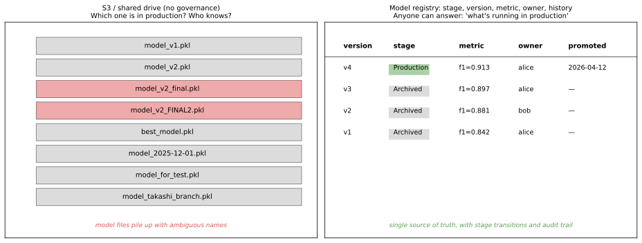
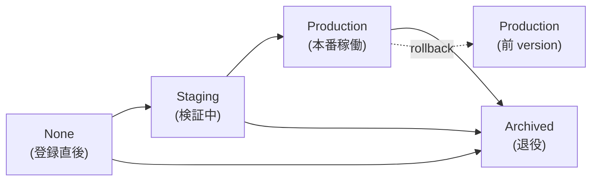
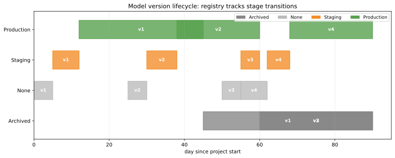
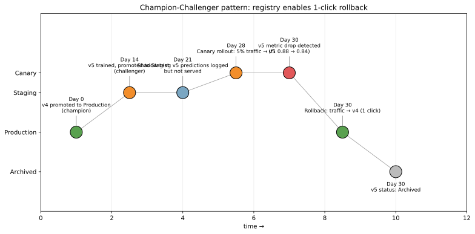

モデルレジストリ（model registry）は、学習済みモデルに「名前 + バージョン + ステージ」を付けて中央管理する仕組みである。コードの世界での Git や npm レジストリに相当するもので、機械学習モデル特有のメタデータ（学習データ、ハイパーパラメータ、評価指標、承認者、デプロイ履歴）も一緒に管理する。

[実験管理](../experiment-tracking/) と隣接するが役割は別物。実験管理は「すべての試行を残す」場所、モデルレジストリは「本番に出すと決めた選別済みモデルを管理する」場所、と棲み分ける。MLflow Model Registry、SageMaker Model Registry、Vertex AI Model Registry、Weights & Biases Model Registry などが代表実装で、いずれも同じコンセプトに沿っている。

### モデルレジストリが解決する課題

レジストリを使わないと、学習済みモデル（`.pkl`、`.pt`、`.onnx` などのファイル）が共有ドライブや S3 バケットに無秩序に増えていく。

```python
# 共有ドライブ上のファイル例
model_v1.pkl
model_v2.pkl
model_v2_final.pkl         # 上書き禁止だったはずなのに「final」が増殖
model_v2_FINAL2.pkl
best_model.pkl             # 誰が決めた best か不明
model_2025-12-01.pkl       # 命名が時系列ベース
model_takashi_branch.pkl   # 個人ブランチがそのまま本番に
```

3 か月後に「今本番で動いているのはどれ？」と聞かれて答えられない、というのが典型的な失敗パターンとなる。



左の「ファイル名で管理」は、誰が責任者か、いつ本番に上がったか、評価指標は何だったかを別ドキュメント（Confluence、Notion、Slack）で追わないと分からない。右の「モデルレジストリ」は、`version` / `stage` / `metric` / `owner` / `promoted` がすべて 1 箇所に集まり、API・UI 両方から検索可能となる。

---

### ライフサイクルとステージ

モデルレジストリは「ステージ（stage）」という抽象でモデルの状態を管理する。MLflow を例に取ると、次の 4 ステージが標準。



- None: 登録だけして配置先未決定
- Staging: 検証環境で動作確認中（ロードテスト、shadow test）
- Production: 本番トラフィックを受けている
- Archived: 役目を終えた

「`v3` を Production に上げる」ボタン 1 つでデプロイのトリガーが発火し、同じワンクリックで切り戻し（rollback）もできる、というのが理想形となる。

### バージョン timeline の例

複数の version が並走するのが普通で、registry はそれを年表として記録する。



`v1` から始まり、`v2` が登場して Production に昇格、`v3` は Staging で問題が出て Production に上がらず Archived、`v4` が現在の Production、というシナリオ。色がそのままステージで、各 version の経過が線で追える。「いつ何が本番だったか」のスナップショットが取れるので、後で「2026 年 5 月の予測結果はどのモデルだったか」のような監査要求に即答できる。

---

### コード例: MLflow Model Registry

[実験管理](../experiment-tracking/) で記録した run の中から best を選んで registry に登録する流れ。

```python
import mlflow

# 1. 学習した最良 run のモデルを registry に登録
result = mlflow.register_model(
    model_uri=f"runs:/{best_run_id}/model",
    name="churn-classifier",
)
print(f"Registered version: {result.version}")  # → 例: "4"

# 2. ステージを Staging に上げる
client = mlflow.MlflowClient()
client.transition_model_version_stage(
    name="churn-classifier",
    version=result.version,
    stage="Staging",
)

# 3. 検証が通ったら Production へ
client.transition_model_version_stage(
    name="churn-classifier",
    version=result.version,
    stage="Production",
    archive_existing_versions=True,  # 前 production を自動 archive
)

# 4. 本番コードからの読み込み (バージョン番号を意識せず最新 Production を)
model = mlflow.pyfunc.load_model("models:/churn-classifier/Production")
predictions = model.predict(X_new)
```

`models:/churn-classifier/Production` のような URI で参照することで、Production stage が動けば本番コードが自動的に新モデルを使うようになる、というのが registry の威力である。

---

### メタデータとして何を残すか

レジストリには「モデルファイル本体」だけでなく、後で参照したくなる属性を全部紐付ける。

| 種別 | 例 |
|---|---|
| 識別 | name, version, stage, registered_at |
| 由来 | run_id（[実験管理](../experiment-tracking/) と紐付け）, git_commit, dataset_version |
| 評価 | accuracy, precision, recall, f1, business_metric |
| 承認 | owner, approver, review_comments |
| 運用 | deployed_endpoint_url, last_traffic_seen_at |
| 説明 | description, model_card_url, known_limitations |

特に「モデルカード（model card）」と呼ばれる説明文書を必ず添えるのは、現代の MLOps では事実上のルールとなっている。`想定する入力分布`、`既知の限界`、`fairness 評価結果`、`ライセンス` などを構造化して残しておくと、後で別チームが使うときの事故が減ると考えられる。

---

### Champion-Challenger と rollback

レジストリの真価が出るのは「新モデルを本番に出したら問題が見つかった」場面である。champion-challenger パターン（既存の Production = champion を、新候補 = challenger と比較）を使うと、安全に切り替えができる。



シナリオ例:

- Day 0: `v4` が Production（champion）として稼働中
- Day 14: `v5` を学習し、Staging に上げる
- Day 21: Shadow test（同じリクエストを v4 と v5 両方に流して結果を log だけ取る、応答は v4 のものを返す）
- Day 28: Canary 開始。本番トラフィックの 5% だけ v5 に流す
- Day 30: v5 のメトリクスが悪化（f1 = 0.84、champion は 0.88）
- Day 30: 即 rollback。100% を v4 に戻し、v5 を Archived へ

レジストリ無しだとこの rollback が `git revert` → `docker build` → デプロイ、と数十分〜数時間かかる。レジストリありだと「`v4` を Production に戻す」ボタン 1 つで秒で切り戻る。本番障害対応のスピードに直結する違いとなる。

---

### バージョニング規約

モデルのバージョン番号にどう意味を持たせるかは、組織で決める運用ルール。3 つの流派がある。

| 流派 | 例 | 特徴 |
|---|---|---|
| 単調増加 ID | `v1, v2, v3, ...` | MLflow / SageMaker のデフォルト。シンプル |
| Semver 風 | `v2.3.1`（major.minor.patch） | 後方互換の有無を示せるが運用が重い |
| 日付ベース | `2026-05-26.1` | 「いつのモデル」が一目で分かる |

機械学習モデルは「API スキーマ変更」と「学習データ変更」の両方が起きるため、純粋な semver は当てはめにくい。実務では「単調増加 ID + 別途タグ」（`v23` + `tag: feature-A-added`）の運用が一番扱いやすいと考えられる。

### 数学での使いどころ

- バージョン管理理論: DAG（有向非巡回グラフ）で表現される版管理（Git と同じ）
- 監査ログの完全性: ハッシュチェーン（Merkle tree）でモデル系譜を改ざん検出
- 多目的最適化: 複数指標（accuracy / latency / fairness）の Pareto 最適性で「どの version を Production に上げるか」を選ぶ
- 統計的検定: champion vs challenger の差を [仮説検定](../../math/hypothesis-test/) で評価

---

### 機械学習での使いどころ

- 本番モデルの単一参照点: 推論サーバーが `models:/X/Production` だけ見ればよい
- A/B テスト・shadow / canary deployment: 複数 version を並走させて比較
- 即時 rollback: 障害発生時に前 version に 1 クリックで戻す
- 監査・規制対応: 「2026 年 3 月の予測結果はどの version か」を追跡可能に
- モデルアプリケーションのバージョン依存性管理: 「v4 までは scikit-learn 1.5 で動く、v5 から PyTorch」
- 引き継ぎ: 元担当者がいなくなっても「現行 Production = v4、責任者 = alice」が登録されている
- 規制業界（金融・医療）でのモデル承認フロー: approver の sign-off を必須にする
- マルチテナント環境: テナントごとに異なる Production version を運用
- 後続の [推論サービング](../inference-serving/) と [再学習パイプライン](../retraining-pipeline/) の接続点

---

### 適さないケース / 落とし穴

- レジストリだけ用意して運用ルールが無い: 「いつ Staging → Production に上げるか」「誰が承認するか」を決めておかないと結局カオス
- ステージ遷移を手動でやり続ける: 自動化されたゲート（テスト合格 / 評価指標達成）を入れる
- メタデータ不足: model_card・known_limitations を埋めずに登録すると、後任が触れない
- ファイルサイズが大きすぎる: 数 GB の deep learning model を毎日新 version で登録すると、ストレージが破裂。古い version の自動退役ポリシーを設定する
- レジストリ専用のバックアップを取らない: 障害でレジストリ DB が飛ぶと再現不可。S3 + 別 region に backup
- アクセス制御を入れない: 誰でも Production に上げられると事故が起きる。RBAC（role-based access control）を設定する
- レジストリと本番デプロイがバラバラ: 「Production に上げたつもりが本番サービスは古い version のまま」になりやすい。CI/CD と統合する
- 1 モデル 1 レジストリエントリの粒度を間違える: アンサンブルや multi-model serving では「論理モデル」と「物理モデル」を分けて管理する設計が必要
- バージョン番号に意味を持たせすぎる: semver 風にすると「これは breaking change か」の判断で消耗する。シンプルな単調 ID で十分なことが多い
- レジストリを実験管理の代わりに使う: 全 run を Staging 登録すると、本番候補が埋もれる。実験は実験管理、選別後の本番候補だけがレジストリ、と棲み分ける
