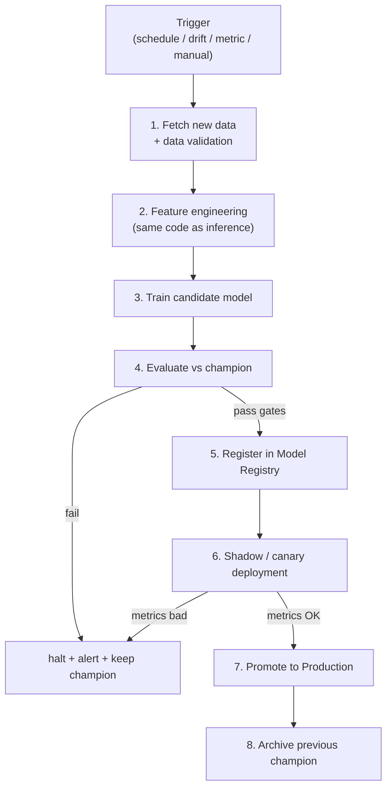
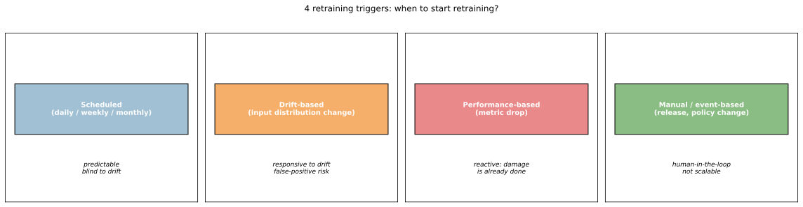
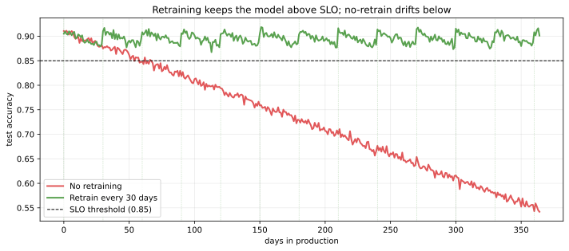
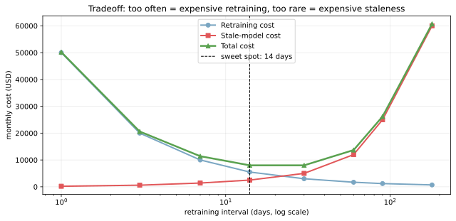
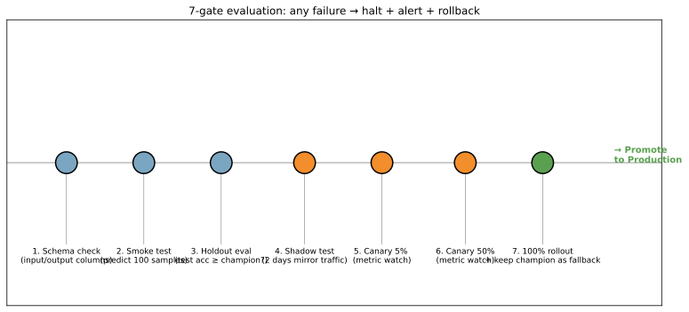

再学習パイプライン（retraining pipeline）は、本番のモデルを「新しいデータで再学習 → 評価 → デプロイ」の流れを自動化した仕組みである。一度学習したモデルを永遠に使い続けることはできないため（[データドリフト](../data-drift/) のノート参照）、定期的に新しいデータで作り直す必要がある。これを人手でやらずにパイプラインとして組むのが MLOps の中核作業の 1 つとなる。

[実験管理](../experiment-tracking/) で新モデルを記録し、[モデルレジストリ](../model-registry/) で版管理し、[推論サービング](../inference-serving/) でデプロイし、[モデル性能劣化の監視](../model-performance-monitoring/) で次の再学習タイミングを判断する、という全工程をつなぐパイプ役とも言える。

### 再学習パイプラインの全体像



工程ごとにテストポイントとロールバックポイントを設けるのが鍵。「再学習が完了 = デプロイ」ではなく、評価ゲートを順に通過してから初めて本番反映する設計にする。

---

### トリガー: いつ再学習するか

再学習を「いつ起動するか」は 4 つのパターンに分けられる。



| トリガー | 起動条件 | 強み | 弱み |
|---|---|---|---|
| Scheduled | 毎日 / 毎週 / 毎月 | 予測可能、計画しやすい | ドリフトに反応できない |
| Drift-based | 入力分布が閾値を超える | 変化に追従 | 誤検知でムダ再学習 |
| Performance-based | 精度指標が SLO を割る | 実害から逆算 | 後追い、damage 済み |
| Manual / event-based | 大型リリース、規制変更 | 確実性高い | スケールしない |

実運用では複数トリガーを組み合わせるのが普通。例えば「毎月 1 回必ず再学習（schedule）+ ドリフトが検知されたら即時（drift）+ 性能 SLO 割れで緊急（performance）」のような OR 条件で組む。

---

### 再学習しないと何が起きるか

[データドリフト](../data-drift/) があるシステムでは、何もしなければ精度がじりじり落ちていく。シミュレーションで見る。

```python
import numpy as np
import matplotlib.pyplot as plt

days = np.arange(0, 365)
# 再学習なし: 1日あたり 0.001 ずつ精度が落ちる
acc_no_retrain = 0.91 - 0.001 * days
# 30 日ごとに再学習: 鋸歯型
acc_retrain = np.zeros_like(days, dtype=float)
for i in range(len(days)):
    acc_retrain[i] = 0.91 - 0.001 * (i % 30)
plt.savefig("retraining_decay_vs_retrain.svg", bbox_inches="tight")
```



赤い線が再学習無し、緑が 30 日ごとに再学習したケース。1 年後には再学習無しは accuracy 0.55、再学習あり 0.88 前後で 30% 以上の差がつく。黒い破線が SLO（service level objective）の 0.85 で、再学習無しは半年で SLO を割り、再学習ありはギリギリ維持できている。

「精度劣化はコストの問題」と捉えると、再学習はそのコストを回避するための投資、と読める。

---

### 再学習頻度の最適化

再学習を「やりすぎ」も「やらなさすぎ」も問題が出る。コスト構造を整理する。

```python
intervals = [1, 3, 7, 14, 30, 60, 90, 180]  # 日数
retrain_cost = [50_000, 20_000, ..., 700]     # 再学習自体のコスト ($/月)
stale_cost = [200, 600, ..., 60_000]           # モデルが古いことによるコスト ($/月)
total_cost = retrain_cost + stale_cost
plt.savefig("retraining_cost_tradeoff.svg", bbox_inches="tight")
```



青が再学習自体のコスト（compute + engineering）、赤がモデルが古いことによる損失（誤予測 × 影響規模）、緑が合計。U 字を描き、ある頻度で総コストが最小になる。図の例では 14 日周期がスイートスポット。

各ビジネスで「stale_cost」がいくらかは違うため、再学習頻度は一意に決まらない。EDA の段階で:

- 1 日早めるとどれくらい精度が改善するか（過去データで simulate）
- 1 件の予測誤りがビジネスにいくらの損失をもたらすか
- 再学習 1 回あたりの compute + engineering cost

の 3 点を見積もって、最適頻度を逆算する。

---

### 評価ゲート: 新モデルが本当に良いか

再学習が完了しても、すぐに本番に上げるのは危険。評価ゲートを段階的に通過させる設計にする。



| ゲート | チェック内容 | 失敗時の対処 |
|---|---|---|
| 1. Schema check | 入出力スキーマが期待通り | パイプライン即停止、データチームに通知 |
| 2. Smoke test | 100 件のサンプル予測が走るか | 学習コードの bug を疑う |
| 3. Holdout eval | テスト精度が champion 以上 | 学習データを疑う、特徴量を見直す |
| 4. Shadow test | 2 日間 mirror traffic で運用 | 推論時の不整合を検出 |
| 5. Canary 5% | 本番 5% で監視 | metric watcher が異常検知すれば halt |
| 6. Canary 50% | 段階拡大 | 同上 |
| 7. 100% rollout | 全展開、champion は archive ではなく fallback として残す | rollback 可能性を担保 |

「champion-challenger」という名前の通り、現役モデル（champion）に対して挑戦者（challenger）が勝つことを 7 段階で検証する。すべて通過して初めて Production になる、というのが現代的な MLOps の標準デプロイメントフローとなる。

### コード例: Airflow DAG での再学習スケジュール

Airflow / Prefect / Dagster などのワークフローエンジンで実装するのが典型。Airflow の例:

```python
from airflow import DAG
from airflow.operators.python import PythonOperator
from datetime import datetime, timedelta

with DAG(
    "weekly_retrain",
    start_date=datetime(2026, 1, 1),
    schedule_interval="0 2 * * 1",  # 毎週月曜 2:00
    catchup=False,
) as dag:

    fetch = PythonOperator(task_id="fetch_data", python_callable=fetch_new_data)
    validate = PythonOperator(task_id="validate_data", python_callable=validate_schema)
    train = PythonOperator(task_id="train", python_callable=train_model)
    evaluate = PythonOperator(task_id="evaluate", python_callable=eval_vs_champion)
    register = PythonOperator(task_id="register", python_callable=register_to_mlflow)
    canary = PythonOperator(task_id="canary_deploy", python_callable=start_canary)

    fetch >> validate >> train >> evaluate >> register >> canary
```

各タスクは冪等（idempotent, 何回実行しても結果が同じ）に書くのがコツ。失敗時の再実行で副作用が累積しないようにする。

---

### Feature store との連携

再学習を回すうえで地味に難しいのが「訓練時の特徴量と推論時の特徴量を完全に一致させる」こと。同じ生データから feature engineering をしているはずなのに、わずかな実装差で `train/serve skew` が生まれることがある（[データリーク](../../ml/data-leakage/) の派生問題）。

Feature store（Feast、Tecton、Vertex AI Feature Store など）を導入すると、特徴量の定義を 1 箇所に集約できる。

- バッチ取り込み: 過去全期間の特徴量を S3 / BigQuery に書く（訓練用）
- オンライン取り込み: 最新の特徴量を Redis に書く（推論用）
- 同じ Python 関数で両方の経路に書き出す → train/serve skew が原理的に発生しない

Feature store は規模が小さいうちはオーバーキルだが、特徴量数 100 を超え、複数モデルで共有する段階になると無いと苦しい、と考えられる。

### 数学での使いどころ

- 最適停止理論: 「いつ再学習を始めるか」の意思決定問題
- ベイズ更新: 過去の再学習結果を事前分布として、次回の改善幅を予測（[ベイズの定理](../../math/bayes-theorem/)）
- 多腕バンディット: champion-challenger を arm として、Thompson sampling でトラフィック配分
- 統計的変化検出: CUSUM、変化点検出で「いつ再学習が必要か」を判定
- 経済モデル: 再学習コスト vs ステイル損失の最適化（marginal cost analysis）

---

### 機械学習での使いどころ

- レコメンドモデルの定期更新（毎日 / 毎週、ユーザー嗜好の変化に追従）
- 不正検知の頻繁な再学習（攻撃パターンが日々変わるので毎日 〜 毎時）
- 需要予測（季節性・トレンドを取り込むため週次 / 月次）
- 検索ランキングのオンライン学習（リアルタイムフィードバック → 軽量モデルの即時更新）
- 自然言語処理モデルの finetune（新トピックや新スラングへの追従）
- A/B test 後の本番反映（experiment 結果が良ければ自動デプロイ）
- イベント発生時の緊急再学習（COVID 発生、規制改定、競合の動きで使い物にならなくなったとき）
- マルチテナント環境（顧客ごとに個別モデルを定期再学習）

ツール選び:

- スケジューラ: Airflow、Prefect、Dagster、Argo Workflows
- 軽量: cron + シェルスクリプト（小規模なら現実的）
- マネージド: Vertex AI Pipelines（KFP ベース）、SageMaker Pipelines、Databricks Workflows、Azure ML Pipelines

---

### 適さないケース / 落とし穴

- 再学習しても精度が上がらない: ドリフトの原因が特徴量空間の外（規制変更、UI 変更）にあるケース。モデル更新では解決せず、特徴量設計から見直し
- 古いトレーニングデータを使い続ける: 「全期間データで学習」を続けるとドリフト後のデータの比重が薄い。slide window で直近 N か月だけ使う設計を検討
- 評価ゲートを省略する: 新モデルが champion より悪化していても気づかず本番反映 → 障害
- 再学習がブラックボックス: パイプラインが落ちた理由が分からない（ログが薄い）。各タスクに metrics と alert を仕込む
- 再学習の頻度を直感で決める: 月次・週次が「なんとなく」になりがち。コスト分析で逆算する
- データ取得が遅延: 「24 時間前のデータ」を「最新」として学習すると ground truth と乖離。データの freshness を別 metric として監視
- スキーマ変更を吸収できないコード: 上流のテーブルが列追加されたらパイプラインが落ちる。schema-on-read で耐える
- 並列再学習で feature store が衝突: 同時実行制御が必要
- champion の archive を急ぐ: 万が一の rollback ができなくなる。fallback として N 世代は残す
- 開発と本番で違う再学習コード: 開発で動いていたコードが本番で落ちる古典バグ。CI で本番相当 env でテスト
- 「再学習さえすれば良くなる」と思う: 再学習はあくまで「現状維持」の手段。モデル改善は別軸の取り組み（[特徴量選択](../../ml/feature-selection/)、新アルゴリズム、ハイパーパラメータ探索）が必要
